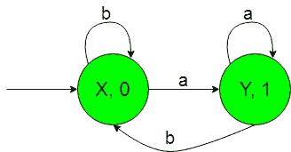
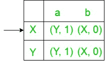

# 构造有限的机器，将“1”作为子串“a”每次出现的输出

> 原文:[https://www . geeksforgeeks . org/构造有限机器-打印-每出现一个作为子字符串的输出-1/](https://www.geeksforgeeks.org/construction-of-finite-machines-to-prints-1-as-the-output-for-every-occurrence-of-a-as-a-substring/)

**前提:** [美利和摩尔机器](https://www.geeksforgeeks.org/mealy-and-moore-machines/)[美利机器和摩尔机器](https://www.geeksforgeeks.org/difference-between-mealy-machine-and-moore-machine/)
的区别在本文中，我们将看到一些有输出的有限自动机的设计，即摩尔和美利机器。

**问题:**构造机器，该机器将{a，b}上的所有字符串集作为输入，并将“a”作为子字符串的每次出现打印“1”作为输出。
假设，

```
Ε = {a, b} and 
Δ = {0, 1}  
```

其中ε和δ分别是输入和输出字母表。

**说明:**
所需的摩尔机构造如下:-


在上图中，初始状态“X”在获得“b”作为输入时，它保持自身状态，并打印“0”作为输出，在获得“a”作为输入时，它转换到状态“Y”，并打印“1”作为输出。状态“Y”在获取“a”作为输入时，它保持自身状态，并打印“1”作为输出，在获取“b”作为输入时，它返回状态“X”，并打印“0”作为输出。

因此，最后上面的摩尔机器可以很容易地打印“1”作为输出，得到“a”作为输入子串。

上面的 Moore 机器将{a，b}上的所有字符串集合作为输入，并计算子串' a '的数量，即在获取' a '作为子串时，它给出' 1 '作为输出，因此在计算' 1 '的数量时，我们可以计算子串' a '的数量。

现在我们需要把上面摩尔机的过渡图转换成等价的 Mealy 机过渡图。

**从摩尔机到美利机的转换:**
所需转换的步骤如下:-

*   **Step-1:** Formation of State Transition Table of the above Moore machine-
    
    In the above transition table, States ‘X’ and ‘Y’ are kept in the first column which on getting ‘a’ as the input it transits to ‘Y’ and ‘Y’ states respectively, kept in the second column and on getting ‘b’ as the input it transits to ‘X’ and ‘X’ states respectively, kept in the third column.

    在δ下的第四列中，有第一列状态的相应输出。在表格中，箭头(→)表示初始状态。

*   **Step-2:** Formation of Transition Table for Mealy machine from above Transition Table of Moore machine-
    Below transition table is going to be formed with the help of the above table and its entries just by using the corresponding output of the states of the first column and placing them in the second and third column accordingly.
    
    In the above table, the states in the first column like ‘X’ on getting ‘a’ as the input it goes to a state ‘Y’ and gives ‘1’ as the output and on getting ‘b’ as the input it goes to the state ‘X’ and gives ‘0’ as the output and so on for the remaining states in the first column. In the table, An arrow (→) indicates the initial state.
*   **第三步:**最后我们可以借助上面的转换表来形成 Mealy 机器的状态转换图。
    所需的图表如下所示-
    
    以上 Mealy 机器将{a，b}上的所有字符串集作为输入，并计算子字符串“a”的数量，即在获取“a”作为子字符串时，它给出“1”作为输出，因此在计算“1”的数量时，我们可以计算子字符串“a”的数量。

**注意:**当从摩尔转换到米莱机时，摩尔和米莱机的状态数保持不变，但是在米莱到摩尔转换的情况下，它给出的状态数并不相同。