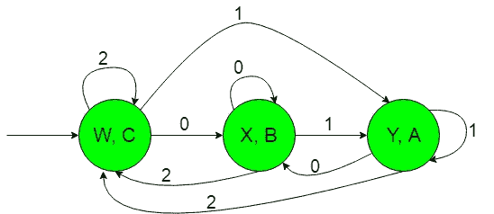
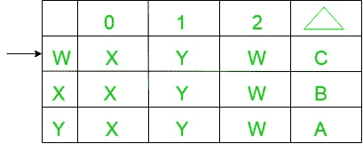
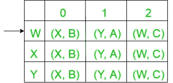

# 如果输入以“1”、“0”或“无”结束，则生产“A”、“B”或“C”的机器的构造

> 原文:[https://www . geesforgeks . org/生产-a-B-或-c-的机器的构造-如果输入以-1-0 或-0 结束/](https://www.geeksforgeeks.org/construction-of-the-machines-that-produce-a-b-or-c-if-input-ends-with-1-0-or-nothing/)

先决条件:[米莱和摩尔机器](https://www.geeksforgeeks.org/mealy-and-moore-machines/)、[米莱机器和摩尔机器的区别](https://www.geeksforgeeks.org/difference-between-mealy-machine-and-moore-machine/)
**问题:**以{0，1}上的一组所有字符串作为输入，如果输入以“1”结尾，则产生“A”作为输出的机器的构造，或者如果输入以“0”结尾，则产生“B”作为输出的机器的构造。
假设:

```
Ε = {0, 1, 2} and 
Δ = {A, B, C}  
```

其中ε和δ分别是输入和输出字母表。

**说明:**
所需摩尔机构造如下:


在上图中，初始状态“w”在获得“2”作为输入时，它保持自身状态并打印“C”作为输出，在获得“1”作为输入时，它传输到状态“Y”并打印“A”作为输出，在获得“0”作为输入时，它传输到状态“X”并打印“B”作为输出，以此类推。

因此，如果输入以“1”结尾，上面的摩尔机器可以容易地产生“A”作为输出，或者如果输入以“0”结尾，则产生“B”作为输出，否则产生“C”

上面的摩尔机器将{0，1}上的所有字符串集作为输入，如果输入以“1”结尾，则产生“A”作为输出，如果输入以“0”结尾，则产生“B”作为输出，否则产生“C”作为输出。

现在我们需要把上面摩尔机的过渡图转换成等价的 Mealy 机过渡图。

**从摩尔机到美利机的转换:**
所需转换的步骤如下:-

*   **Step-1:** Formation of State Transition Table of the above Moore machine-
    
    In the above transition table, States ‘W’, ‘X’ and ‘Y’ are kept in the first column which on getting ‘0’ as the input it transits to ‘X’, ‘X’ and ‘X’ states respectively, kept in the second column and on getting ‘1’ as the input it transits to ‘Y’, ‘Y’ and ‘Y’ states respectively, kept in the third column and on getting ‘2’ as the input it transits to ‘W’, ‘W’ and ‘W’ states respectively, kept in the fourth column and In the fifth column under Δ, there are corresponding outputs of the first column states. In the table, An arrow (→) indicates the initial state.
*   **Step-2:** Formation of Transition Table for Mealy machine from above Transition Table of Moore machine-
    Below transition table is going to be formed with the help of the above table and its entries just by using the corresponding output of the states of the first column and placing them in the second and third column accordingly.
    
    In the above table, the states in the first column like ‘W’ on getting ‘0’ as the input it goes to a state ‘X’ and gives ‘B’ as the output and on getting ‘1’ as the input it goes to the state ‘Y’ and gives ‘A’ as the output and on getting ‘2’ as the input it goes to the state ‘W’ and gives ‘C’ as the output and so on for the remaining states in the first column. In the table, An arrow (→) indicates the initial state.
*   **Step-3:** Then finally we can form the state trasition diagram of Mealy machine with help of it’s above transition table.
    The required diagram is shown below-
    
    Above Mealy machine takes set of all string over {0, 1} as input and produce ‘A’ as output if the input ends with ‘1’ or produce ‘B’ as output if the input ends with ‘0’ otherwise produce ‘C’ as the output.

    **注意:**当从摩尔转换到米莱机时，摩尔和米莱机的状态数保持不变，但是在米莱到摩尔转换的情况下，它给出的状态数并不相同。