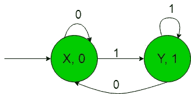
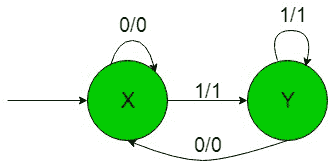

# 制造二进制数的剩余模‘2’的机器的结构

> 原文:[https://www . geeksforgeeks . org/构造机器来产生二进制数的剩余模 2/](https://www.geeksforgeeks.org/construction-of-the-machines-to-produce-residue-modulo-2-of-binary-numbers/)

先决条件: [Mealy 和 Moore 机器](https://www.geeksforgeeks.org/mealy-and-moore-machines/)、[Mealy 机器和 Moore 机器](https://www.geeksforgeeks.org/difference-between-mealy-machine-and-moore-machine/)
的区别在本文中，我们将看到一些带输出的有限自动机的设计，即 Moore 和 Mealy 机器。

**问题:**以二进制数{0，1}为输入，产生以‘2’为输出的余数的机器的构造，即当二进制输入在{0，1}上的等价十进制数除以 2 时，它给出的输出是余数。
假设，

```
Ε = {0, 1} and 
Δ = {0, 1} 
```

其中ε和δ分别是输入和输出字母表。

**所需的系泊机构造如下:**



在上图中，初始状态“X”在获得“0”作为输入时，它保持自身状态，并打印“0”作为输出，在获得“1”作为输入时，它传输到状态“Y”，并打印“1”作为输出，以此类推其余状态。

对于**示例**，当输入字符串为‘10’时，由于二进制输入‘10’的十进制等效值为 2，2 除以 2 等于 0，即余数为 0，因此上述摩尔机器产生 0 作为输出。因此，最后上面的摩尔机器可以很容易地产生以“2”为模的余数作为输出，即当{0，1}上的二进制输入的等效十进制数除以 2 时，它给出的输出是余数。

**所需的粉饼机构造如下:**



在上图中，初始状态“X”在获得“0”作为输入时，它保持自身状态，并打印“0”作为输出，在获得“1”作为输入时，它传输到状态“Y”，并打印“1”作为输出。状态“Y”在获取“1”作为输入时，它保持自身状态，并打印“1”作为输出，在获取“0”作为输入时，它返回初始状态“X”，并打印“0”作为输出。

对于**示例**，当输入字符串为‘10’时，以上 Mealy 机器产生 0 作为输出，因为二进制输入‘10’的十进制等价物为 2，2 除以 2 等于 0，即余数为 0。因此，最后上面的 Mealy 机器可以很容易地产生以“2”为模的余数作为输出，也就是说，当{0，1}上二进制输入的等价十进制数除以 2 时，它给出的输出是余数。