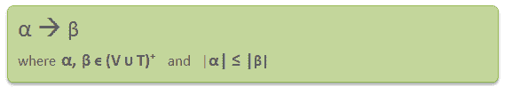

# 上下文相关语法(CSG)和语言(CSL)

> 原文:[https://www . geesforgeks . org/context-sensitive-grammar-CSG-and-language-csl/](https://www.geeksforgeeks.org/context-sensitive-grammar-csg-and-language-csl/)

**上下文相关语法–**
上下文相关语法是一种不受限制的语法，其中所有的产物都是–

形式，其中α和β是非终结符和终结符的字符串。

上下文敏感语法**比上下文无关语法**更强大，因为有些语言可以用 CSG 描述，但不能用上下文无关语法描述，而 CSL 的语法没有无限制语法强大。这就是为什么在乔姆斯基层次结构中，上下文敏感语法位于上下文无关语法和无限制语法之间。
T3】

上下文相关语法有 4 元组。 **G = {N，σ，P，S}** ，其中
N =非终端符号集
σ=终端符号集
S =生产开始符号
P =有限生产集
P 中所有规则的形式为α1Aα2–>α1β2
T16】

**上下文敏感语言:**可以用上下文敏感语法定义的语言叫 CSL。CSL 的房产有:

*   两种上下文相关语言的并集、交集和连接是上下文相关的。
*   上下文相关语言的补语是上下文相关的。

**示例–**

想想下面的 CSG。
S→ABC/aAbc
Ab→Ba
Ac→Bbcc
bB→Bb
Ab→aa/AaA
T6**这个语法生成的语言是什么？**

**解决方案**:
S→aAbc
→abAc
→abBbcc
→abBbcc
→aabbcc
→aabbcc
→aabbAcc
→aabbBbccc
→aabbBbccc
→aabbBbccc
→aabbbccc
该语法生成的语言为{**anb【T11** 

**GATE CS 角题**

练习下列问题将帮助你测试你的知识。所有的问题在前几年的 GATE 考试或 GATE 模拟考试中都被问过。强烈建议你练习一下。

1.  [GATE CS 2005，问题 55](https://www.geeksforgeeks.org/gate-gate-cs-2005-question-55/)
2.  [GATE CS 2004，问题 87](https://www.geeksforgeeks.org/gate-gate-cs-2004-question-87/)

【CSG】【维基百科】[【CSG】–CsA . IIC . ernet . in](https://drona.csa.iisc.ernet.in/~deepakd/atc-2011/csl.pdf)