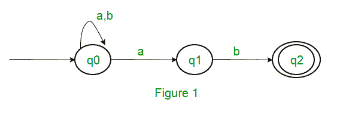
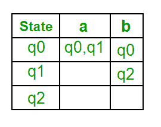
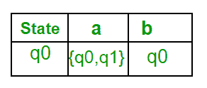
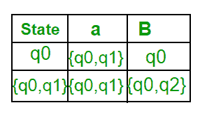
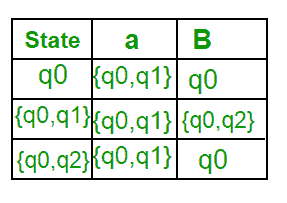
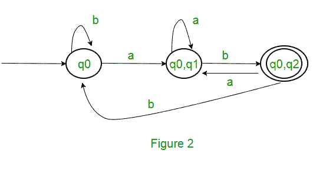
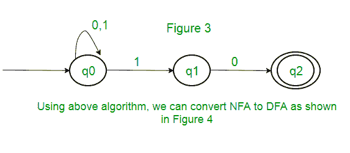
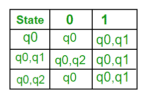
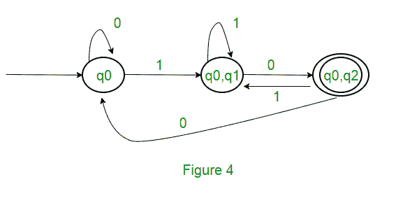

# 从 NFA 到 DFA 的转换

> 原文:[https://www.geeksforgeeks.org/conversion-from-nfa-to-dfa/](https://www.geeksforgeeks.org/conversion-from-nfa-to-dfa/)

在给定的输入符号上，NFA 可以从给定的状态移动零次、一次或多次。NFA 也可以有空移动(没有输入符号的移动)。另一方面，在给定的输入符号上，DFA 从给定的状态只有一次移动。

**从 NFA 到 DFA 的转换**
假设有一个识别语言 l 的 NFA N < Q，∑，q0，δ，F >,那么可以将语言 l 的 DFA D < Q '，∑，q0，δ'，F' >构造为:
步骤 1:最初 Q' = ɸ.
第二步:在 Q’上加上 q0。
步骤 3:对于 Q’中的每个状态，使用 NFA 的转移函数找到每个输入符号的可能状态集。如果这组状态不在 Q '中，将其添加到 Q '中。
步骤 DFA 的最终状态将是包含 F 的所有状态(NFA 的最终状态)

**示例**
考虑下面图 1 所示的 NFA。

以下是 NFA 的各种参数。
Q = { q0，q1，q2 }
∑ = ( a，b)
F = { Q2 }
δ(NFA 的过渡函数)

步骤 1: Q' = ɸ
步骤 2: Q' = {q0}
步骤 3:对于 q '中的每个状态，找到每个输入符号的状态。
当前，Q’中的状态为 q0，使用 NFA 的转换函数从输入符号 a 和 b 上的 q0 查找移动，并更新 DFA 的转换表。

δ'(DFA 的转移函数)

现在{ q0，q1 }将被视为单一状态。由于其条目不在 Q '中，将其添加到 Q '中。
所以 Q' = { q0，{ q0，q1 } }

现在，从不同输入符号上的状态{ q0，q1 }移动到 DFA 的转换表中不存在，我们将像这样计算:
δ' ( { q0，q1 }，a ) = δ ( q0，a)≈δ(Q1，a ) = { q0，q1 }
δ' ( { q0，q1 }，b ) = δ ( q0，b)≈δ(Q1，b ) = { q0，q2 }
现在我们将更新 DFA 的转换表。

δ'(DFA 的转移函数)

现在{ q0，q2 }将被视为单一状态。由于其条目不在 Q '中，将其添加到 Q '中。
所以 Q' = { q0，{ q0，q1 }，{ q0，q2 } }

现在，从不同输入符号上的状态{q0，q2}开始的移动在 DFA 的转换表中不存在，我们将像这样计算:
δ' ( { q0，q2 }，a ) = δ ( q0，a ) ∪ δ ( q2，a ) = { q0，q1 }
δ' ( { q0，q2 }，b ) = δ ( q0，b ) ∪ δ ( q2，b ) = { q0 }
现在我们将更新 DFA 的转换表。

δ’(DFA 的转移函数)

由于没有生成新的状态，我们完成了转换。DFA 的最终状态将是以 q2 为其组成部分的状态，即{ q0，q2 }

以下是 DFA 的各种参数。
Q' = { q0，{ q0，q1 }，{ q0，q2 } }
∑ = ( a，b )
F = { { q0，q2 } }和转换函数δ'如上所示。图 2 显示了上述 NFA 的最终密度泛函分析。

**注意:**有时候，把正则表达式转换成 DFA 并不容易。首先，您可以将正则表达式转换为 NFA，然后将 NFA 转换为 DFA。

**问题:**正则表达式(0 + 1)* (10)对应的极小确定性有限自动机中的状态数是 ______。
**解决方法:**首先，我们将为上面的表达式制作一个 NFA。要为(0 + 1)*制作 NFA，NFA 将处于输入符号 0 或 1 的相同状态 q0。然后对于串联，我们将添加两个移动(q0 到 q1 表示 1，q1 到 q2 表示 0)，如图 3 所示。

本文由 Sonal Tuteja 供稿。

如果您发现任何不正确的地方，或者您想分享关于上面讨论的主题的更多信息，请写评论