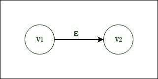
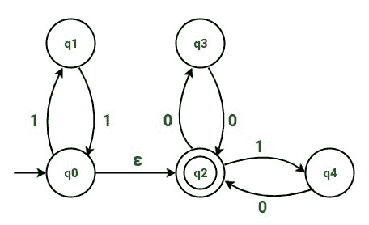
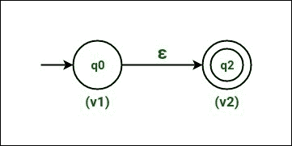
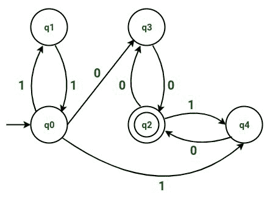
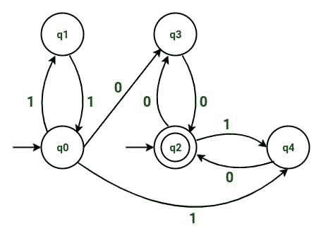
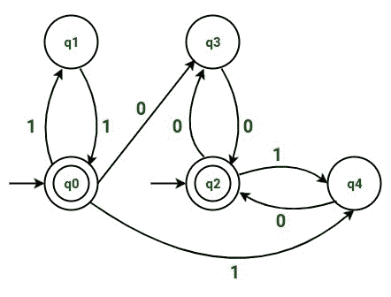

# ε-NFA 到 NFA 的转换

> 原文:[https://www . geesforgeks . org/conversion-of-epsilon-NFA-to-NFA/](https://www.geeksforgeeks.org/conversion-of-epsilon-nfa-to-nfa/)

**非确定性有限自动机(NFA)** 是一种[有限自动机](https://www.geeksforgeeks.org/introduction-of-finite-automata/)，在给定的输入符号上，从给定的状态有零个、一个或多个移动。[艾司隆 NFA](https://www.geeksforgeeks.org/regular-expression-to-nfa/) 是包含艾司隆移动/空移动的 NFA。要从ε-NFA 中移除ε移动/空移动，并将其转换为 NFA，我们遵循以下步骤。

**Figure –** Vertex v1 and Vertex v2 having an epsilon move

**步骤-1:**
考虑具有ε移动的两个顶点。在*图 1* 中，我们有顶点 v1 和顶点 v2，其中ε从 v1 移动到 v2。

**步骤-2:**
现在找到从顶点 v2 *开始的到任何其他顶点的所有移动(除了正在考虑的ε移动)。*

找到移动后，复制从顶点 v2 开始的所有移动，用相同的输入从顶点 v1 开始，并删除从顶点 v1 到顶点 v2 的ε移动。

**第三步:**
看顶点 v1 是不是开始状态。如果顶点 v1 是一个开始状态，那么我们也将把顶点 v2 作为一个开始状态。如果顶点 v1 不是开始状态，那么就不会有任何变化。

**步骤-4:**
看顶点 v2 是不是最终状态。
如果顶点 v2 是最终状态，那么我们也会把顶点 v1 作为最终状态。
如果顶点 v2 不是最终状态，那么不会有任何变化。

重复步骤*(从步骤 1 到步骤 4)* ，直到所有的ε移动从 NFA 中移出。

现在，为了解释这种转换，让我们举个例子。

**示例:**将ε-NFA 转换为 NFA。
考虑状态为 q0、q1、q2、q3 和 q4 的示例。

在上面的例子中，我们有 5 个状态，命名为 q0、q1、q2、q3 和 q4。最初，我们将 q0 作为开始状态，q2 作为最终状态。我们将 q1、q3 和 q4 作为中间状态。

上述 NFA 的过渡表为:

| 状态/输入 | 输入 0 | 输入 1 | 输入ε |
| --- | --- | --- | --- |
| q0 | – | 雌三醇环戊醚 | q2 |
| 雌三醇环戊醚 | – | q0 | – |
| q2 | q3 | q4 | – |
| q3 | q2 | – | – |
| q4 | q2 | – | – |

根据上面的过渡表，

*   获得输入 1 时，状态 q0 变为状态 q1。
*   作为空移动*(即ε移动)*获得输入时的状态 q0 进入状态 q2。
*   获得输入 1 时，状态 q1 变为状态 q0。
*   类似地，获得输入 0 时的状态 q2 变为状态 q3，获得输入 1 时的状态 q2 变为状态 q4。
*   类似地，当输入 0 时，状态 q3 变为状态 q2。
*   类似地，在获得输入 0 时，状态 q4 变为状态 q2。

我们可以看到，我们有一个从状态 q0 到状态 q2 的ε移动，它将被移除。
要将 move 从状态 q0 移至状态 q1，我们将遵循下面提到的步骤。

**步骤-1:**
考虑到ε从状态 q0 移动到状态 q2。考虑状态 q0 为顶点 v1，状态 q2 为顶点 v2。

**Figure –** State q0 as vertex v1 and state q2 as vertex v2

**第二步:**
现在找到从顶点 v2 *(即状态 q2)* 开始的所有招式。

找到招式后，复制所有从顶点 v2 *(即状态 q2)* 开始的招式，输入相同的从顶点 v1 *(即状态 q0)* 开始，去掉从顶点 v1 *(即状态 q0)* 到顶点 v2 *(即状态 q2)* 的ε招式。

因为输入 0 时状态 q2 变为状态 q3。
因此，在复制移动时，在输入 0 时，我们将使状态 q0 也变为状态 q3。

类似地，在输入 1 时，状态 q2 变为状态 q4。
因此，在复制移动时，在输入 1 时，我们将使状态 q0 也变为状态 q4。

所以，NFA 在复制了这些动作之后是:

**Figure –** NFA on duplicating moves

**Step-3:**
由于顶点 v1 *(即状态 q0)* 为起始状态。因此我们也将顶点 v2 *(即状态 q2)* 作为开始状态。

请注意，状态 q2 也将保持为我们最初的最终状态。

NFA 在使状态 q2 也作为开始状态之后是:

**Figure –** NFA after making state q2 as a start state

**步骤-4:**
由于顶点 v2 *(即状态 q2)* 是最终状态。因此我们也将顶点 v1 *(即状态 q0)* 作为最终状态。

请注意，状态 q0 也将像最初一样保持为开始状态。

在使状态 q0 也成为最终状态之后，得到的 NFA 是:

**Figure –** Resulting NFA (state q0 as a final state)

上述 NFA 的过渡表如下:

| 状态/输入 | 输入 0 | 输入 1 |
| --- | --- | --- |
| q0 | q3 | q1、q4 |
| 雌三醇环戊醚 | – | q0 |
| q2 | q3 | q4 |
| q3 | q2 | – |
| q4 | q2 | – |

