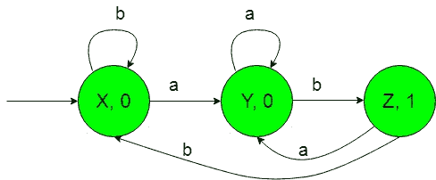
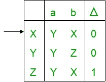
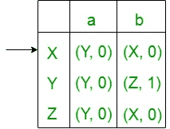
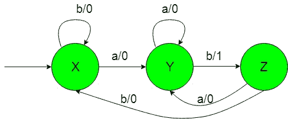

# 将摩尔转换为粉磨机(第 4 套)

> 原文:[https://www . geesforgeks . org/Moore-to-mealy-machine-set-4 的转换/](https://www.geeksforgeeks.org/conversion-of-moore-to-mealy-machine-set-4/)

**先决条件:** [美利和摩尔机器](https://www.geeksforgeeks.org/mealy-and-moore-machines/)[美利机器和摩尔机器](https://www.geeksforgeeks.org/difference-between-mealy-machine-and-moore-machine/)的区别

在本文中，我们将看到摩尔到 Mealy 机器的转换-
**摩尔机器的状态转换图:-**

上面的摩尔机器将{a，b}上的所有字符串集作为输入，并将子字符串的数量计数为“ab”，即在将“ab”作为输入子字符串时，它将“1”作为输出，因此在计数输出“1”的数量时，它也将子字符串的数量计数为“ab”。

现在我们需要把上面摩尔机的过渡图转换成等价的 Mealy 机过渡图。所需转换的步骤如下

*   **Step-1:** 上述摩尔机的状态转移表的形成-
    
    在上述转移表中，状态‘X’、‘Y’和‘Z’保持在第一列，当得到‘a’作为输入时，它分别转移到‘Y’、‘Y’和‘Y’状态，保持在第二列，当得到‘b’作为输入时，它分别转移到‘X’、‘Z’和‘X’状态，保持在第三列。在δ下的第四列中，有第一列状态的相应输出。在表格中，箭头(→)表示初始状态。

*   **步骤 2:** 从上面的摩尔机过渡表形成米莱机过渡表-
    下面的过渡表将借助于上面的表及其条目形成，只需使用第一列状态的相应输出，并将它们相应地放置在第二列和第三列中。
    
    在上表中，第一列中的状态像“X”一样，在获得“a”作为输入时，它进入状态“Y”并给出“0”作为输出，在获得“b”作为输入时，它进入状态“X”，并给出“0”作为输出，以此类推，第一列中的其余状态。在表格中，箭头(→)表示初始状态。*   **Step-3:** Then finally we can form the state transition diagram of Mealy machine with help of it’s above transition table.
    The required diagram is shown below-
    
    Above Mealy machine takes set of all string over {a, b} as input and count the number of substrings as ‘ab’ i.e, on getting ‘ab’ as the input substrings it gives ‘1’ as the output thus on counting number of outputs ‘1’, it gives the count of substrings as ‘ab’ as well.

    **注意:**当从摩尔转换到米莱机时，摩尔和米莱机的状态数保持不变，但是在米莱到摩尔转换的情况下，它给出的状态数并不相同。