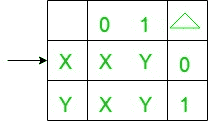
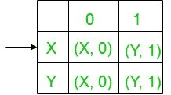

# 将摩尔转换为米粉机(第 9 套)

> 原文:[https://www . geesforgeks . org/Moore-to-mealy-machine-set-9/](https://www.geeksforgeeks.org/conversion-of-moore-to-mealy-machine-set-9/)

**先决条件:** [美利和摩尔机器](https://www.geeksforgeeks.org/mealy-and-moore-machines/)[美利机器和摩尔机器](https://www.geeksforgeeks.org/difference-between-mealy-machine-and-moore-machine/)
的区别在本文中，我们将看到摩尔到美利机器的转换-

**摩尔机器的状态转移图:-**

以上摩尔机器以二进制数{0，1}为输入，以“2”为输出，即当二进制输入在{0，1}上的等价十进制数除以 2 时，输出为余数。
现在我们需要把上面摩尔机的过渡图转换成等效的 Mealy 机过渡图。
所需转换的步骤如下

*   **Step-1:** Formation of State Transition Table of the above Moore machine-
    
    In the above transition table, States ‘X’ and ‘Y’ are kept in the first column which on getting ‘0’ as the input it transits to ‘X’ and ‘X’ states respectively, kept in the second column and on getting ‘1’ as the input it transits to ‘Y’ and ‘Y’ states respectively, kept in the third column and In the fourth column under Δ, there are corresponding outputs of the first column states. In the table, An arrow (→) indicates the initial state.

*   **Step-2:** Formation of Transition Table for Mealy machine from above Transition Table of Moore machine-
    Below transition table is going to be formed with the help of the above table and its entries just by using the corresponding output of the states of the first column and placing them in the second and third column accordingly.
    
    In the above table, the states in the first column like ‘X’ on getting ‘0’ as the input it goes to a state ‘X’ and gives ‘0’ as the output and on getting ‘1’ as the input it goes to the state ‘Y’ and gives ‘1’ as the output and so on for the remaining states in the first column. In the table, An arrow (→) indicates the initial state.
*   **第三步:**最后我们可以借助上面的转换表来形成 Mealy 机器的状态转换图。
    如下图所示-
    
    以上 Mealy 机器以二进制数{0，1}为输入，以“2”为输出，即当二进制输入的等效十进制数超过{0，1}除以 2 时，它以余数给出输出。

**注意:**当从摩尔转换到米莱机时，摩尔和米莱机的状态数保持不变，但是在米莱到摩尔转换的情况下，它给出的状态数并不相同。