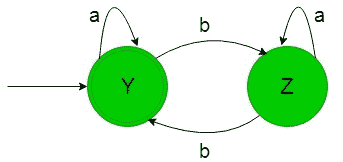
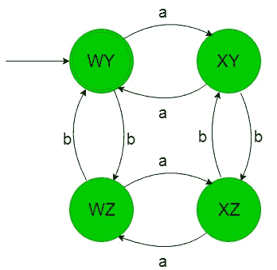

# DFA 中的交叉产品操作

> 原文:[https://www . geesforgeks . org/跨产品-运营-in-dfa/](https://www.geeksforgeeks.org/cross-product-operation-in-dfa/)

**先决条件:** [设计有限自动机](https://www.geeksforgeeks.org/designing-finite-automata-from-regular-expression/)
我们借助下面的例子来理解确定性有限自动机(DFA)中的叉积运算-

为{a，b}上的字符串集设计一个 DFA，使得该语言的字符串包含偶数个 a 和 b，那么所需的语言如下-

```
L = {ε, aa, bb, abab, aabb, baba, bbaa, .......}
```

让我们看看 DFA 中交叉产品操作的步骤:

**Step-1:**
让我们形成一个计算偶数个 a 的 DFA-
在下面的状态转移图中，“W”也是初始状态和最终状态，它接受包含偶数个 a 和任意个 b 的字符串语言。

上述 DFA 接受的语言为-

```
L = {ε, aab, b, baa, aabbbbb, aaaab, ..........}
```

上述 DFA 不接受的语言是-

```
L = {aaa, abbb, baaa, bbaaba, ...........}
```

**Step-2:**
让我们形成一个计算偶数个 b 的 DFA-
在下面的状态转移图中，“Y”也是初始状态和最终状态，它接受包含偶数个 b 和任意个 a 的字符串语言。

上述 DFA 接受的语言为-

```
L = {ε, bba, a, abb, bbbbaaaa, bbbba, ...........}
```

上述 DFA 不接受的语言是-

```
L = {bbb, bbba, abbb, aaba, ...........}
```

**步骤-3:**
这里步骤-1 和步骤-2 的状态交叉相乘，产生如下结果-

```
{W, X} * {Y, Z} = {WY, WZ, XY, XZ} 
```

在下面的状态转换图中，使用的四个状态{WY，WZ，XY，XZ}是第 1 步和第 2 步状态交叉乘积的结果，其中“WY”也是初始和最终状态，因为在第 1 步中“W”是初始和最终状态，在第 2 步中“Y”是初始和最终状态，其余是正常状态。
则叉积运算后的合成状态转移图如下-

这样上面的 DFA 接受偶数个 a 和 b 的字符串的所有语言，下面给出上面的 DFA 接受和不接受的语言-

```
L1 = {ε, aa, bb, abab, aabb, baba, bbaa, .......}
L2 = {aaa, aaabb, aaabaabb, aaabb, baaba, bbbaa, .......}

```

L1 被上述 DFA 接受，但 L2 不接受。