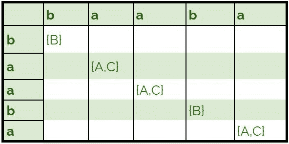
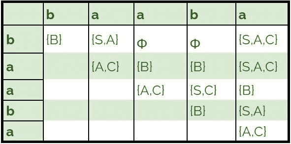

# 上下文无关语法的 CYK 算法

> 原文:[https://www . geeksforgeeks . org/cyk-算法用于上下文无关语法/](https://www.geeksforgeeks.org/cyk-algorithm-for-context-free-grammar/)

先决条件–[将上下文无关语法转换为乔姆斯基范式](https://www.geeksforgeeks.org/converting-context-free-grammar-chomsky-normal-form/)
**CYK 算法**是上下文无关语法的解析算法。
为了将 CYK 算法应用于一个语法，它必须是乔姆斯基范式。它使用动态编程算法来判断字符串是否是语法语言。

**算法:**
设 w 为待解析的 n 长度字符串。而 G 代表我们语法中的一组规则，起始状态为 s。

1.  构造一个大小为 n × n 的表格 DP。
2.  如果 w = e(空字符串)并且 S -> e 是 G 中的一个规则，那么我们接受我们拒绝的字符串。
3.  ```
    For i = 1 to n:
      For each variable A:
         We check if A -> b is a rule and b = wi for some i:
            If so, we place A in cell (i, i) of our table. 
    ```

4.  ```
    For l = 2 to n:
      For i = 1 to n-l+1:
           j = i+l-1
            For k = i to j-1:
               For each rule A -> BC: 
            We check if (i, k) cell contains B and (k + 1, j) cell contains C:
                 If so, we put A in cell (i, j) of our table. 
    ```

5.  ```
    We check if S is in (1, n):
      If so, we accept the string
      Else, we reject.
    ```

**例–**
让我们的语法 G 为:

```
S -> AB | BC
A -> BA | a
B -> CC | b
C -> AB | a 
```

我们检查 **baaba** 是否在 L(G)中:

1.  We first insert single length rules into our table.

    

2.  We then fill the remaining cells of our table.

    

3.  我们观察到 S 在单元格(1，5)中，因此，字符串 **baaba 属于 L(G)。**

**时空复杂度:**

*   **Time Complexity –**

    ```
    O(n3.|G|) 
    ```

    其中|G|是给定语法中的规则数。

*   **空间复杂性–**

    ```
    O(n2)  
    ```