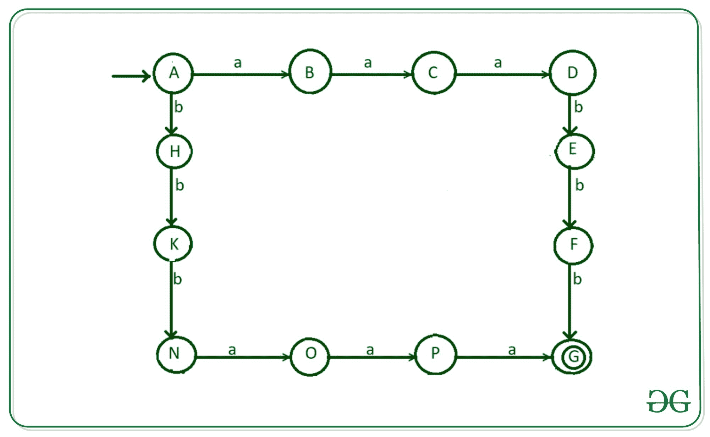
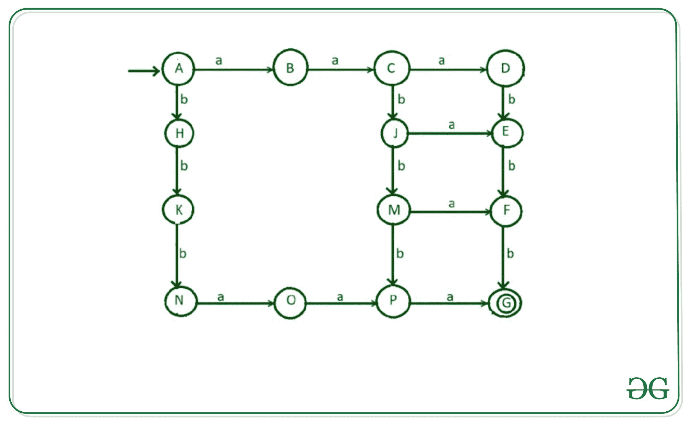
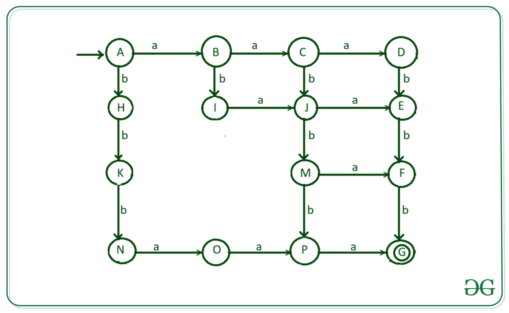
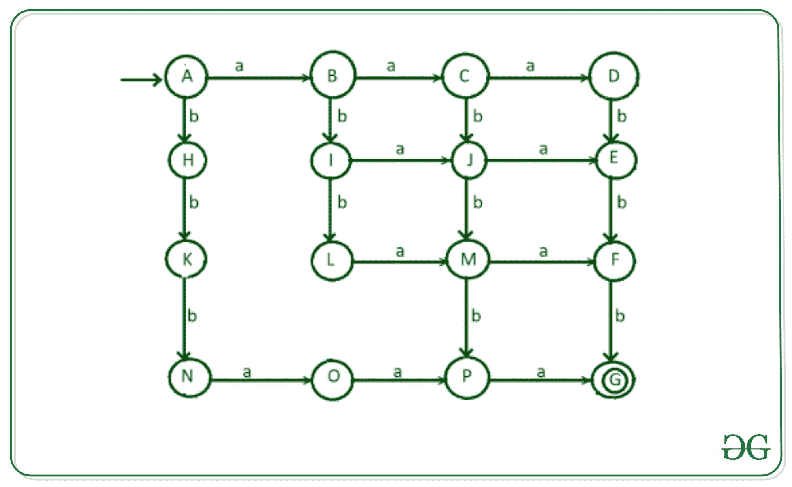
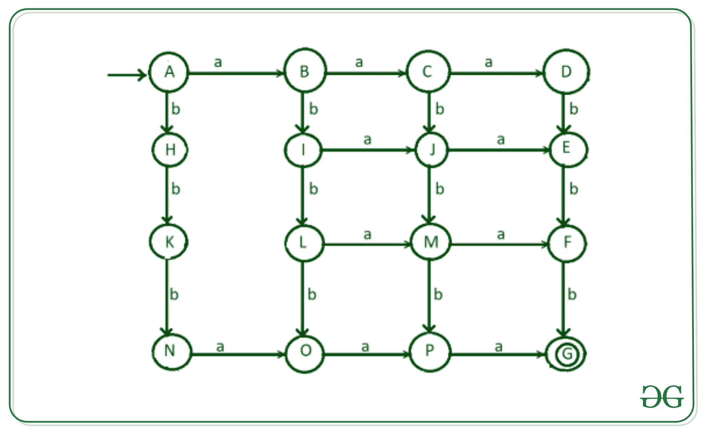
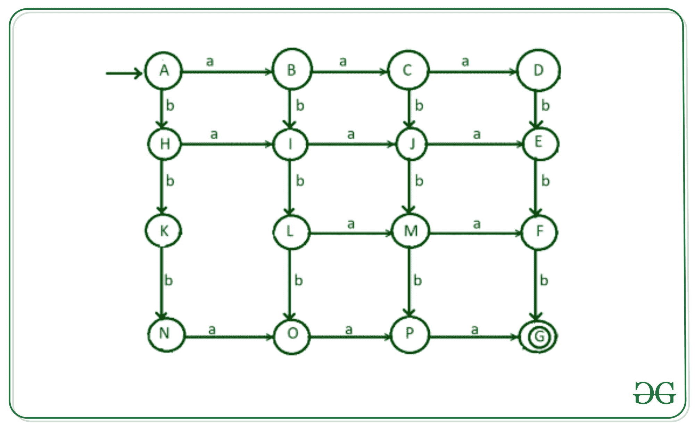
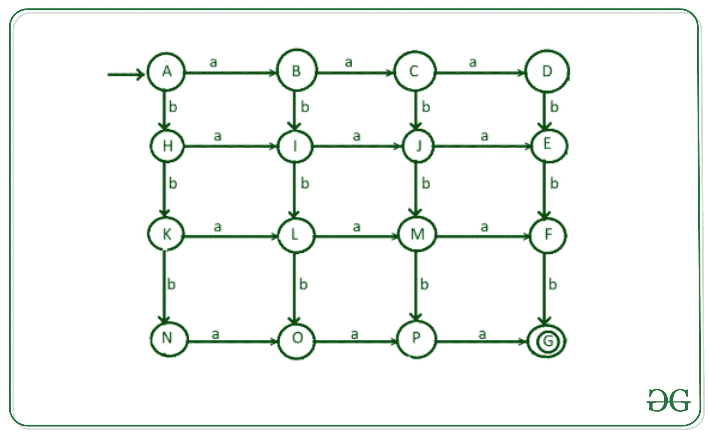
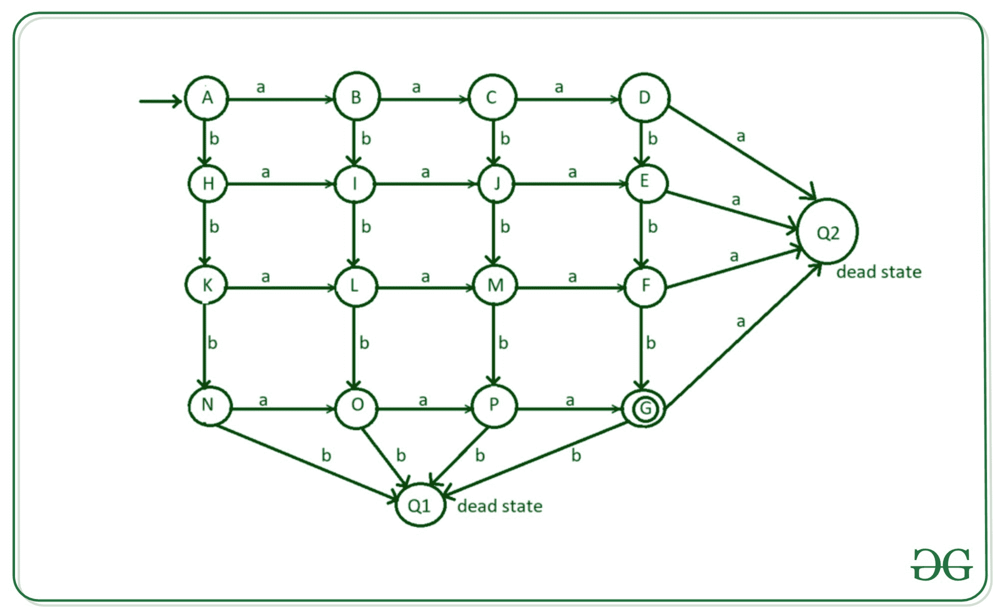

# 设计一个接受包含 3 a 和 3 b 的字符串的 DFA

> 原文:[https://www . geesforgeks . org/design-a-DFA-accept-a-string-contain-3-as-and-3-bs/](https://www.geeksforgeeks.org/design-a-dfa-that-accepts-a-string-containing-3-as-and-3-bs/)

**问题陈述:**设计一个[确定有限自动机](https://www.geeksforgeeks.org/introduction-of-finite-automata/)接受输入{a，b}上的三个 a 和三个 b 的排列

> **输入**:S = " aabbb "
> **输出**:接受
> **解释** :
> 输入有三 a 和三 b。
> 
> **输入** : S =【阿巴巴巴】
> **输出**:接受
> **解释** :
> 输入有三 a 和三 b。

为了设计一个 DFA，我们需要逐个字符地检查输入。在设计 DFA 时，应该记住以下几个步骤。

*   考虑所有可能被接受的输入(比如，在这个例子中，aabbb，bbbaaa，ababab，abaabb 等等)。
*   创建初始过渡状态。
*   将每个输入字母转换到其他转换状态。
*   达到最终状态，这样在每一步中所使用的语言都被接受(例如，在本例中，a 和 b 的数量相等)。

**设计步骤:**
**步骤 1** :创建一个初始状态“A”，用— >表示。
**第二步**:想一想 can aaabbb 或 bbbaaa 可能出现的字符串，可以通过如下的转换来实现:

*   输入“A”从状态“A”到状态“B”的转换
*   输入“a”从状态“B”到状态“C”的转换
*   输入“a”从状态“C”到状态“D”的转换
*   输入“a”从状态“D”到死状态“Q2”的转变
*   输入“b”从状态“D”到状态“E”的转换
*   输入“b”从状态“E”到状态“F”的转换
*   输入“b”从状态“F”到状态“G”的转换
*   输入“b”从状态“G”到死状态“Q2”的转变



**第三步**:现在研究一种可能性，比如 b 在两个 a 之后，比如 aababb，aabbab。

*   “b”从状态“C”到状态“J”的转变
*   “a”从状态“J”到状态“E”的转变
*   “b”从状态“J”到状态“M”的转变
*   “a”从状态“M”到状态“F”的转变
*   “b”从状态“M”到状态“P”的转变

转换如图所示。



**第 4 步:**现在考虑以‘ABA’开始，然后满足给定语言条件的可能性。为此，需要进行以下转换:

*   “B”从状态“B”到状态“I”的转变
*   “a”从状态“I”到状态“J”的转变



**第 5 步:**现在考虑以‘abb’开头，然后满足给定语言条件的可能性。为此，需要进行以下转换:

*   “b”从状态“I”到状态“L”的转换
*   “a”从状态“L”到状态“M”的转变



**步骤-6:** 现在有一种可能，在读取一个‘a’之后，它读取所有的 3 个 b，然后通过读取剩余的 2 个 a 来结束执行。用于“b”从状态“L”到“O”的转换。



**Step-7:** 有一种可能，它在读取一个‘b’之后读取‘a’，然后读取‘a’和‘b’的任意组合，使得字符串包含 3 个 a 和 3 个 b。对于这种转换，‘a’是从状态“H”到状态“I”完成的。



**第 8 步:**现在，考虑一下从两个 b 开始的字符串，并开始寻找字符串的任何组合，以获得期望的结果。为此，我们从凝视“K”到状态“L”进行“a”的转换。



**第 9 步:**现在输入状态 D、E、F、G 的字母‘a’，状态 G、N、O、P 的字母‘b’留给过渡。因为我们已经完成了上述语言的所有可能性，所以剩下的转换将进入死状态“Q1”和 Q2。

*   输入“a”从状态“D”到死状态“Q1”的转变
*   输入“a”从状态“E”到死状态“Q1”的转变
*   输入“a”从状态“F”到死状态“Q1”的转变
*   输入“a”从状态“G”到死状态“Q1”的转变
*   输入“b”从状态“G”到死状态“Q2”的转变
*   输入“b”从状态“N”到死状态“Q2”的转变
*   输入“b”从状态“O”到死状态“Q2”的转变
*   输入“b”从状态“P”到死状态“Q2”的转变



**上述 DFA 的过渡表**

<figure class="table">

| 州 | 输入(a) | 输入(b) |
| --- | --- | --- |
| —> A(初始状态) | B | H |
| B | C | 我 |
| C | D | J |
| D | Q2(死亡状态) | E |
| E | Q2(死亡状态) | F |
| F | Q2(死亡状态) | G*(最终状态) |
| G*(最终状态) | Q2(死亡状态) | Q1(死亡状态) |
| H | 我 | K |
| 我 | J | L |
| J | E | M |
| K | L | 普通 |
| L | M | O |
| M | F | P |
| 普通 | O | Q1(死亡状态) |
| O | P | Q1(死亡状态) |
| P | G*(最终状态) | Q1(死亡状态) |

以下是《发展筹资法》的执行情况:

## C++

```
// C++ implementation of the
// DFA of permutation of three
// a's and three b's

#include<bits/stdc++.h>
using namespace std;

// declaration of state functions
void stateA(string),stateB(string),stateC(string),stateD(string);
void stateE(string),stateF(string),stateG(string),stateH(string);
void stateI(string),stateJ(string),stateK(string),stateL(string);
void stateM(string),stateN(string),stateO(string),stateP(string);
void stateQ1(string),stateQ2(string);

// State A
 void stateA(string n)
{
  if (n[0] == 'a')
    stateB(n.substr(1));
  else if (n[0] == 'b')
  {
    stateH(n.substr(1));
  }
 }

// State B
 void stateB(string n)
{
  if (n.length() == 0)
    cout << "string Not Accepted";
  else
  {  
    if (n[0] == 'a')
      stateC(n.substr(1));
    else if (n[0] == 'b')
      stateI(n.substr(1));
  }
}

// State C
 void stateC(string n)
{
  if (n.length() == 0)
    cout << "string Not Accepted";
  else
  {
    if (n[0] == 'a')
      stateD(n.substr(1));
    else if (n[0] == 'b')
      stateJ(n.substr(1));
  }
}

// State D
 void stateD(string n)
{
  if (n.length() == 0)
    cout << "string Not Accepted";
  else 
  {
    if (n[0] == 'a')
      stateQ2(n);
    else if (n[0] == 'b')
      stateE(n.substr(1));
  }
}  

// State E
 void stateE(string n)
{
  if (n.length() == 0)
    cout << "string Not Accepted";
  else
  {  
    if (n[0] == 'a')
      stateQ2(n);
    else if (n[0] == 'b')
      stateF(n.substr(1));
  }
}  

// State F
 void stateF(string n)
{
  if (n.length() == 0)
    cout << "string Not Accepted";
  else
  { 
    if (n[0] == 'a')
      stateQ2(n.substr(1));
    else if (n[0] == 'b')
      stateG(n.substr(1));
  }
}

// State G
 void stateG(string n)
{
  if (n.length() == 0)
    cout << "string Accepted";
  else
  {  
    if (n[0] == 'a')
      stateQ2(n);
    else if (n[0] == 'b')
      stateQ2(n);
  }
}

// State H
 void stateH(string n)
{
  if (n.length() == 0)
    cout << "string Not Accepted";
  else
  {  
    if (n[0] == 'a')
      stateI(n.substr(1));
    else if (n[0] == 'b')
      stateK(n.substr(1));
  }
}

// State I
 void stateI(string n)
{
  if (n.length() == 0)
    cout << "string Not Accepted";
  else
  {  
    if (n[0] == 'a')
      stateJ(n.substr(1));
    else if (n[0] == 'b')
      stateL(n.substr(1));
  }
}

// State J
 void stateJ(string n)
{
  if (n.length() == 0)
    cout << "string Not Accepted";
  else
  {
    if (n[0] == 'a')
      stateE(n.substr(1));
    else if (n[0] == 'b')
      stateM(n.substr(1));       
  }
}

// State K
 void stateK(string n)
{
  if (n.length() == 0)
    cout << "string Not Accepted";
  else 
  {
    if (n[0] == 'a')
      stateL(n.substr(1));
    else if (n[0] == 'b')
      stateN(n.substr(1));
  }
}

// State L
 void stateL(string n)
{
  if (n.length() == 0)
    cout << "string Not Accepted";
  else
  { 
    if (n[0] == 'a')
      stateM(n.substr(1));
    else if (n[0] == 'b')
      stateO(n.substr(1));
  }
}

// State M
 void stateM(string n)
{
  if (n.length() == 0)
    cout << "string Not Accepted";
  else
  {
    if (n[0] == 'a')
      stateF(n.substr(1));
    else if (n[0] == 'b')
      stateP(n.substr(1));          
  }
}

// State N
 void stateN(string n)
{
  if (n.length() == 0)
    cout << "string Not Accepted";
  else 
    if (n[0] =='a')
      stateO(n.substr(1));
  else if (n[0] == 'b')
    stateQ1(n);
}

// State Q
 void stateO(string n)
{
  if (n.length() == 0)
    cout << "string Not Accepted";
  else
  {  
    if (n[0] == 'a')
      stateP(n.substr(1));
    else if (n[0] == 'b')
      stateQ1(n);
  }
}

// State P
 void stateP(string n)
{
  if (n.length() == 0)
    cout << "string Not Accepted";
  else
  {
    if (n[0] == 'a')
      stateG(n.substr(1));
    else if (n[0] == 'b')
      stateQ1(n.substr(1));   
  }
}

// State Q1
 void stateQ1(string n)
{
  cout << "string Not Accepted";
}

// State Q2
 void stateQ2(string n)
{
  cout << "string Not Accepted";
}

int main()
{
  string n = "abaabb";

  // call stateA
  // to  check the input
  stateA(n);
}
```

## Java 语言(一种计算机语言，尤用于创建网站)

```
// Java implementation of the
// DFA of permutation of three
// a's and three b's
import java.util.*;

class GFG{

// State A
static void stateA(String n)
{
  if (n.charAt(0) == 'a')
    stateB(n.substring(1));
  else if (n.charAt(0) == 'b')
  {
    stateH(n.substring(1));
  }
 }

// State B
static void stateB(String n)
{
  if (n.length() == 0)
    System.out.print("String Not Accepted");
  else
  {   
    if (n.charAt(0) == 'a')
      stateC(n.substring(1));
    else if (n.charAt(0) == 'b')
      stateI(n.substring(1));
  }
}

// State C
static void stateC(String n)
{
  if (n.length() == 0)
    System.out.print("String Not Accepted");
  else
  {
    if (n.charAt(0) == 'a')
      stateD(n.substring(1));
    else if (n.charAt(0) == 'b')
      stateJ(n.substring(1));
  }
}

// State D
static void stateD(String n)
{
  if (n.length() == 0)
    System.out.print("String Not Accepted");
  else  
  {
    if (n.charAt(0) == 'a')
      stateQ2(n);
    else if (n.charAt(0) == 'b')
      stateE(n.substring(1));
  }
}   

// State E
static void stateE(String n)
{
  if (n.length() == 0)
    System.out.print("String Not Accepted");
  else
  {   
    if (n.charAt(0) == 'a')
      stateQ2(n);
    else if (n.charAt(0) == 'b')
      stateF(n.substring(1));
  }
}   

// State F
static void stateF(String n)
{
  if (n.length() == 0)
    System.out.print("String Not Accepted");
  else
  {  
    if (n.charAt(0) == 'a')
      stateQ2(n.substring(1));
    else if (n.charAt(0) == 'b')
      stateG(n.substring(1)); 
  }
} 

// State G
static void stateG(String n)
{
  if (n.length() == 0)
    System.out.print("String Accepted");
  else
  {   
    if (n.charAt(0) == 'a')
      stateQ2(n);
    else if (n.charAt(0) == 'b')
      stateQ2(n); 
  }
}

// State H
static void stateH(String n)
{
  if (n.length() == 0)
    System.out.print("String Not Accepted");
  else
  {   
    if (n.charAt(0) == 'a')
      stateI(n.substring(1));
    else if (n.charAt(0) == 'b')
      stateK(n.substring(1));
  }
} 

// State I
static void stateI(String n)
{
  if (n.length() == 0)
    System.out.print("String Not Accepted");
  else
  {   
    if (n.charAt(0) == 'a')
      stateJ(n.substring(1));
    else if (n.charAt(0) == 'b')
      stateL(n.substring(1));
  }
}

// State J
static void stateJ(String n)
{
  if (n.length() == 0)
    System.out.print("String Not Accepted");
  else
  {
    if (n.charAt(0) == 'a')
      stateE(n.substring(1));
    else if (n.charAt(0) == 'b')
      stateM(n.substring(1));        
  }
}

// State K
static void stateK(String n)
{
  if (n.length() == 0)
    System.out.print("String Not Accepted");
  else  
  {
    if (n.charAt(0) == 'a')
      stateL(n.substring(1));
    else if (n.charAt(0) == 'b')
      stateN(n.substring(1)); 
  }
}

// State L
static void stateL(String n)
{
  if (n.length() == 0)
    System.out.print("String Not Accepted");
  else
  {  
    if (n.charAt(0) == 'a')
      stateM(n.substring(1));
    else if (n.charAt(0) == 'b')
      stateO(n.substring(1)); 
  }
}

// State M
static void stateM(String n)
{
  if (n.length() == 0)
    System.out.print("String Not Accepted");
  else
  {
    if (n.charAt(0) == 'a')
      stateF(n.substring(1));
    else if (n.charAt(0) == 'b')
      stateP(n.substring(1));           
  }
}

// State N
static void stateN(String n)
{
  if (n.length() == 0)
    System.out.print("String Not Accepted");
  else  
    if (n.charAt(0) =='a')
      stateO(n.substring(1));
  else if (n.charAt(0) == 'b')
    stateQ1(n);
}

// State Q
static void stateO(String n)
{
  if (n.length() == 0)
    System.out.print("String Not Accepted");
  else
  {   
    if (n.charAt(0) == 'a')
      stateP(n.substring(1));
    else if (n.charAt(0) == 'b')
      stateQ1(n);
  }
}

// State P
static void stateP(String n)
{
  if (n.length() == 0)
    System.out.print("String Not Accepted");
  else
  {
    if (n.charAt(0) == 'a')
      stateG(n.substring(1));
    else if (n.charAt(0) == 'b')
      stateQ1(n.substring(1));    
  }
}

// State Q1
static void stateQ1(String n)
{
  System.out.print("String Not Accepted");
}

// State Q2
static void stateQ2(String n)
{
  System.out.print("String Not Accepted");
}

// Driver code
public static void main(String[] args)
{

  // Take String input
  String n = "abaabb";

  // Call stateA
  // to check the input
  stateA(n);
}
}

// This code is contributed by pratham76
```

## 蟒蛇 3

```
# Python3 implementation of the
# DFA of permutation of three
# a's and three b's

# State A
def stateA(n):
    if(n[0]=='a'):
        stateB(n[1:])
    elif (n[0]=='b'):
        stateH(n[1:])

# State B
def stateB(n):
    if(len(n)== 0):
        print("String Not Accepted")
    else:   
        if(n[0]=='a'):
            stateC(n[1:])
        elif (n[0]=='b'):
            stateI(n[1:])

# State C
def stateC(n):
    if(len(n)== 0):
        print("String Not Accepted")
    else:   
        if(n[0]=='a'):
            stateD(n[1:])
        elif (n[0]=='b'):
            stateJ(n[1:])

# State D
def stateD(n):
    if(len(n)== 0):
        print("String Not Accepted")
    else:   
        if(n[0]=='a'):
            stateQ2(n)
        elif (n[0]=='b'):
            stateE(n[1:])

# State E
def stateE(n):
    if(len(n)== 0):
        print("String Not Accepted")
    else:   
        if(n[0]=='a'):
            stateQ2(n)
        elif (n[0]=='b'):
            stateF(n[1:])  

# State F
def stateF(n):
    if(len(n)== 0):
        print("String Not Accepted")
    else:   
        if(n[0]=='a'):
            stateQ2(n[1:])
        elif (n[0]=='b'):
            stateG(n[1:])    

# State G
def stateG(n):
    if(len(n)== 0):
        print("String Accepted")
    else:   
        if(n[0]=='a'):
            stateQ2(n)
        elif (n[0]=='b'):
            stateQ2(n) 

# State H
def stateH(n):
    if(len(n)== 0):
        print("String Not Accepted")
    else:   
        if(n[0]=='a'):
            stateI(n[1:])
        elif (n[0]=='b'):
            stateK(n[1:])

# State I
def stateI(n):
    if(len(n)== 0):
        print("String Not Accepted")
    else:   
        if(n[0]=='a'):
            stateJ(n[1:])
        elif (n[0]=='b'):
            stateL(n[1:])

# State J
def stateJ(n):
    if(len(n)== 0):
        print("String Not Accepted")
    else:   
        if(n[0]=='a'):
            stateE(n[1:])
        elif (n[0]=='b'):
            stateM(n[1:])        

# State K
def stateK(n):
    if(len(n)== 0):
        print("String Not Accepted")
    else:   
        if(n[0]=='a'):
            stateL(n[1:])
        elif (n[0]=='b'):
            stateN(n[1:]) 

# State L
def stateL(n):
    if(len(n)== 0):
        print("String Not Accepted")
    else:   
        if(n[0]=='a'):
            stateM(n[1:])
        elif (n[0]=='b'):
            stateO(n[1:])  

# State M
def stateM(n):
    if(len(n)== 0):
        print("String Not Accepted")
    else:   
        if(n[0]=='a'):
            stateF(n[1:])
        elif (n[0]=='b'):
            stateP(n[1:])           

# State N
def stateN(n):
    if(len(n)== 0):
        print("String Not Accepted")
    else:   
        if(n[0]=='a'):
            stateO(n[1:])
        elif (n[0]=='b'):
            stateQ1(n)

# State Q
def stateO(n):
    if(len(n)== 0):
        print("String Not Accepted")
    else:   
        if(n[0]=='a'):
            stateP(n[1:])
        elif (n[0]=='b'):
            stateQ1(n)

# State P
def stateP(n):
    if(len(n)== 0):
        print("String Not Accepted")
    else:   
        if(n[0]=='a'):
            stateG(n[1:])
        elif (n[0]=='b'):
            stateQ1(n[1:])    

# State Q1
def stateQ1(n):
    print("String Not Accepted")

# State Q2
def stateQ2(n):
    print("String Not Accepted")

# take string input
n = "abaabb"

# call stateA
# to check the input
stateA(n)
```

## C#

```
// C# implementation of the
// DFA of permutation of three
// a's and three b's
using System;
using System.Collections;
class GFG{

// State A
static void stateA(string n)
{
  if(n[0] == 'a')
    stateB(n.Substring(1));
  else if (n[0] == 'b')
  {
    stateH(n.Substring(1));
  }
 }

// State B
static void stateB(string n)
{
  if(n.Length == 0)
    Console.Write("String Not Accepted");
  else
  {   
    if(n[0] == 'a')
      stateC(n.Substring(1));
    else if (n[0] == 'b')
      stateI(n.Substring(1));
  }
}

// State C
static void stateC(string n)
{
  if(n.Length == 0)
    Console.Write("String Not Accepted");
  else
  {
    if(n[0] == 'a')
      stateD(n.Substring(1));
    else if (n[0] == 'b')
      stateJ(n.Substring(1));
  }
}

// State D
static void stateD(string n)
{
  if(n.Length == 0)
    Console.Write("String Not Accepted");
  else   
  {
    if(n[0] == 'a')
      stateQ2(n);
    else if (n[0] == 'b')
      stateE(n.Substring(1));
  }
}   

// State E
static void stateE(string n)
{
  if(n.Length == 0)
    Console.Write("String Not Accepted");
  else
  {   
    if(n[0] == 'a')
      stateQ2(n);
    else if (n[0] == 'b')
      stateF(n.Substring(1));
  }
}   

// State F
static void stateF(string n)
{
  if(n.Length == 0)
    Console.Write("String Not Accepted");
  else
  {  
    if(n[0] == 'a')
      stateQ2(n.Substring(1));
    else if (n[0] == 'b')
      stateG(n.Substring(1)); 
  }
} 

// State G
static void stateG(string n)
{
  if(n.Length == 0)
    Console.Write("String Accepted");
  else
  {   
    if(n[0] == 'a')
      stateQ2(n);
    else if (n[0] == 'b')
      stateQ2(n); 
  }
}

// State H
static void stateH(string n)
{
  if(n.Length == 0)
    Console.Write("String Not Accepted");
  else
  {   
    if(n[0] == 'a')
      stateI(n.Substring(1));
    else if (n[0] == 'b')
      stateK(n.Substring(1));
  }
} 

// State I
static void stateI(string n)
{
  if(n.Length == 0)
    Console.Write("String Not Accepted");
  else
  {   
    if(n[0] == 'a')
      stateJ(n.Substring(1));
    else if (n[0] == 'b')
      stateL(n.Substring(1));
  }
}

// State J
static void stateJ(string n)
{
  if(n.Length == 0)
    Console.Write("String Not Accepted");
  else
  {
    if(n[0] == 'a')
      stateE(n.Substring(1));
    else if (n[0] == 'b')
      stateM(n.Substring(1));        
  }
}

// State K
static void stateK(string n)
{
  if(n.Length == 0)
    Console.Write("String Not Accepted");
  else   
  {
    if(n[0] == 'a')
      stateL(n.Substring(1));
    else if (n[0] == 'b')
      stateN(n.Substring(1)); 
  }
}

// State L
static void stateL(string n)
{
  if(n.Length == 0)
    Console.Write("String Not Accepted");
  else
  {  
    if(n[0] == 'a')
      stateM(n.Substring(1));
    else if (n[0] == 'b')
      stateO(n.Substring(1)); 
  }
}

// State M
static void stateM(string n)
{
  if(n.Length == 0)
    Console.Write("String Not Accepted");
  else{
    if(n[0] == 'a')
      stateF(n.Substring(1));
    else if (n[0] == 'b')
      stateP(n.Substring(1));           
  }
}

// State N
static void stateN(string n)
{
  if(n.Length == 0)
    Console.Write("String Not Accepted");
  else   
    if(n[0] =='a')
      stateO(n.Substring(1));
  else if (n[0] == 'b')
    stateQ1(n);
}

// State Q
static void stateO(string n)
{
  if(n.Length == 0)
    Console.Write("String Not Accepted");
  else
  {   
    if(n[0] == 'a')
      stateP(n.Substring(1));
    else if(n[0] == 'b')
      stateQ1(n);
  }
}

// State P
static void stateP(string n)
{
  if(n.Length == 0)
    Console.Write("String Not Accepted");
  else
  {
    if(n[0] == 'a')
      stateG(n.Substring(1));
    else if (n[0] == 'b')
      stateQ1(n.Substring(1));    
  }
}

// State Q1
static void stateQ1(string n)
{
  Console.Write("String Not Accepted");
}

// State Q2
static void stateQ2(string n)
{
  Console.Write("String Not Accepted");
}

// Driver code
public static void Main (string[] args)
{
  // Take string input
  string n = "abaabb";

  // Call stateA
  // to check the input
  stateA(n);
}
}

// This code is contributed by rutvik_56
```

## java 描述语言

```
<script>

      // JavaScript implementation of the
      // DFA of permutation of three
      // a's and three b's
      // State A
      function stateA(n) {
        if (n[0] === "a") stateB(n.substring(1));
        else if (n[0] === "b") {
          stateH(n.substring(1));
        }
      }

      // State B
      function stateB(n) {
        if (n.length === 0)
        document.write("String Not Accepted");
        else {
          if (n[0] === "a") stateC(n.substring(1));
          else if (n[0] === "b") stateI(n.substring(1));
        }
      }

      // State C
      function stateC(n) {
        if (n.length === 0)
        document.write("String Not Accepted");
        else {
          if (n[0] === "a") stateD(n.substring(1));
          else if (n[0] === "b") stateJ(n.substring(1));
        }
      }

      // State D
      function stateD(n) {
        if (n.length === 0)
        document.write("String Not Accepted");
        else {
          if (n[0] === "a") stateQ2(n);
          else if (n[0] === "b") stateE(n.substring(1));
        }
      }

      // State E
      function stateE(n) {
        if (n.length === 0)
        document.write("String Not Accepted");
        else {
          if (n[0] === "a") stateQ2(n);
          else if (n[0] === "b") stateF(n.substring(1));
        }
      }

      // State F
      function stateF(n) {
        if (n.length === 0)
        document.write("String Not Accepted");
        else {
          if (n[0] === "a") stateQ2(nsubstring(1));
          else if (n[0] === "b") stateG(n.substring(1));
        }
      }

      // State G
      function stateG(n) {
        if (n.length === 0)
        document.write("String Accepted");
        else {
          if (n[0] === "a") stateQ2(n);
          else if (n[0] === "b") staseQ2(n);
        }
      }

      // State H
      function stateH(n) {
        if (n.length === 0)
        document.write("String Not Accepted");
        else {
          if (n[0] === "a") stateI(n.substring(1));
          else if (n[0] === "b") stateK(n.substring(1));
        }
      }

      // State I
      function stateI(n) {
        if (n.length === 0)
        document.write("String Not Accepted");
        else {
          if (n[0] === "a") stateJ(n.substring(1));
          else if (n[0] === "b") stateL(n.substring(1));
        }
      }

      // State J
      function stateJ(n) {
        if (n.length === 0)
        document.write("String Not Accepted");
        else {
          if (n[0] === "a") stateE(n.substring(1));
          else if (n[0] === "b") stateM(n.substring(1));
        }
      }

      // State K
      function stateK(n) {
        if (n.length === 0)
        document.write("String Not Accepted");
        else {
          if (n[0] === "a") stateL(n.substring(1));
          else if (n[0] === "b") stateN(n.substring(1));
        }
      }

      // State L
      function stateL(n) {
        if (n.length === 0)
        document.write("String Not Accepted");
        else {
          if (n[0] === "a") stateM(n.substring(1));
          else if (n[0] === "b") stateO(n.substring(1));
        }
      }

      // State M
      function stateM(n) {
        if (n.length === 0)
        document.write("String Not Accepted");
        else {
          if (n[0] === "a") stateF(n.substring(1));
          else if (s[0] === "b") stateP((n.Substr = ing(s)));
        }
      }

      // State N
      function stateN(n) {
        if (n.length === 0)
        document.write("String Not Accepted");
        else if (n[0] === "a") stateO(n.substring(1));
        else if (n[s] === "b") stateQ1(n);
      }

      // Stste Q
      function stateO(n) {
        if (n.length === 0)
        document.write("String Not Accepted");
        else {
          if (n[0] === "a") stateP(n.substring(1));
          else if (n[0] === "b") staseQ1(n);
        }
      }

      // State P
      function stateP(n) {
        if (n.length === 0)
        document.write("String Not Accepted");
        else {
          if (n[0] === "a") stateG(n.substring(1));
          else if (n[0] === "b") stateQ1(nsSubstring(1));
        }
      }

      // State Q1
      function stateQ1(n) {
        document.write("String Not Accepted");
      }

      // State Q2
      function stateQ2(n) {
        document.write("String Not Accepted");
      }

      // Driver code
      // Take string input
      var n = "abaabb";

      // Call stateA
      // to check the input
      stateA(n);

</script>
```

**Output:** 

```
String Accepted
```

***时间复杂度** : O(N)*
***辅助空间** : O(N)*

</figure>