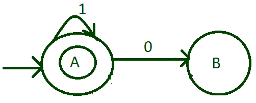
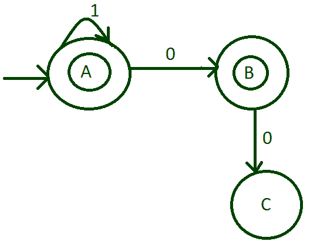
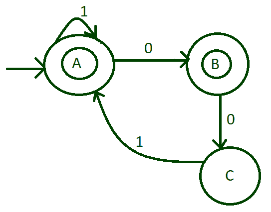
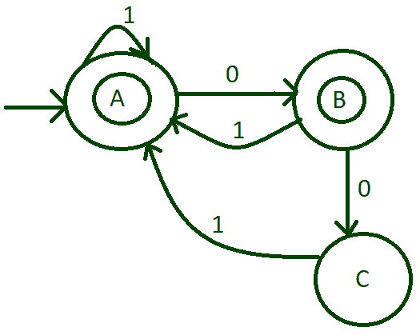
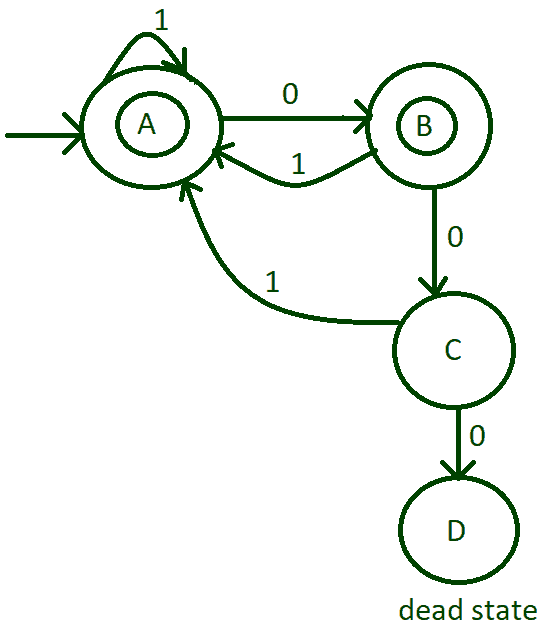
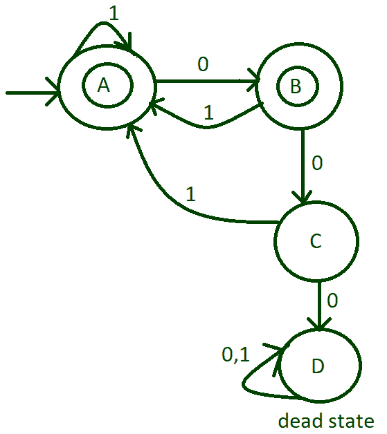
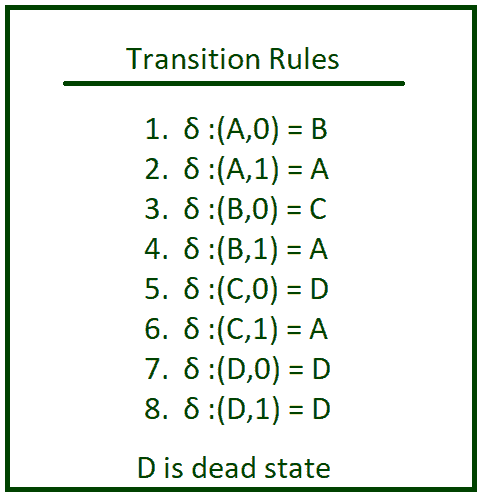

# 设计一个 DFA，每 00 紧跟 1

> 原文:[https://www . geesforgeks . org/design-a-DFA-that-ever-00-紧接着是-1/](https://www.geeksforgeeks.org/design-a-dfa-that-every-00-is-immediately-followed-by-1/)

[DFA 机器](https://www.geeksforgeeks.org/introduction-of-finite-automata/?ref=lbp)被设计成接受特定类型的输入，其输出是通过输入字母表从每个状态的转换而产生的。

**进场:**

*   在这种情况下，除了 3 个以上的零之外，所有字符串都是可以接受的。在这种字符串中，没有三个连续的零是可以接受的。
*   创建初始状态，从最小长度的可能字符串开始，将其输入 0 和 1 转换为可能的状态。
*   根据过渡，注意最终状态并标记它。

**分步设计 DFA:**

**Step-1:**
做一个初始状态，比如说“A”，最小可能的字符串是 1 和 0，也可以是任意数量的 1。为此，将 1 的自循环置于状态“A”，并将输入字母 0 转换到状态“B”。因为只有 1 是可接受的，所以状态“A”也被称为最终状态。

**Step-2:**
由于字符串中的单个零是可以接受的，所以使状态“B”成为最终状态。横断面输入 0 从状态“B”到状态“C”。

**第 3 步:**
由于每 00 紧接着 1，所以现在在状态“C”之后，将输入 1 从状态“C”转换到状态“A”。

**步骤-4:**
我们剩下状态“B”的输入字母表 1 的转换。所以把 1 从状态“B”过渡到状态“A”。

**第 5 步:**
00 后连续不超过零是可以接受的。所以横切状态“C”到死状态“D”的 0。

**第 6 步:**
输入死亡状态的字母 0 和 1 横切死亡状态本身。

**上述 DFA–**
状态“A”既是最终状态也是初始状态，状态“C”是最终状态，状态“D”是死状态。初始状态由— >表示，最终状态标识由*表示。

| 状态 | 输入(0) | 输入(1) |
| --- | --- | --- |
| —>A*(初始和最终状态均为) | B | A |
| B*(最终状态) | C | A |
| C | d(死状态) | A |
| d(死状态) | d(死状态) | d(死状态) |

q ':有限集合集= {A，B，C，D}
输入字母集= {0，1}

转换规则讲述了使用每个输入字母在每个状态下工作的转换函数。