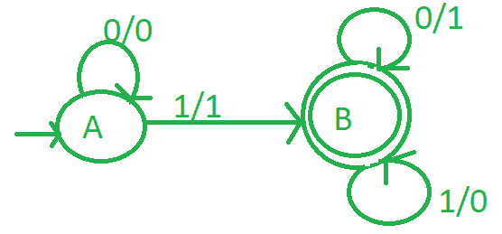

# 为 2 的补码设计一台磨粉机

> 原文:[https://www . geesforgeks . org/design-a-mealy-machine-for-2s-complete/](https://www.geeksforgeeks.org/design-a-mealy-machine-for-2s-complement/)

[Mealy 机器](https://www.geeksforgeeks.org/difference-between-mealy-machine-and-moore-machine/)是一个[有限状态机](https://www.geeksforgeeks.org/introduction-of-finite-automata/)，它的当前状态和当前输入决定了该机器的输出。

[**2 的补码**](https://www.geeksforgeeks.org/1s-2s-complement-binary-number/) **:**
是对二进制数的数学运算。它作为一种有符号数表示方法用于计算。其相对于 2 N 的补码将两者的补码定义为一个 N 位数字。

**逻辑:-**
首先计算二进制数的 1 的补码，将 1 转换为 0，将 0 转换为 1，然后再加 1。例如，如果二进制数是 1011，那么它的 1 的补码是 0100，2 的补码是 0101

**设计磨粉机:**

1.  取初始状态 a。
2.  如果初始状态有 n 个零，它将保持初始状态。
3.  每当找到第一个输入 1 时，它就给出输出 1 并进入状态 b。
4.  在状态 B，如果输入为零，输出将为 1。如果输入为 1，则输出为 0。
5.  然后将状态 B 设置为最终状态。

方法如下:

1.  从右向左开始。
2.  忽略所有 0。
3.  当 1 出现时，忽略它，然后取每个数字的 1 的补码。

**图–**2 进制的粉饼机

**示例-1:**

1.  让我们取 001，我们知道它的 2 的补码是(110+1 = 111)。
2.  所以从右向左扫描。
3.  在状态 A 下，“1”首先进入阶段 B，并在输出中写入 1。
4.  在状态 B 上，将“0”替换为“1”，反之亦然。
5.  最后我们得到了 111 作为输出。
6.  请注意，输出也是按从右到左的顺序打印的。

**示例-2:**

1.  让我们取 01，我们知道它的 2 的补码是(10+1 = 11)。
2.  所以从右向左扫描。
3.  在状态 A 下，“1”首先进入阶段 B，并在输出中写入 1。
4.  在状态 B 上，将“0”替换为“1”，反之亦然。
5.  最后我们得到了 11 作为输出。
6.  请注意，输出也是按从右到左的顺序打印的。