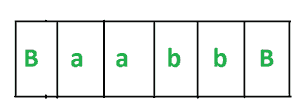
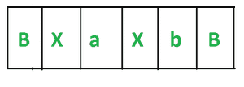
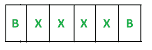
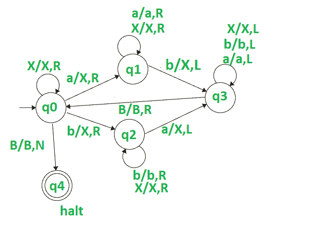

# 为相等数量的 a 和 b 设计图灵机

> 原文:[https://www . geeksforgeeks . org/design-a-turing-machine-for-equal-number-as-and-bs/](https://www.geeksforgeeks.org/design-a-turing-machine-for-equal-number-of-as-and-bs/)

**先决条件–**[图灵机](https://www.geeksforgeeks.org/turing-machine-in-toc/)

**任务:**
我们的任务是为相等数量的 a 和 b 设计一个图灵机。

**分析:**
这里主要要分析的是由相等数量的 a 和 b 组成的字符串可以有 4 种类型–

这里的 n 是 a 或 b 的计数。

```
a) a^n b^n like aabb

b) b^n a^n like bbaa

c) (ab)^n like abab

d) (ba)^n like baba
```

**示例:**

```
Input-1 :  aabb
Output : Yes

Input-2 : bababa
Output : Yes

Input-3 : aabbbb
Output : No

Input-4 : aaabbaa
Output : No
```

**进场:**

*   我们必须从左到右扫描输入。
*   将扫描中的第一个“a”和第一个“b”转换为“X”，然后在第二圈将第二个“a”和第二个“b”转换为“X”等等。我们必须重复这个过程，直到我们把所有的 a 和 b 转换成“X”。
*   在“a”和“b”之间扫描的字符不会改变。

让我们通过使用字符串“aabb”来理解这种方法——

1.  从左侧扫描输入。
2.  Our string looks like this –

    [](https://media.geeksforgeeks.org/wp-content/uploads/20201103192905/Capture1-300x110.PNG)

3.  Now we see that we get our first ‘a’ at the first position and first b in the third position. We convert these ‘a’ and ‘b’ to ‘X’.

    现在角色“a”我们介于“a”和“b”之间。所以它将保持不变。当我们读第一个 b 时，我们把指针向左移动。指针将向左移动，直到变成空白。现在我们的字符串看起来像这样–

    [](https://media.geeksforgeeks.org/wp-content/uploads/20201103193145/Capture2-300x108.PNG)

4.  Our pointer is at Blank(B). We again scan the input from left to right and convert second ‘a’ and second ‘b’ to ‘X’. When we read our second b we move our pointer to left. The pointer will move to the left until it gets a Blank(B). Now our string looks like this –

    [](https://media.geeksforgeeks.org/wp-content/uploads/20201103193509/Capture3-300x100.PNG)

5.  我们重复这个过程，直到所有的 a 和 b 都转换成 x。
6.  正如我们看到的，我们把所有的 a 和 b 转换成“X”。因此我们的机器将停止运转。
7.  当我们分析这个过程时，我们看到我们成对地将 a 和 b 转换成 X，即在第 3 点，我们将 a 和 b 的第一个出现转换成 X，然后在第 4 点，我们将 a 和 b 的第二个出现转换成 X。如果 a 和 b 的数量不等，那么在这种情况下，一些 a 或 b 将留在 ou 字符串中， 否则，所有的字符都将被转换成 x。因此，它会给我们一个点来证明我们的条件，即我们的字符串由相等数量的 a 和 b 组成。

**图灵机:**
[](https://media.geeksforgeeks.org/wp-content/uploads/20201103194032/article91.PNG)