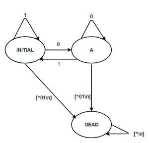

# 在 LEX 代码中设计 DFA，该代码接受输入字母表{0，1}

上具有偶数二进制数的字符串

> 原文:[https://www . geesforgeks . org/design-DFA-in-lex-code-accept-the-string-having-binary-number-over-input-alphabet-01/](https://www.geeksforgeeks.org/design-dfa-in-lex-code-that-accepts-the-string-having-even-binary-number-over-input-alphabet-01/)

**问题概述–**
在 LEX 代码中设计一个 DFA，它接受输入字母表{0，1}上具有偶数二进制数的字符串。

**示例–**

```
Input : 1010
Output: Accepted

Input : 1001
Output: Not Accepted

Input: 23ab
Output:Invalid

Input:ab345
Output:Invalid

Input:010101
Output:Not Accepted
```

**方法:**
LEX 默认为我们提供一个 INITIAL 状态。所以要做一个 DFA，用这个作为 DFA 的初始状态。我们定义了另外两种状态:A 和 DEAD，如果遇到错误或无效的输入，将使用 DEAD 状态。当用户输入无效字符时，移动到“死亡”状态，然后打印“无效”。如果输入字符串以 A 结尾，则显示消息“已接受”。否则，如果输入字符串在初始状态结束，则显示消息“不接受”。



**注意–**
要编译 lex 程序，我们需要一个安装了 flex 的 Unix 系统。然后我们需要用。l 分机。
例如- filename.l
然后在保存程序后关闭 lex 文件，然后打开终端，写下如下命令。

```
lex filename.l
cc lex.yy.c
./a.out
```

**LEX CODE :**

```
%{
%}

%s A DEAD

%%
<INITIAL>0 BEGIN A;
<INITIAL>1 BEGIN INITIAL;
<INITIAL>[^01\n] BEGIN DEAD;
<INITIAL>\n BEGIN INITIAL; {printf("Not Accepted\n");}

<A>0 BEGIN A;
<A>1 BEGIN INITIAL;
<A>[^01\n] BEGIN DEAD;
<A>\n BEGIN INITIAL; {printf("Accepted\n");}

<DEAD>[^\n] BEGIN DEAD;
<DEAD>\n BEGIN INITIAL; {printf("Invalid\n");} 

%%

int yywrap()
{
    return 1;
}  
int main()
{
    printf("Enter String\n");
    yylex();
return 0;
}
```

**输出:**

```
Enter String
1100
Accepted
1010
Accepted
0001
Not Accepted
abc
Invalid
0101
Not Accepted
```