# 从正则表达式设计有限自动机

> 原文:[https://www . geesforgeks . org/design-有限自动机-from-正则表达式/](https://www.geeksforgeeks.org/design-finite-automata-from-regular-expressions/)

**先决条件–**[<u>有限自动机</u>](https://www.geeksforgeeks.org/toc-finite-automata-introduction/) 、 [<u>正则表达式、语法</u>](https://www.geeksforgeeks.org/regular-expressions-regular-grammar-and-regular-languages/) 、 [<u>和语言</u>](https://www.geeksforgeeks.org/regular-expressions-regular-grammar-and-regular-languages/) <u>。</u>

在本文中，我们将看到一些流行的正则表达式，以及如何将它们转换为 [有限自动机(NFA 和 DFA)](https://www.geeksforgeeks.org/introduction-of-finite-automata/) 。我们一个一个来讨论。

**概述:**
让 a 和 b 为输入符号，r 为正则表达式。现在我们必须为每个正则表达式设计 NFA 和 DFA。

**从正则表达式设计有限自动机:**
在这里，我们将讨论从正则表达式设计有限自动机如下。

**情况-1 :**
当 r =φ时，那么 FA 会如下。


**情况-2 :**
当 **r = ε** 时，那么 FA 会如下。


**情况-3 :**
当 **r = a** 时，那么 FA 会如下。


**情况-4 :**
当 **r = a+b** 时，那么 FA 会如下。


**情况-5 :**
当 **r = r = a <sup>*</sup>** 时，那么 FA 会如下。


**情况-6 :**
当 **r = a* + b*** 时，那么 FA 会如下。


**情况-7 :**
当 **r = (ab)*** 时，那么 FA 会如下。

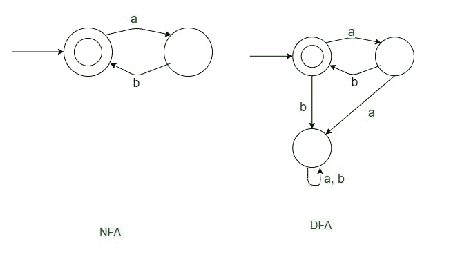

**情况-8 :**
当 **r = (ab)*b** 时，那么 FA 会如下。

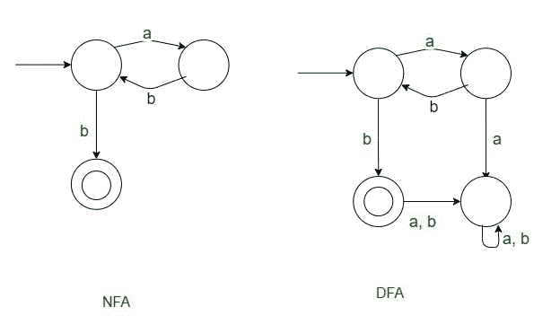

**情况-9 :**
当 **r = (ab)*a** 时，那么 FA 会如下。

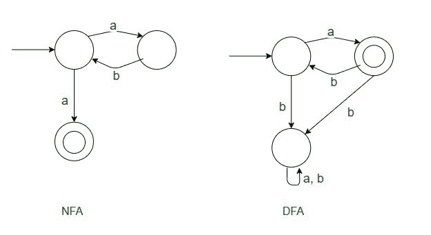

**情况-10 :**
当 **r = a*b*** 时，那么 FA 会如下。

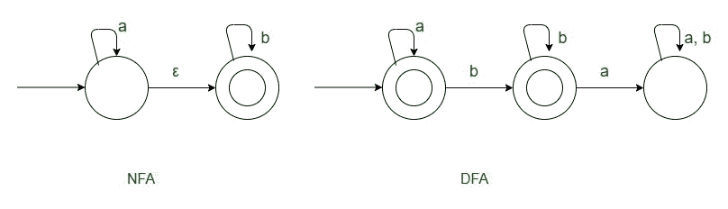

**情况-11 :**
当 **r = (a+b)*** 时，那么 FA 会如下。


**一元设计:**
让 a 为输入符号，r 为正则表达式。对于每个正则表达式，我们将设计有限自动机。

**案例-1 : r = a***

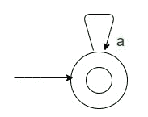

**Case-2 : r = (aa)***

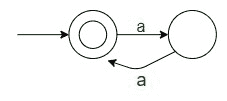

**案例-3 : r = (aa)*a**

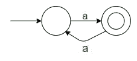

**病例-4 : r = aaaa***

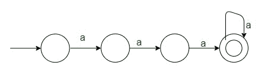

**Case-5:****r =(aa+AAA)***

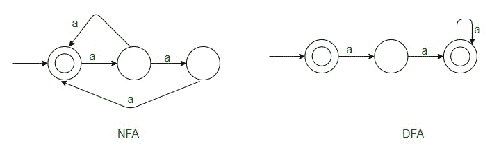

**Case-6:r =(AAA+AAAA)***

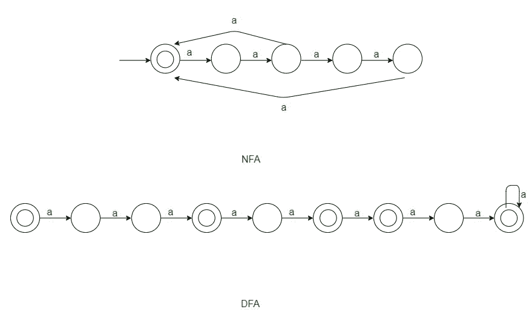

**Case-7:r =(aa+AAA)***
它是 1 项的倍数即 aa，所以可以化简为 r=(aa)*。


```
L= {a<sup>n</sup> | n = 7x+12, x €  Z, x >=0 }
```

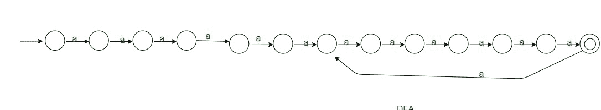

**通用方法:**
在这里，我们将讨论一些通用的方法如下。

**法-1 :**

```
**L = { a<sup>K</sup><sub><sup>1</sup></sub><sup>n+K</sup><sub><sup>2</sup></sub> ; n>=0 }**
```

If K<sub>1</sub>T34】K<sub>2</sub>状态数=<sub>T6】K<sub>1</sub>T9
T11】If K<sub>1</sub>T35】K<sub>2</sub>状态数=<sub>T17】K<sub>2</sub>+1</sub></sub>T21If K<sub>1</sub>= K【T25

**法-2 :**

```
**L = { a<sup>Kn</sup>; n>0 , K is a fixed integer }**
```

= { a<sup>Kn</sup>；n > =1。K 为整数}
状态数= K +1

**法-3 :**

```
**L = { a<sup>Kn</sup>; n>=0 , K is a fixed integer }**
```

此处，残数即 K <sub>2</sub> =0，K<sub>1</sub>T14【K<sub>2。</sub>因此<sub>、</sub>状态数= K