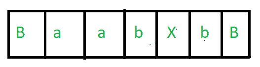
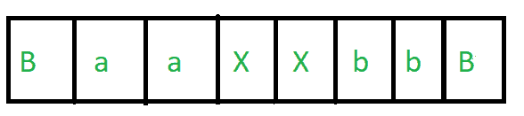
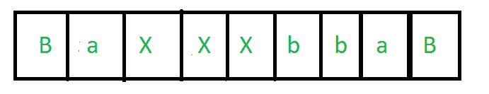
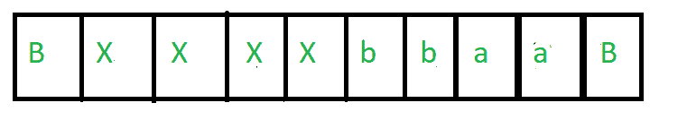
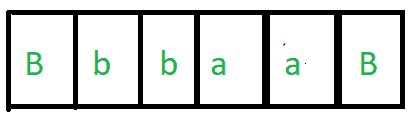
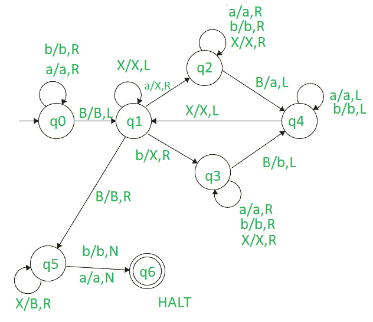

# 设计图灵机反转由 a 和 b 组成的字符串

> 原文:[https://www . geesforgeks . org/design-turing-machine-to-reverse-string-由 as-and-bs 组成/](https://www.geeksforgeeks.org/design-turing-machine-to-reverse-string-consisting-of-as-and-bs/)

**先决条件:**T2】图灵机

**任务:**
我们的任务是设计一个图灵机来反转由 a 和 b 组成的字符串。

**示例:**

```
Input-1 : aabb
Output-1 : bbaa

Input-2 : abab
Output-2 : baba
```

**做法:**
基本思路是从右向左读输入，用字母表替换 Blank(B)，用‘X’替换字母表。当我们读完所有的 a 和 B，用空白替换所有的 X，我们就得到所需的字符串。

让我们以“aabb”为例来理解这种方法。

1.  The first task is that we have to take our pointer to the right so that we can read our string from right to left. To do that we read all the a’s and b’s from left to right and when we get first Blank(B) we turn the pointer to left and we get the rightmost character.
2.  Now there will be two cases –
    *   我们得到的字符是“a”。
    *   我们得到的字符是“b”。
3.  In this example we get our first character as ‘b’ i.e the last character of aabb. We replace b with ‘X’ and make Blank(B). An extra Blank will automatically append at the end. Our string looks like this –

    [](https://media.geeksforgeeks.org/wp-content/uploads/20201020211859/pic1.PNG) 

4.  Now we have to get our second character. For that, we move the pointer from right to left and move it until we get an ‘a’ or’b’ after ‘X’. In this case, we get ‘b’. Now we repeat the same task, i.e. we replace that ‘b’ with X and move the pointer from that position to right until we get a Blank(B). When we get a Blank(B) we replace it with the character we get in this case ‘b’ and a Black(B) will automatically append at the end. Our string looks like this –

    [](https://media.geeksforgeeks.org/wp-content/uploads/20201020212137/pic2.PNG) 

5.  Now we have to get or the third character. For that, we move the pointer from right to left and move it until we get an ‘a’ or’b’ after ‘X’. In this case, we get ‘a’. Now we repeat the same task, i.e. we replace that ‘a’ with X and move the pointer from that position to right until we get a Blank(B). When we get a Blank(B) we replace it with the character we get in this case ‘a’ and a Black(B) will automatically append at the end. Our string looks like this –

    [](https://media.geeksforgeeks.org/wp-content/uploads/20201020212512/pic3.PNG) 

6.  Similarly we get our last character which is ‘a’ and we perform the same task as describe in the above steps. Our string will look like this –

    [](https://media.geeksforgeeks.org/wp-content/uploads/20201020212743/pic4.PNG) 

7.  Now we have seen that we have traversed all the four-character and we get the character in order “bbaa” which is reverse of “aabb” i.e. after removing all the ‘X’ we get our required string.
8.  为了去掉所有的“X”，我们将所有的“X”替换为空白(B)，即在替换“X”后，我们得到 4 个空白(B)，相当于一个空白(B)。意味着我们得到了最后的线索。

[](https://media.geeksforgeeks.org/wp-content/uploads/20201020213008/pic5.PNG) 

**图灵机:**

