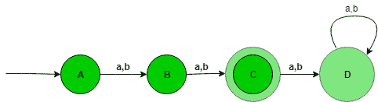
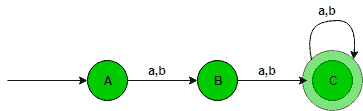
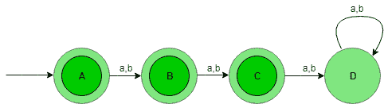

# 设计确定性有限自动机(集合 1)

> 原文:[https://www . geeksforgeeks . org/design-design-determinative-有限自动机-set-1/](https://www.geeksforgeeks.org/designing-deterministic-finite-automata-set-1/)

先决条件–[设计有限自动机](https://www.geeksforgeeks.org/designing-finite-automata-from-regular-expression/)
在本文中，我们将看到确定性有限自动机(DFA)的一些设计。

**问题-1:** 为{a，b}上的字符串集构造一个 DFA，使得字符串的长度|w|=2，即字符串的长度正好是 2。

**解释–**想要的语言应该是:

```
L = {aa, ab, ba, bb} 
```

该语言的状态转换图如下所示:



这里，
状态 A 表示长度为零(0)所有串的集合，状态 B 表示长度为一(1)的所有串的集合，状态 C 表示长度为二(2)的所有串的集合。状态 C 是最终状态，D 是死状态，因为在输入任何字母后，它永远不会进入最终状态。

```
Number of states: n+2
Where n is |w|=n 
```

上面的自动机将接受字符串长度正好为 2 的所有字符串。当字符串的长度为 1 时，则从状态 A 进入状态 B，当字符串的长度为 2 时，则从状态 B 进入状态 C，当字符串的长度大于 2 时，则从状态 C 进入状态 D (Dead 状态)，之后从状态 D 进入状态 D 本身。

```
#check string in
#in state A
def checkStateA(n):

    #if length of
    #string is one
    #print not accepted
    if(len(n)==1):
        print("string not accepted")
    else:   
        #pass string to stateB to
        #to check further transitions
        if(n[0]=='a' or n[0]=='b'):
            stateB(n[1:])

def stateB(n):
    #here if length 
    #is not 1 print#string not accepted
    if(len(n)!=1):
        print("string not accepted")
    else:
        #else pass string 
        #to state c
        stateC(n[1:])
def stateC(n):
    #here if length 
    #becomes zero
    #print accepted
    #else not accepted
    if (len(n)==0):
        print("string accepted")
    else:
        print("string not accepted")

#take input    
n=input()
checkStateA(n)
```

**问题-2:** 为{a，b}上的字符串集构造一个 DFA，使得字符串的长度|w| > =2，即字符串的长度至少应为 2。

**解释–**想要的语言应该是:

```
L = {aa, ab, ba, bb, aaa, aab, aba, abb........} 
```

该语言的状态转换图如下所示:



这里，
状态 A 表示长度为零(0)的所有刺的集合，状态 B 表示长度为一(1)的所有刺的集合，状态 C 表示长度为二(2)的所有刺的集合。

```
Number of states: n+1
Where n is |w|>=n 
```

上述自动机将接受字符串长度至少为 2 的所有字符串。当字符串的长度为 1 时，它将从状态 A 进入状态 B，当字符串的长度为 2 时，它将从状态 B 进入状态 C，最后当字符串的长度大于 2 时，它将从状态 C 进入状态 C 本身。

```
#check string in
#in state A
def checkStateA(n):

    #if length of
    #string is one
    #print not accepted
    if(len(n)==1):
        print("string not accepted")
    else:   
        #pass string to stateB to
        #to check further transitions
        if(n[0]=='a' or n[0]=='b'):
            stateB(n[1:])

def stateB(n):

    #here if length 
    #is less than 1 
    #printstring not accepted
    if(len(n)<1):
        print("string not accepted")
    else:

        #else pass string 
        #to state c
        stateC(n[1:])

def stateC(n):
    #here if length of string 
    #is greater than equal to zero
    #print accepted
    #else not accepted
    if (len(n)>=0):
        print("string accepted")
    else:
        print("string not accepted")

#take input    
n=input()
checkStateA(n)
```

**问题-3:** 为{a，b}上的字符串集构造一个 DFA，使得字符串的长度|w| < =2，即字符串的长度为 atmost 2。

**解释–**想要的语言应该是:

```
L = {?, aa, ab, ba, bb} 
```

该语言的状态转换图如下所示:



这里，
状态 A 表示长度为零(0)的所有刺的集合，状态 B 表示长度为一(1)的所有刺的集合，状态 C 表示长度为二(2)的所有刺的集合，状态 A、B、C 是最终状态，D 是死状态，之所以如此，是因为在获得任何字母表作为输入之后，它将永远不会进入最终状态。

```
Number of states: n+2
Where n is |w|<=n 
```

上述自动机将接受字符串长度最多为 2 的所有字符串。当字符串的长度为 1 时，它将从状态 A 变为状态 B。当字符串的长度为 2 时，它将从状态 B 变为状态 C。最后，当字符串的长度大于 2 时，它将从状态 C 变为状态 D(死状态)。

```
#check string in
#in state A
def checkStateA(n):

    #if only two transition occurs 
    #then print string accepted

    if(n[0]=='a' or n[0]=='b'):
        stateB(n[1:])

def stateB(n):

    #if length is 0 
    #print accepted
    if(len(n)==0):
        print("string accepted")
    else:
        stateC(n[1:])

def stateC(n):
    #if length is 0 
    #print accepted
    #else not accepted
    if (len(n)==0):
        print("string sccepted")
    else:
        print("string not accepted")

#take input    
n=input()
checkStateA(n)
```