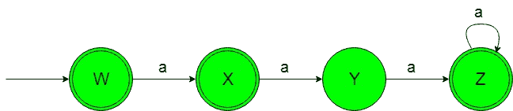
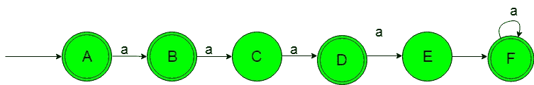

# 设计确定性有限自动机(集合 10)

> 原文:[https://www . geesforgeks . org/design-design-determinal-有限自动机-set-10/](https://www.geeksforgeeks.org/designing-deterministic-finite-automata-set-10/)

**先决条件:** [设计有限自动机](https://www.geeksforgeeks.org/designing-finite-automata-from-regular-expression/)
在本文中，我们将看到确定性有限自动机(DFA)的一些设计。
**问题-1:** 构造{a}上接受字符串的最小 DFA 集合，其中{a <sup>n</sup> | n≥0，n≠2，即‘n’应大于 0 且不等于 2}。
**解释:**想要的语言会像:

```
L1 = {ε, a, aaa, aaaa, aaaaa, ..................}
```

这里，ε被视为字符串，因为“n”的值大于或等于零，其余字符串的“a”是任何正自然数的幂，但不是 2。
下面的语言不被这个 DFA 接受，因为有些包含‘a’的字符串的 2 次方。

```
L2 = {aa, aaaaa, ..........}
```

这种语言 L2 不被所需的 DFA 接受，因为它的字符串包含 2 的幂“a”。
所需语言的状态转换图如下:



在上面的 DFA 中，当获得“a”作为输入时，初始和最终状态“w”转变为最终状态“X”。获得“a”作为输入时的最终状态“X”转变为状态“Y”。当得到“a”作为输入时，状态“Y”转变为最终状态“Z”，当得到任意数量的“a”时，它保持在自身状态。

### Python 实现:

## 蟒蛇 3

```

def stateW(n):
    #if length of n become 0
    #then print accepted
    if(len(n)==0):
        print("string accepted")

    else:
        #if at zero index
        #'a' found call
        #stateX function   
        if (n[0]=='a'):
            stateX(n[1:])

def stateX(n):
    #if length of n become 0
    #then print accepted
    if(len(n)==0):
        print("string accepted")

    else: 
        #if at zero index
        #'a' found call
        #stateY function   
        if (n[0]=='a'):
            stateY(n[1:])

def stateY(n):
    #if length of n become 0
    #then print not accepted
    if(len(n)==0):
        print("string not accepted")

    else:
        #if at zero index
        #'a' found call
        #stateZ function   
        if (n[0]=='a'):
            stateZ(n[1:])

def stateZ(n):
    #if length of n become 0
    #then print accepted
    if(len(n)==0):
        print("string accepted")

    else:
        #if at zero index
        #'a' found call
        #stateZ function   
        if (n[0]=='a'):
            stateZ(n[1:])

#take input
n=input()

#call stateW function
#to check the input
stateW(n)
```

**问题-2:** 构造{a}上的最小 DFA 接受串集，其中{a <sup>n</sup> | n≥0，n≠2，n≠4，即‘n’应大于 0 且不等于 2 和 4}。
**解释:**想要的语言会像:

```
L1 = {ε, a, aa, aaaaa, aaaaaa, .................. }
```

这里，ε被视为字符串，因为“n”的值大于或等于零，其余字符串的“a”是任何正自然数的幂，但不是 2 和 4。
下面的语言不被这个 DFA 接受，因为有些包含‘a’的字符串是 2 和 4 的幂。

```
L2 = {aa, aaaaa, aaaaaaaaaa, ............. }
```

所需语言的状态转换图如下所示:



在上面的 DFA 中，当得到“A”作为输入时，初始和最终状态“A”转变为最终状态“B”。当得到“a”作为输入时，最终状态“B”转变为状态“C”。获得“a”作为输入时的状态“C”会转变为最终状态“D”。当输入为“a”时，最终状态“D”转变为状态“E”。获得“a”作为输入时的状态“E”转变为最终状态“F”。最后的状态‘F’在得到‘a’作为输入时它保持在自身的状态。

### Python 实现:

## 蟒蛇 3

```

def stateA(n):
    #if length of n become 0
    #then print accepted
    if(len(n)==0):
        print("string accepted")

    else:
        #if at zero index
        #'a' found call
        #stateB function   
        if (n[0]=='a'):
            stateB(n[1:])

def stateB(n):
    #if length of n become 0
    #then print accepted
    if(len(n)==0):
        print("string accepted")

    else: 
        #if at zero index
        #'a' found call
        #stateC function   
        if (n[0]=='a'):
            stateC(n[1:])

def stateC(n):
    #if length of n become 0
    #then print not accepted
    if(len(n)==0):
        print("string not accepted")

    else:
        #if at zero index
        #'a' found call
        #stateD function   
        if (n[0]=='a'):
            stateD(n[1:])

def stateD(n):
    #if length of n become 0
    #then print accepted
    if(len(n)==0):
        print("string accepted")

    else:
        #if at zero index
        #'a' found call
        #stateE function   
        if (n[0]=='a'):
            stateE(n[1:])

def stateE(n):
    #if length of n become 0
    #then print not accepted
    if(len(n)==0):
        print("string not accepted")

    else:
        #if at zero index
        #'a' found call
        #stateF function   
        if (n[0]=='a'):
            stateF(n[1:])

def stateF(n):
    #if length of n become 0
    #then print accepted
    if(len(n)==0):
        print("string accepted")

    else:
        #if at zero index
        #'a' found call
        #stateF function   
        if (n[0]=='a'):
            stateF(n[1:])           

#take input
n=input()

#call stateA function
#to check the input
stateA(n)
```