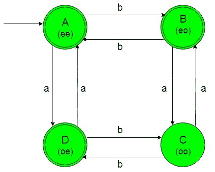

# 设计确定性有限自动机(集合 11)

> 原文:[https://www . geesforgeks . org/design-design-determinal-有限自动机-set-11/](https://www.geeksforgeeks.org/designing-deterministic-finite-automata-set-11/)

**先决条件:** [设计有限自动机](https://www.geeksforgeeks.org/designing-finite-automata-from-regular-expression/)
在本文中，我们将看到一个确定性有限自动机(DFA)的设计。

**问题:**构造{a，b}上接受字符串集合的最小 DFA，其中 Number of a(w) mod 2 = 0 或 Number of b(w) mod 2 = 0，即‘a’的个数应可被 2 整除或‘b’的个数应可被 2 整除或两者均可被 2 整除，其中‘w’是{a，b}上的任意字符串。

**解释:**想要的语言会是这样的:

```
L1 = {ε, aa, aabb, aab, bb, bba, ...........}
```

在这里，我们可以看到，上述语言的每个字符串都满足给定问题的条件，即这里ε被接受，因为“a”和“b”的数量都为零，其余字符串的“a”可以被 2 整除，或者“b”可以被 2 整除，或者两者都可以被 2 整除。

但是下面的语言不被这个 DFA 接受，因为它的字符串不满足给定问题的条件。

```
L2 = {ba, bbba, baaa, ..............}
```

这里我们可以看到，上述语言的字符串没有一个满足给定问题的条件，即‘a’或‘b’或两者都不能被 2 整除。

所需语言的状态转换图如下:

在上面的 DFA 中，每个状态都有一个状态名为“A”，在它的正下方有一个(ee)，表示“A”的数字是偶数(e)，而“b”的数字也是偶数(e)。对于“B”这样的州名，在它的正下方有一个(eo)，表示“a”的数字是偶数(e)，而“B”的数字是奇数(o)等等。

*   初始和最终状态“A”在作为输入获得“A”时转变为最终状态“D”，在作为输入获得“B”时转变为另一个最终状态“B”。
*   当输入为“A”时，最终状态“B”转变为状态“C”，当输入返回初始状态“A”时，最终状态“B”。
*   另一个最终状态“D”在获得“b”作为输入时转变为状态“C”，在获得“A”作为输入时返回初始状态“A”。
*   状态“C”在获得“B”作为输入时转换到最终状态“D”，在获得“a”作为输入时返回到状态“B”。

### Python 实现:

```
def stateA(n):
    #if length of n become 0 
    #then print accepted
    if(len(n)==0):
        print("string accepted")

    else: 
        #if at zero index 
        #'a' found call
        #stateD function    
        if (n[0]=='a'):
            stateD(n[1:])

        #if at zero index 
        #'b' found call
        #stateB function    
        elif (n[0]=='b'):
            stateB(n[1:])    

def stateB(n):
    #if length of n become 0 
    #then print accepted
    if(len(n)==0):
        print("string accepted")

    else:  
        #if at zero index 
        #'a' found call
        #stateC function    
        if (n[0]=='a'):
            stateC(n[1:])

        #if at zero index 
        #'b' found call
        #stateA function    
        elif (n[0]=='b'):
            stateA(n[1:])    

def stateC(n):
    #if length of n become 0 
    #then print not accepted
    if(len(n)==0):
        print("string not accepted")

    else:
        #if at zero index 
        #'a' found call
        #stateB function    
        if (n[0]=='a'):
            stateB(n[1:])

        #if at zero index 
        #'b' found call
        #stateD function    
        elif (n[0]=='b'):
            stateD(n[1:])    

def stateD(n):
    #if length of n become 0 
    #then print accepted
    if(len(n)==0):
        print("string accepted")

    else: 
        #if at zero index 
        #'a' found call
        #stateA function    
        if (n[0]=='a'):
            stateA(n[1:])

        #if at zero index 
        #'b' found call
        #stateC function    
        elif (n[0]=='b'):
            stateC(n[1:])    

#take input
n=input()

#call stateA function
#to check the input
stateA(n)
```