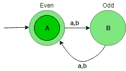
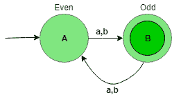
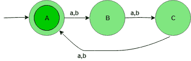
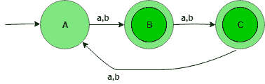

# 设计确定性有限自动机(集合 2)

> 原文:[https://www . geesforgeks . org/design-design-determinal-有限-automat-set-2/](https://www.geeksforgeeks.org/designing-deterministic-finite-automata-set-2/)

先决条件–[设计有限自动机](https://www.geeksforgeeks.org/designing-finite-automata-from-regular-expression/)，前一篇:[设计确定性有限自动机(集 1)](https://www.geeksforgeeks.org/toc-designing-deterministic-finite-automata-set-1/)
在本文中，我们将看到确定性有限自动机(DFA)的一些设计。

**问题-1:** 构造{a，b}上的字符串集合的 DFA，使得字符串|w|的长度可被 2 整除，即|w| mod 2 = 0。

**解释–**想要的语言应该是:

```
L = {?, aa, ab, ba, bb, aaaa, bbbb, ............} 
```

该语言的状态转换图如下所示:


这里，状态 A 表示长度为偶数(0，2，4，…)所有串的集合，状态 B 表示长度为奇数(1，3，5，…)的所有串的集合。

```
Number of states: n
If |W| mod n = 0 
```

```
def stateA(n):
    if(len(n)==0):
        print("Accepted")
    else:  

        #on any input call function stateB
        if (n[0]=='0' or n[0]=='1'):
            stateB(n[1:])

def stateB(n):
    if(len(n)==0):
        print("Not Accepted")
    else:

         #on any input call function stateA
        if (n[0]=='0' or n[0]=='1'):
            stateA(n[1:])        

#take input
n=input()

#call stateA
#to check the input
stateA(n)
```

上面的自动机将接受所有长度可被 2 整除的字符串。当字符串的长度为 1 时，那么它将从状态 A 进入状态 B，当字符串的长度为 2 时，那么它将从状态 B 进入状态 A，以此类推。状态 A 是最终状态，即它接受所有长度可被 2 整除的字符串。

**问题-2:** 为{a，b}上的字符串集构造 DFA，使得字符串|w|的长度不能被 2 整除，即|w| mod 2 = 1。

**解释–**想要的语言应该是:

```
L = {a, b, aaa, aab, aba, abb, aaaaa, bbbb, .......} 
```

该语言的状态转换图如下所示:


这里，状态 A 表示长度为偶数(0，2，4，…)所有串的集合，状态 B 表示长度为奇数(1，3，5，…)的所有串的集合。

```
def stateA(n):
    if(len(n)==0):
        print("Not Accepted")
    else:  

        #on any input call function stateB
        if (n[0]=='0' or n[0]=='1'):
            stateB(n[1:])

def stateB(n):
    if(len(n)==0):
        print("Accepted")
    else:

         #on any input call function stateA
        if (n[0]=='0' or n[0]=='1'):
            stateA(n[1:])        

#take input
n=input()

#call stateA
#to check the input
stateA(n)
```

上述自动机将接受字符串长度不能被 2 整除的所有字符串。当字符串的长度为 1 时，那么它将从状态 A 进入状态 B，当字符串的长度为 2 时，那么它将从状态 B 进入状态 A，以此类推。状态 B 是最终状态，即它接受所有长度不能被 2 整除的字符串。

**问题-3:** 为{a，b}上的字符串集构造 DFA，使得字符串|w|的长度可被 3 整除，即|w| mod 3 = 0。

**解释–**想要的语言应该是:

```
L = {?, aaa, aab, aba, abb, aaaaaa, bbbbbb, .......} 
```

该语言的状态转换图如下所示:


这里，状态 A 表示字符串长度除以 3 后余数为零(0)的集合，状态 B 表示字符串长度除以 3 后余数为 1(1)的集合，状态 C 表示字符串长度除以 3 后余数为 2(2)的集合。

```
Number of states: n
If |W| mod n = 0 
```

```
def stateA(n):
    if(len(n)==0):
        print("Accepted")
    else:  

        #on any input call function stateB
        if (n[0]=='0' or n[0]=='1'):
            stateB(n[1:])

def stateB(n):
    if(len(n)==0):
        print("Not Accepted")
    else:

         #on any input call function stateC
        if (n[0]=='0' or n[0]=='1'):
            stateC(n[1:])  

def stateC(n):
    if(len(n)==0):
        print("Not Accepted")
    else:

         #on any input call function stateA
        if (n[0]=='0' or n[0]=='1'):
            stateA(n[1:])              

#take input
n=input()

#call stateA
#to check the input
stateA(n)
```

上面的自动机将接受所有长度可被 3 整除的字符串。当字符串的长度为 1 时，它将从状态 A 进入状态 B，当字符串的长度为 2 时，它将从状态 B 进入状态 C，当字符串的长度为 3 时，它将从状态 C 进入状态 A(最终状态)。状态 A 是最终状态，即它接受所有长度可被 3 整除的字符串。

**问题-4:** 为{a，b}上的字符串集构造 DFA，使得字符串|w|的长度不能被 3 整除，即|w| mod 3 = 1。

**解释–**想要的语言应该是:

```
L = {a, b, aa, ab, ba, bb, aaaa, bbbb, ........} 
```

该语言的状态转换图如下所示:


这里，状态 A 表示字符串长度除以 3 后余数为零(0)的集合，状态 B 表示字符串长度除以 3 后余数为 1(1)的集合，状态 C 表示字符串长度除以 3 后余数为 2(2)的集合。

```
def stateA(n):
    if(len(n)==0):
        print("Not Accepted")
    else:  

        #on any input call function stateB
        if (n[0]=='0' or n[0]=='1'):
            stateB(n[1:])

def stateB(n):
    if(len(n)==0):
        print("Accepted")
    else:

         #on any input call function stateC
        if (n[0]=='0' or n[0]=='1'):
            stateC(n[1:])  

def stateC(n):
    if(len(n)==0):
        print("Not Accepted")
    else:

         #on any input call function stateA
        if (n[0]=='0' or n[0]=='1'):
            stateA(n[1:])              

#take input
n=input()

#call stateA
#to check the input
stateA(n)
```

上述自动机将接受字符串长度不能被 3 整除的所有字符串。当字符串的长度为 1 时，它将从状态 A 进入状态 B，当字符串的长度为 2 时，它将从状态 B 进入状态 C，当字符串的长度为 3 时，它将从状态 C 进入状态 A，状态 B 和 C 是最终状态，即它接受所有长度不能被 3 整除的字符串。