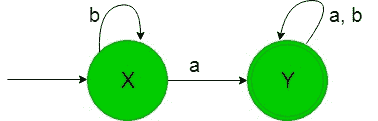
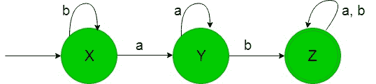

# 设计确定性有限自动机(集合 3)

> 原文:[https://www . geeksforgeeks . org/design-design-determinative-有限自动机-set-3/](https://www.geeksforgeeks.org/designing-deterministic-finite-automata-set-3/)

先决条件:[设计有限自动机](https://www.geeksforgeeks.org/designing-finite-automata-from-regular-expression/)、[设计确定性有限自动机(集合 2)](https://www.geeksforgeeks.org/toc-designing-deterministic-finite-automata-set-2/)
在本文中，我们将看到确定性有限自动机(DFA)的一些设计。

**问题-1:** 在{a，b}上构造一个接受字符串集的最小 DFA，其中每个字符串包含“a”作为子字符串。

**解释:**
想要的语言会像:

```
L1 = {a, aa, ab, ba, ..............}
```

这里我们可以看到，语言的每个字符串都包含“a”作为子字符串，但是下面的语言不被这个 DFA 接受，因为下面语言的一些字符串不包含“a”作为子字符串。

```
L2 = {b, bb, bbb, ..............}
```

包含“a”作为子串的语言的状态转换图将类似于:



在上面的 DFA 中，状态‘X’和‘Y’分别是初始状态和最终状态，它接受所有包含‘a’的字符串作为子串。这里我们看到，当输入为“b”时，它本身保持在“X”的状态，但是当输入为“a”时，它转换到最终状态“Y”，因此这样的字符串被上面的 DFA 接受。

**问题-2:** 在{a，b}上构造一个接受字符串集的最小 DFA，其中每个字符串包含' ab '作为子字符串。

**解释:**想要的语言会像:

```
L1 = {ab, aab, abb, bab, ..............}
```

这里我们可以看到，语言的每个字符串都包含‘ab’作为子串，但是下面的语言不被这个 DFA 接受，因为下面语言的一些字符串不包含‘ab’作为子串-

```
L2 = {aba, bba, bbbaaa, ..............}
```

包含“ab”作为子串的语言的状态转换图将类似于:



在上面的 DFA 中，状态‘X’和‘Z’分别是初始状态和最终状态，它接受所有包含‘ab’的字符串作为子串。在这里，我们看到，在获得“b”作为输入时，它保持在初始状态本身的状态，在获得“a”作为输入时，它转换到状态“Y”，然后在获得“b”时，它最终转换到最终状态“Z”，因此这个 DFA 接受所有包含“ab”作为子串的语言。