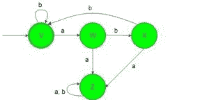
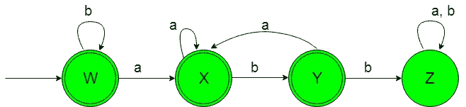

# 设计确定性有限自动机(集合 5)

> 原文:[https://www . geeksforgeeks . org/design-design-determinative-有限自动机-set-5/](https://www.geeksforgeeks.org/designing-deterministic-finite-automata-set-5/)

**先决条件:** [设计有限自动机](https://www.geeksforgeeks.org/designing-finite-automata-from-regular-expression/)
在本文中，我们将看到确定性有限自动机(DFA)的一些设计。

**问题-1:** 在{a，b}上构造一个接受字符串集的最小 DFA，其中每个“a”后面跟一个“bb”。
**解释:**想要的语言会是这样的:

```
L1 = {ε, abb, abbabb, bbbbabb, abbabbabbabbabbbb, ..............}
```

在这里我们可以看到，包含“a”的语言的每个字符串后面都是“bb”，但是下面的语言不被这个 DFA 接受，因为下面语言的一些字符串不包含“a”后面是“bb”。

```
L2 = {ba, baab, bbaba, ..............}
```

包含“a”后面紧跟“bb”的语言的状态转换图将类似于:

在上面的 DFA 中， 状态“V”也是初始和最终状态，当获得“b”作为输入时，它保持自身状态，当获得“a”作为输入时，它过渡到正常状态“W”，当获得“a”作为输入时，它过渡到死状态“Z”，当获得“b”作为输入时，它过渡到正常状态“X”，当获得“b”作为输入时，它过渡到最终状态“V”，当获得“a”作为输入时，它过渡到相同的死状态“Z”。 状态“Z”被称为死状态，因为一旦获得任何输入，它就不能过渡到任何最终状态。

**问题-2:** 在{a，b}上构造一个接受字符串集的最小 DFA，其中每个“a”后面都不跟“bb”。
**解释:**想要的语言会是这样的:

```
L1 = {ε, a, aa, aabaa, b, bb, bbbbba, ..............}
```

在这里，我们可以看到，包含“a”的语言的每个字符串后面都不会跟“bb”，但是下面的语言不被这个 DFA 接受，因为下面包含“a”的语言的一些字符串后面会跟“bb”。

```
L2 = {abb, babbabb, bbaba, ..............}
```

包含“a”后面不跟“bb”的语言的状态转换图将类似:

在上面的 DFA 中， 状态“W”也是初始和最终状态，当获得“b”作为输入时，它保持自身状态，当获得“a”作为输入时，它过渡到最终状态“X”，当获得“a”作为输入时，它保持“X”状态，当获得“b”作为输入时，它过渡到最终状态“Y”，当获得“a”作为输入时，它过渡到另一个最终状态“X”，当获得“b”作为输入时，它过渡到最终状态“Y”，当获得“b”作为输入时，它过渡到死状态“Z”。 状态“Z”被称为死状态，因为一旦获得任何输入，它就不能进入任何最终状态。