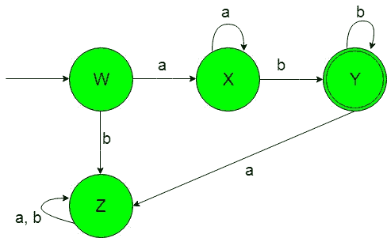
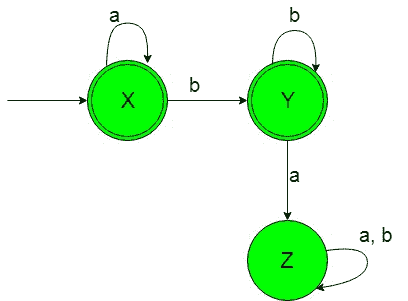

# 设计确定性有限自动机(集合 6)

> 原文:[https://www . geeksforgeeks . org/design-design-determinative-有限自动机-set-6/](https://www.geeksforgeeks.org/designing-deterministic-finite-automata-set-6/)

**先决条件:** [设计有限自动机](https://www.geeksforgeeks.org/designing-finite-automata-from-regular-expression/)
在本文中，我们将看到确定性有限自动机(DFA)的一些设计。

**问题-1:** 构造{a，b}上的最小 DFA 接受字符串集，其中 a <sup>n</sup> b <sup>m</sup> ，其中 n 和 m 大于或等于 1。
**解释:**想要的语言会是这样的:

```
L1 = {ab, aab, abb, aabb, aaabbb, aaabbbb, ...........}
```

**注意:**在上面的字符串中，“b”后面不应该有任何“a”。

这里我们可以看到，每一个包含幂大于等于 1 的 a 和 b 的语言字符串，但是下面的语言不被这个 DFA 接受，因为下面语言的一些字符串不包含幂大于等于 1 的 a 和 b。

```
L2 = {ε, a, b, ..............}
```

L2 的这种语言不被要求的 DFA 接受。
所需语言的状态转换图如下:

在上面的 DFA 中， 状态“W”是初始状态，当获得“a”作为输入时，它过渡到正常状态“X”，当获得“a”作为输入时，它保持自身状态，当获得“b”作为输入时，它过渡到最终状态“Y”，当获得“b”作为输入时，它保持自身状态，当获得输入时，它过渡到停滞状态“Z”，当初始状态“W”获得“b”作为输入时，它过渡到停滞状态“Z”。

状态“Z”被称为死状态，因为它不能在获得任何输入时进入最终状态。

**问题-2:** 构造{a，b}上的最小 DFA 接受字符串集，其中 a <sup>n</sup> b <sup>m</sup> ，其中 n 和 m 大于或等于 0。
**解释:**想要的语言会是这样的:

```
L1 = {ε, a, b, ab, aab, abb, aabb, aaabbb, aaabbbb, ...........}
```

**注意:**在上面的字符串中，“b”后面不应该有任何“a”。

这里我们可以看到，包含 a 和 b 的语言的每个字符串的幂大于或等于 0，但是下面的语言不被这个 DFA 接受，因为下面的语言的一些字符串不包含 a 和 b 的幂大于或等于 0，或者它们可能不遵循 a 和 b 的格式，即在“b”之后不应该有任何“a”。

```
L2 = {ba, baa, bbaaa..............}
```

此必需的 DFA 不接受 L2 语言，因为它的字符串在“b”后包含“a”。
所需语言的状态转换图如下:

在上面的 DFA 中，状态‘X’是初始和最终状态，当获得‘a’作为输入时，它保持在自身状态，当获得‘b’作为输入时，它转换到最终‘Y’，当获得‘b’作为输入时，它保持在自身状态，当获得‘a’作为输入时，它转换到死状态‘Z’。

状态“Z”被称为死状态，因为它不能在获得任何输入字母表时进入最终状态。