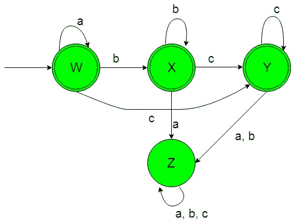
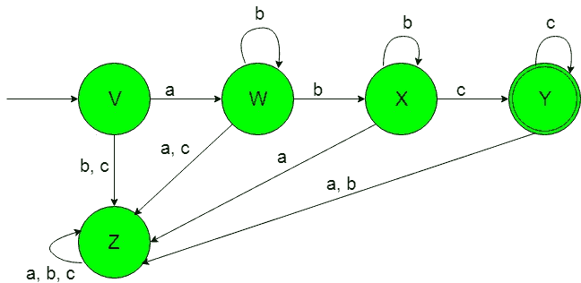

# 设计确定性有限自动机(集合 7)

> 原文:[https://www . geeksforgeeks . org/design-design-determinative-有限自动机-set-7/](https://www.geeksforgeeks.org/designing-deterministic-finite-automata-set-7/)

**先决条件:** [设计有限自动机](https://www.geeksforgeeks.org/designing-finite-automata-from-regular-expression/)
在本文中，我们将看到确定性有限自动机(DFA)的一些设计。

**问题-1:** 构造{a，b}上的最小 DFA 接受字符串集，其中 a <sup>n</sup> b <sup>m</sup> c <sup>l</sup> ，其中 n、m 和 l 大于或等于 0。
**解释:**想要的语言会是这样的:

```
L1 = {ε, a, aa, aaa, b, bb, bbb, c, cc, ccc, abc, ab, ac, ...........}
```

**注意:**在上面的字符串中，必须有像 abc 这样的顺序，即在“b”之后不应该有任何“a”或者在“c”之后不应该有任何“a”等等。

这里我们可以看到，包含 a、b 和 c 的语言的每个字符串的幂大于或等于 0，但是下面的语言不被这个 DFA 接受，因为下面的语言的一些字符串不包含 a、b 和 c 的幂大于或等于 0，或者它们可能不遵循 a、b 和 c 的格式，即在“b”之后不应该有任何“a”或者在“c”之后不应该有任何“a”等等。

```
L2 = {ba, bac, bbacaa..............}
```

这种语言 L2 不被所需的 DFA 接受，因为它的字符串在“b”后包含“a”，在“c”后包含“a”等。
所需语言的状态转换图如下:

在上面的 DFA 中，状态‘W’是初始和最终状态，当获得‘a’作为输入时，它保持在自身状态，当获得‘b’作为输入时，它转换到最终状态‘X’，当获得‘c’作为输入时，它转换到另一个最终状态‘Y’。状态“X”是最终状态，当得到“b”作为输入时，它保持在自身状态，当得到“c”作为输入时，它转换到另一个最终状态“Y”，当得到“a”作为输入时，它转换到死状态“Z”。

另一个最终状态“Y”在获得“c”作为输入时，它保持在自身的状态，在获得“a”或“b”作为输入时，它过渡到相同的死状态“Z”。状态“Z”被称为死状态，因为它不能在获取任何输入字母时进入任何最终状态。

**问题-2:** 构造{a，b}上的最小 DFA 接受字符串集，其中 a <sup>n</sup> b <sup>m</sup> c <sup>l</sup> ，其中 n、m 和 l 大于或等于 1。
**解释:**想要的语言会是这样的:

```
L1 = {abc, aabc, aabbc, aabbcc, abbc, ...........}
```

**注意:**在上面的字符串中，必须有像 abc 这样的顺序，即在“b”之后不应该有任何“a”或者在“a”之后不应该有任何“c”等等。

在这里，我们可以看到，包含 a、b 和 c 的语言的每个字符串的幂大于或等于 1，但是下面的语言不被这个 DFA 接受，因为下面的语言的一些字符串不包含 a、b 和 c 的幂大于或等于 1，或者它们可能不遵循 a、b 和 c 的格式，即在“b”之后不应该有任何“a”或者在“a”之后不应该有任何“c”等等。

```
L2 = {ba, bac, bbacaa..............}
```

这种语言 L2 不被所需的 DFA 接受，因为它的字符串在“b”后包含“a”，在“a”后包含“c”等。
所需语言的状态转换图如下:

在上面的 DFA 中，初始状态“V”在获得“a”作为输入时转换为状态“W”，在获得“b”或“c”作为输入时转换为死状态“Z”。状态“W”在获得“b”作为输入时，它要么保持在状态本身，要么转换到状态“X”，在获得“a”或“c”时，它转换到相同的死状态“Z”。当得到“b”作为输入时，状态“X”保持其自身的状态，当得到“c”作为输入时，它转换到最终状态“Y”，当得到“a”作为输入时，它转换到相同的死状态“Z”。

当得到“c”作为输入时，最终状态“Y”保持在它自身的状态，当得到“a”或“b”作为输入时，它转换到相同的死状态“Z”。状态“Z”被称为死状态，这是因为它不能在获得任何输入字母时进入最终状态。