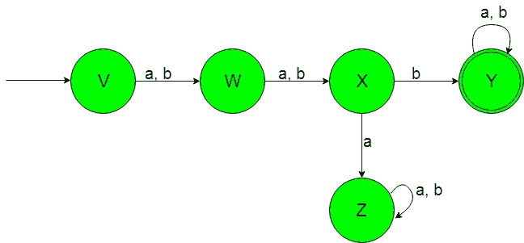

# 设计确定性有限自动机(第 8 集)

> 原文:[https://www . geeksforgeeks . org/design-design-determinative-有限自动机-set-8/](https://www.geeksforgeeks.org/designing-deterministic-finite-automata-set-8/)

**先决条件:** [设计有限自动机](https://www.geeksforgeeks.org/designing-finite-automata-from-regular-expression/)
在本文中，我们将看到确定性有限自动机(DFA)的一些设计。

**问题-1:** 构造一个最小 DFA，接受{a，b}上的一组字符串，其中左手边的第二个符号总是“b”。
**解释:**想要的语言会是这样的:

```
L1 = {ab, aba, abaa, bb, bb, bbbb, ...........}
```

这里我们可以看到，每一个包含“b”作为第二个符号的语言字符串从左侧开始，但是下面的语言不被这个 DFA 接受，因为下面语言的一些字符串不包含“b”作为第二个符号从左侧开始。

```
L2 = {ba, ba, babaaa..............}
```

这种语言 L2 不被所需的 DFA 接受，因为它不包含“b”作为左手边的第二个符号。
所需语言的状态转换图如下:

在上面的 DFA 中，状态“W”是初始状态，当获得“a”或“b”作为输入时，它转换到状态“X”。状态“X”在获得“b”作为输入时转变为最终状态“Y”，在获得“a”作为输入时转变为死状态“Z”。

当得到“a”或“b”作为输入时，最终状态“Y”保持其自身状态。死状态“Z”被称为死状态，因为它不能在获取任何输入字母时进入最终状态。

**注:**上述 DFA 中的状态数为(n+2)，其中‘n’为上述语言中使用的字符串左侧的数字。

**问题-2:** 构造一个最小 DFA，接受{a，b}上的一组字符串，其中左侧的第三个符号总是“b”。
**解释:**想要的语言会是这样的:

```
L1 = {aab, baba, aabaa, bbb, abb, bbbb, ...........}
```

这里我们可以看到，每一个包含“b”作为第三个符号的语言字符串从左侧开始，但是下面的语言不被这个 DFA 接受，因为下面语言的一些字符串不包含“b”作为第三个符号从左侧开始。

```
L2 = {baa, aba, baabaaa..............}
```

这种语言 L2 不被所需的 DFA 接受，因为它不包含“b”作为左手边的第三个符号。
所需语言的状态转换图如下:

在上面的 DFA 中，状态“V”是初始状态，当获得“a”或“b”作为输入时，它转换到状态“W”。状态“W”是这样一种状态，当得到“a”或“b”作为输入时，它转换到状态“X”。状态“X”在获得“b”作为输入时转变为最终状态“Y”，在获得“a”作为输入时转变为死状态“Z”。

当得到“a”或“b”作为输入时，最终状态“Y”保持其自身状态。死状态“Z”被称为死状态，因为它不能在获取任何输入字母时进入最终状态。

**注:**上述 DFA 中的状态数为(n+2)，其中‘n’为上述语言中使用的字符串左侧的数字。