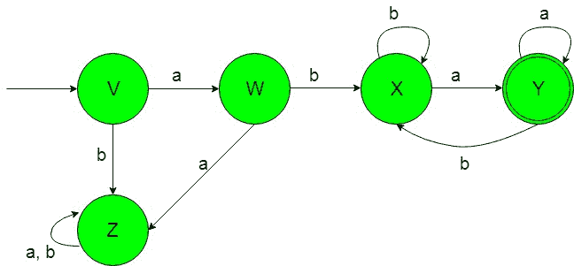
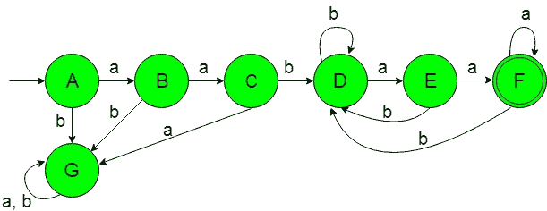

# 设计确定性有限自动机(集合 9)

> 原文:[https://www . geeksforgeeks . org/design-design-determinative-有限自动机-set-9/](https://www.geeksforgeeks.org/designing-deterministic-finite-automata-set-9/)

**先决条件:** [设计有限自动机](https://www.geeksforgeeks.org/designing-finite-automata-from-regular-expression/)
在本文中，我们将看到确定性有限自动机(DFA)的一些设计。

**问题-1:** 在{a，b}上接受一组字符串的最小 DFA 的构造，其中{abwa / wε{a，b}*}。
这里的“w”是包含字母的子串，字母位于从零到无穷大的任意数量的“a”和“b”上。

**解释:**想要的语言会是这样的:

```
L1 = {abεa, abaaaa, ababaaa, abaabbaaa}
```

在这里，我们可以看到，上面语言的每个字符串都有一个不变的初始{即 ab}和最终{a}子字符串，但是“w”有一个超过{a，b}的子字符串，其字母从零到无穷大，但是下面的语言不被这个 DFA 接受，因为它的字符串不遵循字符串的格式。

```
L2 = {baa, aabaa, baabaaa..............}
```

所需语言的状态转换图如下:

在上面的 DFA 中，初始状态“V”在获得“a”作为输入时转换为状态“W”，在获得“b”作为输入时转换为死状态“Z”。状态“W”在获得“a”作为输入时转变为死状态“Z”，在获得“b”作为输入时转变为状态“X”。当获得“b”作为输入时，状态“X”保持其自身的状态，当获得“a”作为输入时，它过渡到最终状态“Y”。

当得到“a”作为输入时，最终状态“Y”保持在它自身的状态，当得到“b”作为输入时，它过渡到状态“X”。状态“Z”被称为死状态，因为它不能在获得任何输入字母时进入最终状态。

**问题-2:** 构造接受{a，b}上一组字符串的最小 DFA，其中{a <sup>2</sup> bwa <sup>2</sup> / wε{a，b}*}。
这里的“w”是包含字母的子串，字母在从零到无穷大的任意数量的“a”和“b”上。

**解释:**想要的语言会是这样的:

```
L1 = {aabεaaa, aabaaaa, aababaaa, aabaabbaaa}
```

这里我们可以看到，上面语言的每一个字符串都有一个不变的首字母，即{a <sup>2</sup> b}和最后的{a <sup>2</sup> 子串，但是“w”有一个超过{a，b}的子串，其字母范围从零到无穷大，但是下面的语言不被这个 DFA 接受，因为它的字符串不遵循字符串的格式。

```
L2 = {baa, abaa, baabaaa..............}
```

所需语言的状态转换图如下:

在上面的 DFA 中，初始状态“A”在获得“A”作为输入时转换为状态“B”，在获得“B”作为输入时转换为死状态“G”。状态“B”在获得“a”作为输入时转变为状态“C”，在获得“B”作为输入时转变为死状态“G”。状态“C”在获得“b”作为输入时转变为状态“D”，在获得“a”作为输入时转变为死状态“G”。状态“D”在获得“a”作为输入时转变为状态“E ”,在获得“b”作为输入时保持其自身状态。状态“E”在获得“a”作为输入时转变为最终状态“F”，在获得“b”作为输入时转变为状态“D”。

当得到“a”作为输入时，最终状态“F”保持在它自身的状态，当得到“b”作为输入时，它过渡到状态“D”。死状态“G”被称为死状态，因为它不能在获得任何输入字母时进入最终状态。