# 为 1 的补码、2 的补码等各种运算设计有限自动机

> 原文:[https://www . geesforgeks . org/design-有限自动机-for-variable-operations-like-1s-complex-2s-complex/](https://www.geeksforgeeks.org/designing-finite-automata-for-various-operations-like-1s-complement-2s-complement/)

有限自动机中的传感器是指带输出的**传感器。**
有输出的 FA 有两种机器。

**1。美餐机:**
它是一个 FA，输出与每个转换相关联。(这意味着输出取决于状态和输入)。
T4【2】。摩尔机:
是 FA，其中输出与每个状态相关联。(这意味着输出仅取决于状态)。

通过使用这些机器，我们可以为各种操作设计有限自动机，例如

*   1 的补码。
*   2 的补码。
*   二进制全加法器。
*   递增 1。
*   更改符号位。
*   整数可分性测试仪。
*   逻辑函数(异或、或、与、非)。
*   当前位和先前位等的总和。

**1。1 的补码:**

> 给定二进制数的 1 的补码是通过简单地反转每一位得到的。
> 即 1<–>0 和 0<–>1

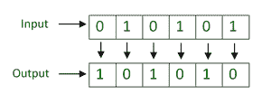

**使用面包机进行设计的逻辑–**

*   对于输入 0，输出为 1。
*   对于输入 1，输出为 0。
    所以它只需要一个状态。

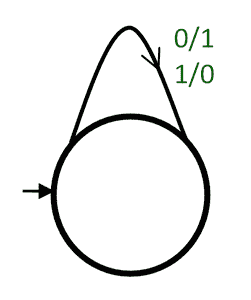

1 的补充粉饼机

**2。2 的补码:**

> 一般来说，2 的补码是通过将 1 加到数的 1 的补码上得到的。
> 但是为了设计 2 的补码机，我们使用另一种算法来推导 2 的补码。

**算法–**

*   从输入的 LSB 开始。
*   复制该位，直到第一个“1”出现。
*   之后，补充每一位。

**示例–**

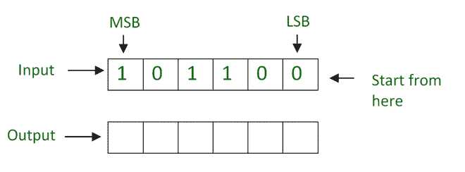

从输入的最低有效位开始

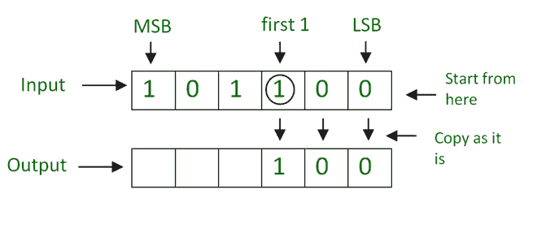

照原样复制该位，直到第一个“1”出现

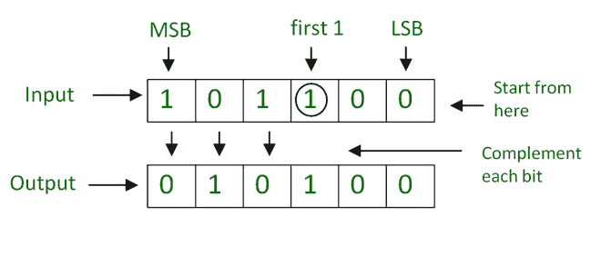

补足每一位

**使用面包机进行设计的逻辑–**

*   从输入的最低有效位获取输入。
*   对于每个输入 till，前 1 个输出与输入相同。
*   之后，对于每个输入，使用 1 补码机对每个位进行补码。

所以，它需要两个状态。一种状态是输出与输入相同，另一种状态是 1 的补码状态。

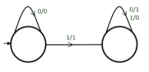

2 的补充粉机

> 当第一个“1”出现时，它转移到下一个状态，对每个位进行补码。
> 这里，第一状态的行为是生成与输入相同的输出，第二状态的行为是生成补码。

**3。二进制全加器:**
二进制全加器将 2 个二进制位和进位输入相加，产生和输出和进位输出。

**二进制全加器的工作–**

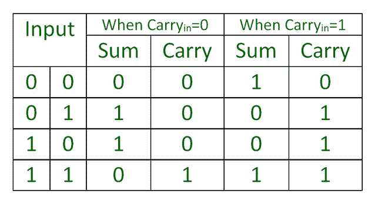

> 这是二进制全加器的功能表。根据进位输入，输入的输出值是变化的。

为了设计一个二进制全加器，我们使用这个表。根据这个表，有两种情况(进位=0 和进位=1)，所以我们需要两种状态。

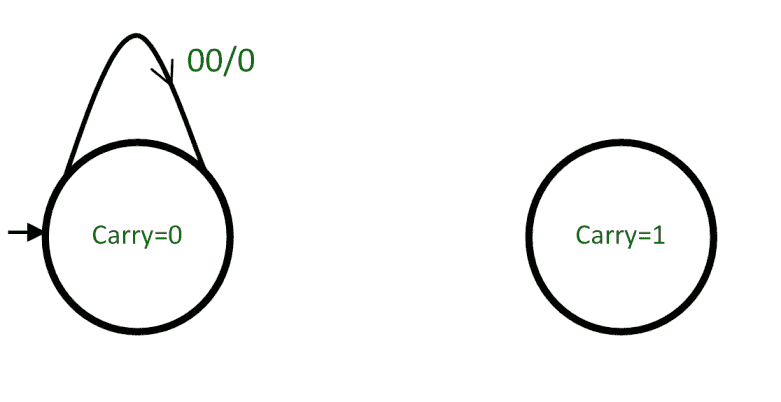

> 当进位=0(从进位=0 状态)在“00”输入求和=0(因此，在 00 转换时，输出为 0)和进位=0(因此，它进入进位=0 状态)

**根据表格设计机器的其余部分。它看起来像–**

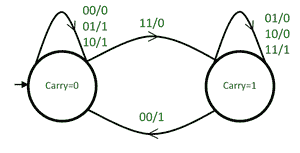

二进制全加器

**4。递增 1 :**
递增 1 表示二进制数加 1。
增加 1 次手术有两种情况

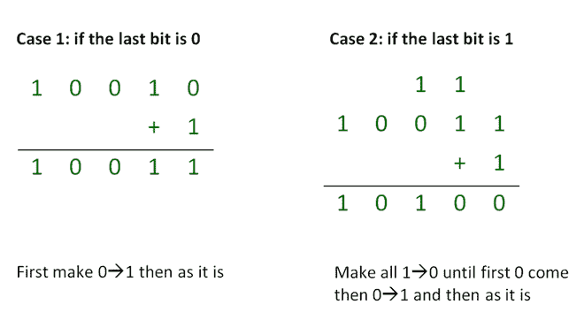

**设计机器的逻辑–**

> 结合这两种情况，我们得到的算法是，直到第一个 0 到来，使所有 1 **⇢** 0，当 0 到来时使其为 1，那么输出的剩余部分与输入相同。这里，输入取自 LSB。

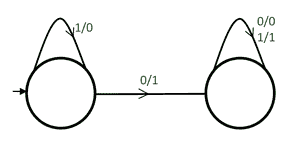

增加 1 台粉饼机

**5。更改符号位:**

> 改变符号位非常简单。只要交换第一位，其他位就和原来一样。

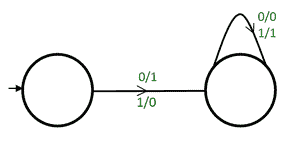

把标志位换成美利机器

**6。整数可分性测试仪:**

> 整数可分性测试机与 Mod 机器相同，接受十进制值，并在状态下输出。

**示例–**
3 可分性测试仪机器与**有限自动机相同，用于输出状态为**的字符串 mod 3=0 的十进制值

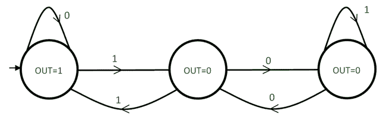

3 可分性测试仪系泊机

**7。逻辑函数(异或、或、与、非):**

> 根据逻辑表为逻辑函数设计机器是非常容易的。

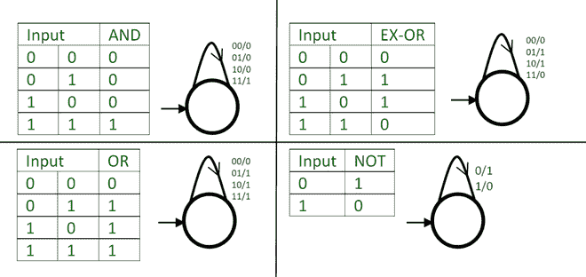

不同逻辑功能的机器

**8。当前位&前一位之和:**

> 如果前一位= 0，输入 0 时，输出= 00，输入 1 时，输出= 01
> 如果前一位= 1，输入 0 时，输出= 01，输入 1 时，输出= 10

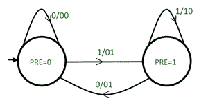

当前位和前一位之和

> 在 pre=0 时，当有 1 转换时，它会移动到 pre=1，因为下一位必须是前一位。pre=1 上的 0 转换也是如此