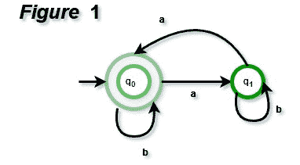
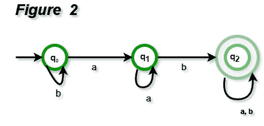
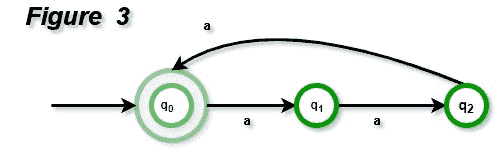
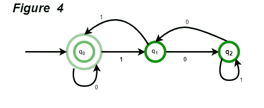
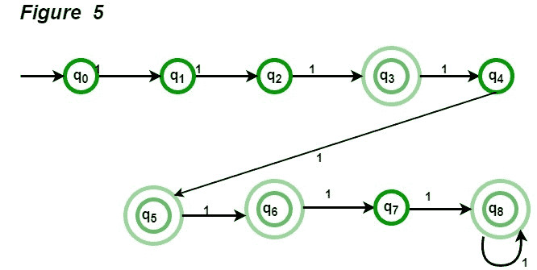
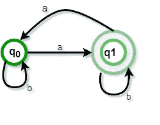

# 从正则表达式(集合 1)设计有限自动机

> 原文:[https://www . geeksforgeeks . org/design-有限自动机-from-正则表达式-set-1/](https://www.geeksforgeeks.org/designing-finite-automata-from-regular-expression-set-1/)

在本文中，我们将看到一些流行的正则表达式，以及如何将它们转换为有限自动机。

*   **Even number of a’s :** The regular expression for even number of a’s is **(b|ab*ab*)***. We can construct a finite automata as shown in Figure 1.

    

    上面的自动机将接受所有带有偶数个 a 的字符串。对于零 a，它将处于 q0，这是最终状态。对于一个“a”，它将从 q0 到 q1，字符串将不被接受。对于任何位置的两个 a，对于第一个 a，它将从 q0 到 q1，对于第二个 a，它将从 q1 到 q0。所以，它会接受所有带有偶数个 a 的字符串。

*   **以‘ab’为子串的字符串:**以‘ab’为子串的字符串的正则表达式为 **(a|b)*ab(a|b)*** 。我们可以构建有限自动机，如图 2 所示。

上述自动机将接受所有以' ab '作为子串的字符串。自动机将保持 b 的初始状态 q0。读取“a”后，它将移动到 q1，之后所有“a”都保持相同的状态。如果“b”被读取，它将移动到 q2。这意味着，如果字符串到达 q2，它已经将' ab '作为子字符串读取。

*   **String with count of ‘a’ divisible by 3 :** The regular expression for strings with count of a divisible by 3 is {a3n | n >= 0}. We can construct automata as shown in Figure 3.

    

    上面的自动机将接受一个 3n 形式的所有字符串。对于ɛ，自动机将保持在初始状态 q0，并且它将被接受。对于字符串“aaa”，它将从 q0 移动到 q1，然后 q1 移动到 q2，然后 q2 移动到 q0。每一组三个 a，它将达到 q0，因此被接受。否则，它将在 q1 或 q2，因此被拒绝。

    **注:**如果我们想设计一个 a 的个数为 3n+1 的有限自动机，可以用同样的自动机，最终状态为 q1 而不是 q0。
    如果要用语言{a kn | n > = 0}设计有限自动机，需要 k 个状态。我们在例子中使用了 k = 3。

*   **Binary numbers divisible by 3 :** The regular expression for binary numbers which are divisible by three is **(0|1(01*0)*1)***. The examples of binary number divisible by 3 are 0, 011, 110, 1001, 1100, 1111, 10010 etc. The DFA corresponding to binary number divisible by 3 can be shown in Figure 4.

    

    上面的自动机将接受所有可被 3 整除的二进制数。对于 1001，自动机将从 q0 到 q1，然后 q1 到 q2，然后 q2 到 q1，最后 q2 到 q0，因此被接受。对于 0111，自动机将从 q0 到 q0，然后 q0 到 q1，然后 q1 到 q0，最后 q0 到 q1，因此被拒绝。

*   **String with regular expression (111 + 11111)* :** The string accepted using this regular expression will have 3, 5, 6(111 twice), 8 (11111 once and 111 once), 9 (111 thrice), 10 (11111 twice) and all other counts of 1 afterwards. The DFA corresponding to given regular expression is given in Figure 5.

    

**问题:**奇数个 a 的字符串的最小状态数是多少？
**解:**a 的奇数的正则表达式为 b*ab*(ab*ab*)*对应的自动机如图 6 所示，最小状态数为 2。

**[TOC |设计确定性有限自动机(第 1 集)](https://www.geeksforgeeks.org/toc-designing-deterministic-finite-automata-set-1/)**

本文由 Sonal Tuteja 供稿。

如果你发现任何不正确的地方，或者你想分享更多关于上面讨论的话题的信息，请写评论