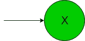
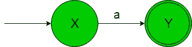
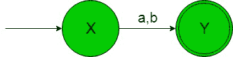
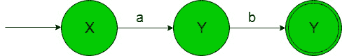
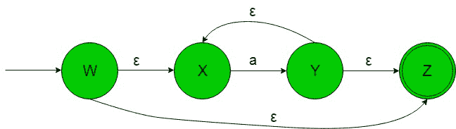

# 从正则表达式(集合 2)设计有限自动机

> 原文:[https://www . geeksforgeeks . org/design-有限自动机-from-正则表达式-set-2/](https://www.geeksforgeeks.org/designing-finite-automata-from-regular-expression-set-2/)

**先决条件:** [有限自动机](https://www.geeksforgeeks.org/toc-finite-automata-introduction/)[正则表达式、语法和语言](https://www.geeksforgeeks.org/regular-expressions-regular-grammar-and-regular-languages/)。[从正则表达式](https://www.geeksforgeeks.org/designing-finite-automata-from-regular-expression/)
设计有限自动机在下面的文章中，我们将从给定的正则表达式中看到一些有限自动机的设计-

**正则表达式 1:**φ(φ)。
给定 RE 的语言是 L1 = {}即空字符串。
它的有限自动机会像下图一样——

在上面的过渡图中，我们可以看到状态‘X’是不接受任何字母表的。

**正则表达式 2:**‘a’(字母‘a’)。
给定 RE 的语言是 L2 = {a}，即只包含“a”作为字符串的语言。
它的有限自动机会像下图一样——

在上面的过渡图中，我们可以看到，状态‘X’在得到‘a’时作为字母表它过渡到了一个状态‘Y’。因此，它只接受字母“a”。

**正则表达式 3:**‘a+b’(两个字母‘a’和‘b’的并集过程)。
给定 RE 的语言是 L3 = {a，b}，即包含‘a’和‘b’作为字符串的语言。
它的有限自动机将如下所示-

在上面的转换图中，我们可以看到状态“X”在获得字母“a”或“b”时，它转换到状态“Y”。因此，它接受所需语言的字符串。

**正则表达式 4:**‘a . b’(两个字母‘a’和‘b’的连接)。
给定 RE 的语言是 L4 = {ab}，即只包含‘ab’作为字符串的语言。
它的有限自动机将如下-

在上面的转换图中，正如我们可以看到的那样，状态‘X’在得到‘a’时作为字母表它转换到状态‘Y’，状态‘Y’在得到‘b’时作为输入字符串它转换到最终状态‘Z’。因此，它接受所需语言的字符串。

**正则表达式 5:** 'a * '(字母‘a’的克莱尼闭合)。
给定 RE 的语言是 L5 = {ε，a，aa，aaa，aaaa，…。}即包含ε和任意数量“a”的语言。
它的有限自动机会像下图-

在上面的过渡图中，状态‘W’在得到ε作为输入时，它过渡到最终状态‘Z’或者如果输入是‘a’则过渡到状态‘X’。状态“X”在获得“a”作为输入字母表时，它过渡到状态“Y”，对于其余状态，状态“Y”通过ε输入等连接到最终状态“Z”。
因此上面的 FA 接受所有包含字符串的语言为ε和任意数量的“a”。