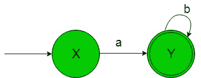
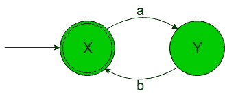
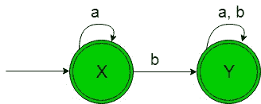
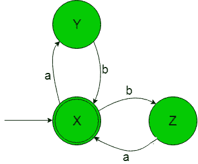
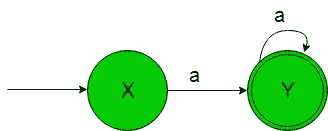

# 从正则表达式(集合 3)设计有限自动机

> 原文:[https://www . geeksforgeeks . org/design-有限自动机-from-正则表达式-set-3/](https://www.geeksforgeeks.org/designing-finite-automata-from-regular-expression-set-3/)

先决条件:[有限自动机](https://www.geeksforgeeks.org/toc-finite-automata-introduction/)、[正则表达式、语法和语言](https://www.geeksforgeeks.org/regular-expressions-regular-grammar-and-regular-languages/)、[从正则表达式(集合 2)](https://www.geeksforgeeks.org/toc-designing-finite-automata-from-regular-expression-set-2/) 设计有限自动机

在下面的文章中，我们将从给定的正则表达式中看到一些有限自动机的设计。

**正则表达式 1:**“ab *”(“a”后跟任意数量的“b”)。给定 RE 的语言是，

```
L1 = {a, ab, abb, abbb, .........} 
```

它的有限自动机将如下所示-

在上面的转换图中，正如我们可以看到的，状态‘X’在获得‘a’作为输入时，它转换到最终状态‘Y’，在获得‘b’作为输入时，它保持在自身的状态。因此这个 FA 接受给定 RE 语言的所有字符串。

**正则表达式 2:** '(ab)*' ('a '后跟' b '，但子串' ab '可以重复任意次)。给定 RE 的语言是，

```
L2 = {ε, ab, abab, ababab, .........} 
```

它的有限自动机将如下所示-

在上面的转换图中，我们可以看到，初始和最终状态“X”在获得“a”作为输入时，它转换到最终状态“Y”，在获得“b”作为输入时，它返回到状态“X”。因此这个 FA 接受给定 RE 语言的所有字符串。

**正则表达式 3:**'(a+b)* '(a ' union ' b '但子串' a+b '可以重复任意次)。给定 RE 的语言是，

```
L3 = {ε, a, b, aa, aaab, bbbbb, ba, .......} 
```

包含ε和任意数量的“a”或“b”或两者组合的语言。
它的有限自动机将如下所示-

在上面的转换图中，正如我们可以看到的那样，状态‘X’在得到‘a’作为输入时它保持在自身的状态，而在得到‘b’作为输入时它过渡到另一个最终状态‘Y’，后者在得到‘b’或‘a’作为输入时它保持在自身的状态。因此这个 FA 接受给定 RE 语言的所有字符串。

**注意–**正则表达式(a+b)*的最小 DFA 将只有一个状态，即起始状态和最终状态。这将只包含字母“a”和“b”的循环。

**正则表达式 4:** '(ab+ba)*' ('ab' union 'ba '但子串' ab+ba '可以重复任意多次)。给定 RE 的语言是，

```
L4 = {ε, ab, abab, abba, ba, baba, ........ } 
```

包含ε和任意数量的“ab”或“ba”或两者组合的语言。
它的有限自动机会像下图一样-


在上面的转换图中，初始和最终状态“X”在获得“a”作为输入时进入状态“Y”，在获得“b”作为输入时进入另一个状态“Z”，以此类推，直到剩余状态。因此这个 FA 接受给定 RE 语言的所有字符串。

**正则表达式 5:**‘a+’(除ε外的‘a’的任意个数)。
给定 RE 的语言是

```
L5 = {a, aa, aaa, aaaa, .........} 
```

它的有限自动机将如下所示-

在上面的转换图中，初始状态“X”在获得“a”作为输入时，它转换到最终状态“Y”，在获得“a”作为输入时，它保持在自身的状态。因此这个 FA 接受给定 RE 语言的所有字符串。