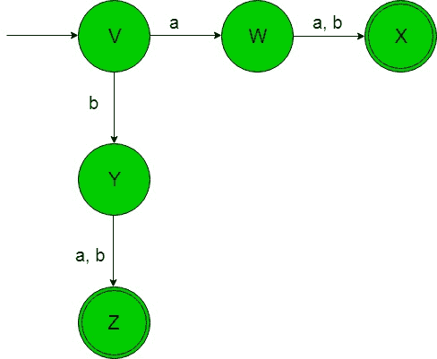
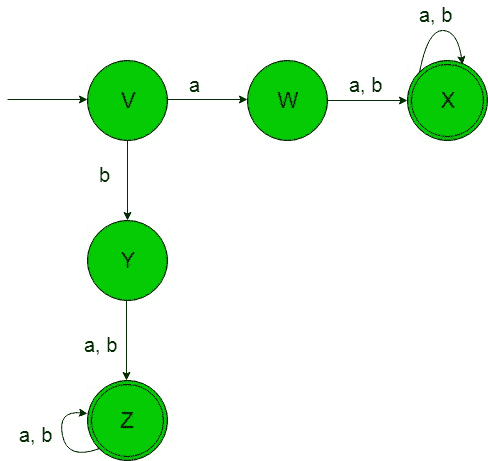
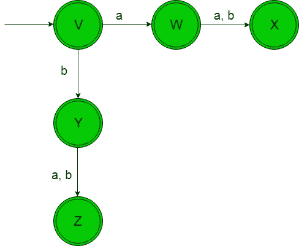
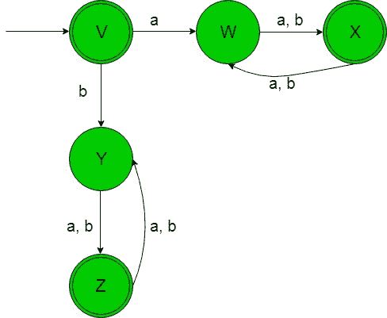
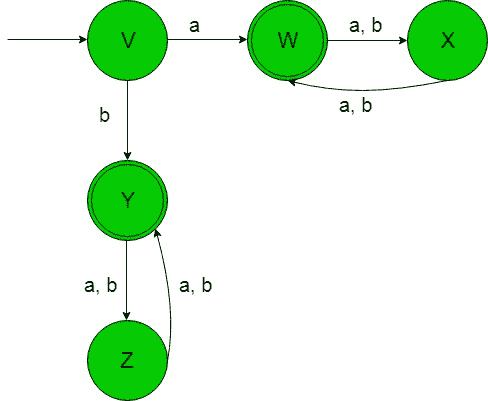

# 从正则表达式(集合 4)设计有限自动机

> 原文:[https://www . geeksforgeeks . org/design-有限自动机-from-正则表达式-set-4/](https://www.geeksforgeeks.org/designing-finite-automata-from-regular-expression-set-4/)

先决条件:[有限自动机](https://www.geeksforgeeks.org/toc-finite-automata-introduction/)、[正则表达式、语法和语言](https://www.geeksforgeeks.org/regular-expressions-regular-grammar-and-regular-languages/)、[从正则表达式(集合 3)](https://www.geeksforgeeks.org/toc-designing-finite-automata-from-regular-expression-set-3/) 设计有限自动机

在下面的文章中，我们将从给定的正则表达式中看到一些有限自动机的设计

**正则表达式 1:** 正则语言，

```
L1 = (a+b)(a+b) 
```

给定 RE 的语言是，

```
{aa, ab, ba, bb} 
```

字符串长度正好为 2。

它的有限自动机将如下所示-



在上面的转换图中，我们可以看到，状态“V”在获得“a”作为输入时，会转换到状态“W”，而在获得“a”或“b”作为输入时，它会转换到最终状态“X”，依此类推。因此这个 FA 接受给定 RE 语言的所有字符串。

**正则表达式 2:** 正则语言，

```
L2 = (a+b)(a+b)(a+b)* 
```

给定 RE 的语言是，

```
{aa, ab, ba, bb, aaa, aab, .........} 
```

字符串长度至少为 2。

它的有限自动机将如下所示-



在上面的转换图中，我们可以看到，状态“V”在获得“a”作为输入时，它转换到状态“W”，在获得“a”或“b”作为输入时，它转换到最终状态“X”，在获得“a”或“b”时，它保持在自身状态，以此类推。因此这个 FA 接受给定 RE 语言的所有字符串。

**正则表达式 3:** 正则语言，

```
L3 = (a+b+ε)(a+b+ε) 
```

给定 RE 的语言是，

```
{ε, a, b, aa, ab, ba, bb} 
```

字符串长度最多为 2。

它的有限自动机将如下所示-



在上面的转换图中，正如我们所看到的，初始和最终状态“V”在获得“a”作为输入时，会转换到另一个最终状态“W”，在获得“a”或“b”作为输入时，它也会转换到另一个最终状态“X”，以此类推。因此这个 FA 接受给定 RE 语言的所有字符串。

**正则表达式 4:** 正则语言，

```
L4 = ((a+b)(a+b))* 
```

给定 RE 的语言是，

```
L4 = {ε, aa, ab, ba, bb, aaaa, ............} 
```

偶数长度字符串的语言。

它的有限自动机将如下所示-



在上面的转换图中，当获得“a”作为输入时，初始和最终状态“V”转换到状态“W”，当获得“a”或“b”作为输入时，它转换到另一个最终状态“X”，当获得“a”或“b”作为输入时，它返回到状态“W”，对于其余状态也是如此。因此这个 FA 接受给定 RE 语言的所有字符串。

**正则表达式 5:** 正则语言，

```
L5 = ((a+b)(a+b))*(a+b) 
```

给定 RE 的语言是

```
{a, b, aaa, bbb, abb, bab, bba, ..........} 
```

奇数长度字符串的语言。

它的有限自动机将如下所示-



在上面的转换图中，初始状态“V”在获得“a”作为输入时进入最终状态“W ”,在获得“a”或“b”作为输入时转换到另一个状态“X ”,在获得“a”或“b”作为输入时，对于剩余的状态也回到最终状态“W”等等。因此这个 FA 接受给定 RE 语言的所有字符串。