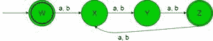
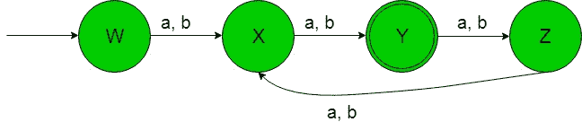
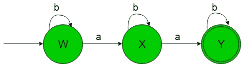
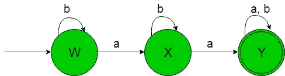
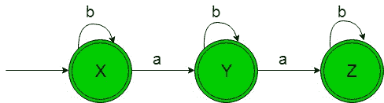

# 从正则表达式(集合 5)设计有限自动机

> 原文:[https://www . geeksforgeeks . org/design-有限自动机-from-正则表达式-set-5/](https://www.geeksforgeeks.org/designing-finite-automata-from-regular-expression-set-5/)

先决条件:[有限自动机](https://www.geeksforgeeks.org/toc-finite-automata-introduction/)、[正则表达式、语法和语言](https://www.geeksforgeeks.org/regular-expressions-regular-grammar-and-regular-languages/)、[从正则表达式(集合 4)](https://www.geeksforgeeks.org/toc-designing-finite-automata-from-regular-expression-set-4/) 设计有限自动机

在下面的文章中，我们将从给定的正则表达式中看到一些非确定性有限自动机的设计

因为 NFA 可以改成相应的 DFA。

**正则表达式 1:** 正则语言，

```
L1 = ((a+b)(a+b)(a+b))* 
```

给定 RE 的语言是，

```
{aaa, aba, baa, bba, aab, abb, bab, bbb,...} 
```

字符串长度可被 3 整除((字符串长度)mod 3 = 0)。
它的有限自动机会如下图-



在上面的转换图中，我们可以看到，初始状态“W”在得到“a”或“b”作为输入时，对于剩余的状态，它转换到状态“X”等等。因此这个 FA 接受给定 RE 语言的所有字符串。

**正则表达式 2:** 正则语言，

```
L2 = (a+b)(a+b).((a+b)(a+b)(a+b))* 
```

给定 RE 的语言是，

```
{aa, ab, ba, bb, aaaaa, aabab, ..........} 
```

字符串 mod 3 = 2 的长度
它的有限自动机将如下所示-



在上面的转换图中，我们可以看到，初始状态“W”在得到“a”或“b”作为输入时，对于剩余的状态，它转换到状态“X”等等。因此这个 FA 接受给定 RE 语言的所有字符串。

**正则表达式 3:** 正则语言，

```
L3 = b*ab*ab* 
```

给定 RE 的语言是，

```
{baa, babab, bbabbabb, ......} 
```

a 的数字正好是 2。
它的有限自动机会如下图-



在上面的转换图中，我们可以看到，初始状态“W”在获得“b”作为输入时，它保持在自身的状态，在获得“a”作为输入时，对于剩余的状态，它转换到状态“X”等等。因此这个 FA 接受给定 RE 语言的所有字符串。

**正则表达式 4:** 正则语言，

```
L4 = b*ab*a(a+b)* 
```

给定 RE 的语言是，

```
{baa, babab, bbabbaabb, ......} 
```

“a”的数量至少为 2。
它的有限自动机会如下图-



在上面的转换图中，我们可以看到，初始状态“W”在获得“b”作为输入时，它保持在自身的状态，在获得“a”作为输入时，对于剩余的状态，它转换到状态“X”等等。因此这个 FA 接受给定 RE 语言的所有字符串。

**正则表达式 5:** 正则语言，

```
L5 = b*(ε+a)b*(ε+a)b* 
```

给定 RE 的语言是，

```
{b, bb, bbb, bab, baab, babab, bbab, .....} 
```

a 的数量最多为 2。
它的有限自动机会如下图-



在上面的转换图中，我们可以看到，初始和最终状态“X”在获得“b”作为输入时，它保持在自身的状态，在获得“a”作为输入时，它转换到另一个最终状态“Y”，以此类推。因此这个 FA 接受给定 RE 语言的所有字符串。