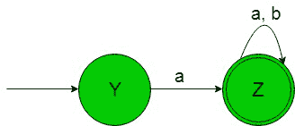
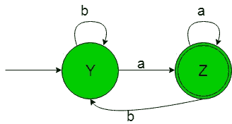
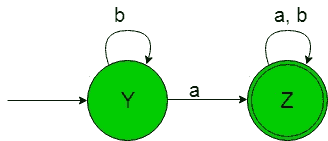
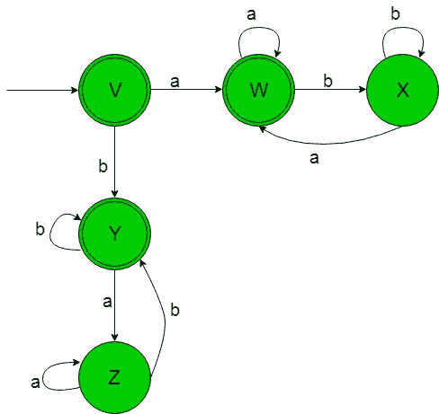

# 从正则表达式(集合 6)设计有限自动机

> 原文:[https://www . geeksforgeeks . org/design-有限自动机-from-正则表达式-set-6/](https://www.geeksforgeeks.org/designing-finite-automata-from-regular-expression-set-6/)

先决条件:[有限自动机](https://www.geeksforgeeks.org/toc-finite-automata-introduction/)、[正则表达式、语法和语言](https://www.geeksforgeeks.org/regular-expressions-regular-grammar-and-regular-languages/)、[从正则表达式(集合 5)](https://www.geeksforgeeks.org/toc-designing-finite-automata-from-regular-expression-set-5/) 设计有限自动机

在下面的文章中，我们将从给定的正则表达式中看到一些有限自动机的设计

**正则表达式 1:** 正则语言，

```
L1 = a(a+b)* 
```

给定 RE 的语言是，

```
{aaa, aba, baa, bba} 
```

字符串总是以“a”开头。
它的有限自动机会像下图-

在上面的过渡图中，我们可以看到初始状态‘Y’在得到‘a’作为输入时它过渡到一个
最终状态‘Z’以此类推为剩余状态。因此这个 FA 接受给定 RE 语言的所有字符串。

**正则表达式 2:** 正则语言，

```
L2 = (a+b)*a 
```

给定 RE 的语言是，

```
{aaa, aba, baa, bba} 
```

字符串总是以“a”结尾。
它的有限自动机会像下图一样-

在上面的转换图中，正如我们可以看到的，初始状态‘Y’在得到‘a’作为输入时它会转换到最终状态‘Z’，在得到‘b’作为输入时它会保持在自身的状态，以此类推剩余的状态。因此这个 FA 接受给定 RE 语言的所有字符串。

**正则表达式 3:** 正则语言，

```
L3 = (a+b)*a(a+b)* 
```

给定 RE 的语言是，

```
{aaa, aba, baa, bba} 
```

包含字母“a”的字符串。
它的有限自动机将如下-

在上面的转移图中，正如我们可以看到的，初始状态‘Y’在得到‘b’作为输入时它保持在自身的状态，在得到‘a’作为输入时它转移到最终状态‘Z’以此类推为剩余状态。因此这个 FA 接受给定 RE 语言的所有字符串。

**正则表达式 4:** 正则语言，

```
L4 = (a(a+b)*b)+(b(a+b)*a) 
```

给定 RE 的语言是，

```
{aab, abb, baa, bba} 
```

字符串以不同的符号开始和结束。
它的有限自动机会像下图-

在上面的跃迁图中，正如我们可以看到的，初始状态‘V’在得到‘a’作为输入时它跃迁到一个状态‘W’以此类推为剩余状态。因此这个 FA 接受给定 RE 语言的所有字符串。

**正则表达式 5:** 正则语言，

```
L5 = (a(a+b)*a)+(b(a+b)*b)+a+b+ε 
```

给定 RE 的语言是，

```
{&epsilon, a, b, aba, bab, bbab} 
```

字符串以相同的符号开始和结束。
它的有限自动机会像下图-

在上面的过渡图中，正如我们可以看到的，初始和最终状态‘V’在得到‘a’作为输入时它过渡到另一个最终状态‘W’以此类推为剩余状态。因此这个 FA 接受给定 RE 语言的所有字符串。