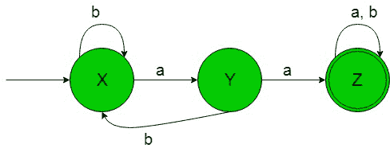
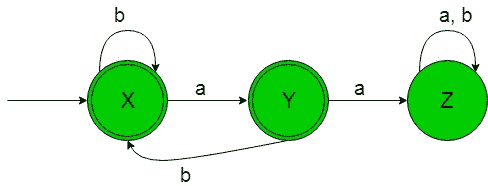
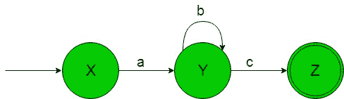
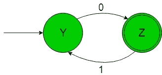
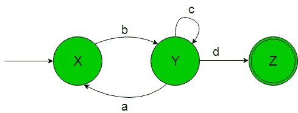

# 从正则表达式(集合 7)设计有限自动机

> 原文:[https://www . geeksforgeeks . org/design-有限自动机-from-正则表达式-set-7/](https://www.geeksforgeeks.org/designing-finite-automata-from-regular-expression-set-7/)

先决条件:[有限自动机](https://www.geeksforgeeks.org/toc-finite-automata-introduction/)、[正则表达式、语法和语言](https://www.geeksforgeeks.org/regular-expressions-regular-grammar-and-regular-languages/)、[从正则表达式(集合 6)](https://www.geeksforgeeks.org/toc-designing-finite-automata-from-regular-expression-set-6/) 设计有限自动机

在下面的文章中，我们将从给定的正则表达式中看到一些有限自动机的设计

**正则表达式 1:** 正则语言，

```
L1 = b*aa(a+b)*+b*ab*aa(a+b*)  
```

给定 RE 的语言是-

```
{aaa, baa, baa, bbaab, ..........}
```

包含两个 a 的字符串总是在一起。
它的有限自动机会像下图-

在上面的转移图中，正如我们可以看到的，初始状态‘X’在得到‘a’作为输入时它会转移到一个
状态‘Y’上，在得到‘b’作为输入时它会保持在自身的状态中，以此类推剩余的状态。因此这个 FA 接受给定 RE 语言的所有字符串。

**正则表达式 2:** 正则语言，

```
L2 = (b+ab)*(ε+a)' or '(a+ε)(b+ba)* 
```

给定 RE 的语言是-

```
{ababa, aba, baba, bba, ...........}
```

包含两个 a 的字符串永远不会在一起。
它的有限自动机将如下-

在上面的转换图中，正如我们可以看到的，初始和最终状态‘X’在获得‘a’作为输入时，它会转换到另一个最终状态‘Y’，在获得‘b’作为输入时，对于剩余状态，它会保持在自身的状态，以此类推。因此这个 FA 接受给定 RE 语言的所有字符串。

**正则表达式 3:** 正则语言，

```
L3 = ab*c 
```

给定 RE 的语言是-

```
{ac, abc, abbc, ...........}
```

它的有限自动机将如下所示-

在上面的转换图中，正如我们可以看到的那样，初始状态‘X’在得到‘a’作为输入时它转换到另一个状态‘Y’并且状态‘Y’在得到‘b’作为输入时它保持在它自身的状态中，以此类推剩余的状态。因此这个 FA 接受给定 RE 语言的所有字符串。

**正则表达式 4:** 正则语言，

```
L4 = 0(10)* 
```

给定 RE 的语言是-

```
{0, 010, 01010, 0101010, ..........}
```

它的有限自动机将如下所示-

在上面的转换图中，我们可以看到，初始状态‘Y’在获得‘0’作为输入时，它会转换为最终状态‘Z’，以此类推剩余状态。因此这个 FA 接受给定 RE 语言的所有字符串。

**正则表达式 5:** 正则语言，

```
L5 = b(c+ab)*d 
```

给定 RE 的语言是-

```
{bd, bcd, babd, ..............}
```

它的有限自动机将如下所示-

在上面的转换图中，我们可以看到，初始状态‘X’在获得‘b’作为输入时，它会转换为状态‘Y’并以此类推剩余的状态。因此这个 FA 接受给定 RE 语言的所有字符串。