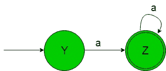
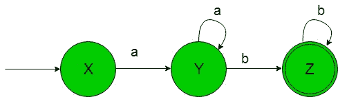
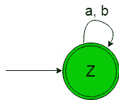
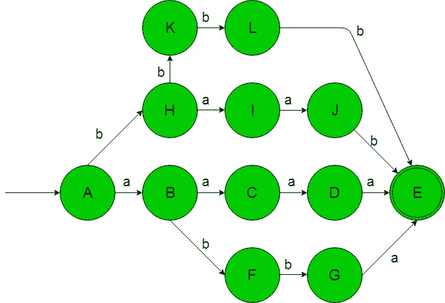

# 从正则表达式(集合 8)设计有限自动机

> 原文:[https://www . geeksforgeeks . org/design-有限自动机-from-正则表达式-set-8/](https://www.geeksforgeeks.org/designing-finite-automata-from-regular-expression-set-8/)

先决条件:[有限自动机](https://www.geeksforgeeks.org/toc-finite-automata-introduction/)、[正则表达式、语法和语言](https://www.geeksforgeeks.org/regular-expressions-regular-grammar-and-regular-languages/)、[从正则表达式(集合 7)](https://www.geeksforgeeks.org/toc-designing-finite-automata-from-regular-expression-set-7/) 设计有限自动机

在下面的文章中，我们将从给定的正则表达式中看到一些有限自动机的设计

**正则表达式 1:** 正则语言，

```
L1 = {an | n≥ 1}  
```

给定 RE 的语言是-

```
{a, aa, aaa, ..........}
```

它的有限自动机将如下所示-

在上面的转换图中，我们可以看到，初始状态‘Y’在获得‘a’作为输入时，它会转换为最终状态‘Z’，以此类推剩余状态。因此这个 FA 接受给定 RE 语言的所有字符串。

**正则表达式 2:** 正则语言，

```
L2 = {anbm | n, m≥ 1}
```

。
给定 RE 的语言为-

```
{ab, aab, abb, aaaabb, ..........}
```

它的有限自动机将如下所示-

在上面的转换图中，我们可以看到，初始状态‘X’在获得‘a’作为输入时，它会转换到一个
状态‘Y’并以此类推剩余状态。因此这个 FA 接受给定 RE 语言的所有字符串。

**正则表达式 3:** 正则语言，

```
L3 = (a+b)*  
```

给定 RE 的语言是-

```
{ε, a, aa, aaa, aabbb, ........} 
```

它的有限自动机将如下所示-

在上面的转换图中，正如我们可以看到的那样，初始和最终状态‘Z’在获得‘a’或‘b’作为输入时它保持在自身的状态。因此这个 FA 接受给定 RE 语言的所有字符串。

**注意:**下面的 REs 相互等价-

```
= (a+b)* 
= (a*+b*)* 
= (a*b*)* 
= (a*+b)* 
= (a+b*)* 
= a*(ba*)* 
= b*(ab*)* 
```

**正则表达式 4:** 正则语言，

```
L4 = {wwR | |w|=2, Σ={a, b}*} 
```

给定 RE 的语言是-

```
{aaaa, abba, baab, bbbb}
```

它的有限自动机将如下所示-

在上面的转换图中，我们可以看到，初始状态‘A’在获得‘A’作为输入时，它转换到状态‘b’，在获得‘b’作为输入时，它转换到状态‘H ’,以此类推。因此这个 FA 接受给定 RE 语言的所有字符串。

**注意:**下面的表达式不是正则表达式，因为字符串“w”的长度不受限制。

```
{wwR | Σ={a, b}*}
```