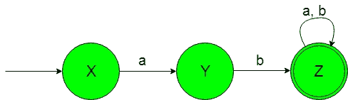
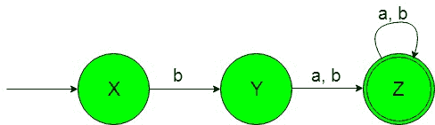

# 设计非确定性有限自动机(集合 3)

> 原文:[https://www . geesforgeks . org/design-非确定性-有限-自动机-set-3/](https://www.geeksforgeeks.org/designing-non-deterministic-finite-automata-set-3/)

**先决条件:** [有限自动机简介](https://www.geeksforgeeks.org/toc-finite-automata-introduction/)
在本文中，我们将看到非确定性有限自动机(NFA)的一些设计。

**问题-1:** 构造一个最小 NFA，接受{a，b}上的一组字符串，其中语言的每个字符串都以“ab”开头。
**解释:**想要的语言会是这样的:

```
L1 = {ab, abba, abaa, ...........}
```

这里我们可以看到，上述语言的每个字符串都以“ab”开头，以任何字母“a”或“b”结尾。
但是下面的语言不被这个 NFA 接受，因为下面的语言没有一串是以“ab”开头的。

```
L2 = {ba, ba, babaaa..............}
```

所需语言的状态转换图如下:

在上面的 NFA 中，初始状态“X”在获得“a”作为输入时会转换为状态“Y”。获得“b”作为输入时的状态“Y”转变为最终状态“Z”。最终状态“Z”在获得“a”或“b”作为输入时，它保持在自身的状态。

### Python 实作:

```
def stateX(n):
    #if length of n become 0 
    #then print not accepted
    if(len(n)==0):
        print("string not accepted")

    else: 
        #if at zero index 
        #'a' found call
        #stateY function    
        if (n[0]=='a'):
            stateY(n[1:])

        #if at zero index 
        #'b' then print 
        #not accepted
        elif (n[0]=='b'):
            print("string not accepted")   

def stateY(n):
    #if length of n become 0 
    #then print not accepted
    if(len(n)==0):
        print("string not accepted")

    else:  
        #if at zero index 
        #'a' then print 
        #not accepted   
        if (n[0]=='a'):
            print("string not accepted") 

        #if at zero index 
        #'b' found call
        #stateZ function    
        elif (n[0]=='b'):
            stateZ(n[1:]) 

def stateZ(n):
    #if length of n become 0 
    #then print accepted
    if(len(n)==0):
        print("string accepted")

    else:  
        #if at zero index 
        #'b' found call
        #stateZ function    
        if (n[0]=='a'):
            stateZ(n[1:]) 

        #if at zero index 
        #'b' found call
        #stateZ function    
        elif (n[0]=='b'):
            stateZ(n[1:])             

#take input
n=input()

#call stateA function
#to check the input
stateX(n) 
```

**问题-2:** 构造一个最小 NFA，接受{a，b}上的一组字符串，其中语言的每个字符串都不是以“ab”开头。
**解释:**想要的语言会是这样的:

```
L1 = {ba, bba, bbaa, ...........}
```

这里我们可以看到，上述语言的每个字符串都不是以“ab”开头，而是可以以“a”或“b”结尾。
但是下面的语言不被这个 NFA 接受，因为下面语言的一些字符串以“ab”开头。

```
L2 = {ab, aba, ababaab..............}
```

所需语言的状态转换图如下:

在上面的 NFA，初始状态“X”在获得“b”作为输入时，它转换到状态“Y”。获得“a”或“b”作为输入时的状态“Y”转变为最终状态“Z”。最终状态“Z”在获得“a”或“b”作为输入时，它保持在自身的状态。

### Python 实现:

```
def stateX(n):
    #if length of n become 0 
    #then print not accepted
    if(len(n)==0):
        print("string not accepted")

    else: 
        #if at zero index 
        #'a' found then 
        #print not accepted    
        if (n[0]=='a'):
            print("string not accepted")   

        #if at zero index 
        #'b' then call
        #stateY function
        elif (n[0]=='b'):
            stateY(n[1:])

def stateY(n):
    #if length of n become 0 
    #then print not accepted
    if(len(n)==0):
        print("string not accepted")

    else:  
        #if at zero index 
        #'a' found call
        #stateZ function   
        if (n[0]=='a'):
            stateZ(n[1:]) 

        #if at zero index
        #'b' found call
        #stateZ function
        elif (n[0]=='b'):
            stateZ(n[1:]) 

def stateZ(n):
    #if length of n become 0 
    #then print accepted
    if(len(n)==0):
        print("string accepted")

    else:  
        #if at zero index 
        #'b' found call
        #stateZ function    
        if (n[0]=='a'):
            stateZ(n[1:]) 

        #if at zero index 
        #'b' found call
        #stateZ function    
        elif (n[0]=='b'):
            stateZ(n[1:])             

#take input
n=input()

#call stateA function
#to check the input
stateX(n)
```