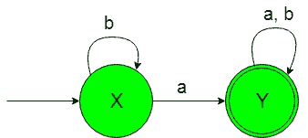
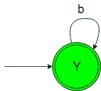

# 设计非确定性有限自动机(集合 4)

> 原文:[https://www . geesforgeks . org/design-非确定性-有限-自动机-set-4/](https://www.geeksforgeeks.org/designing-non-deterministic-finite-automata-set-4/)

**先决条件:** [有限自动机简介](https://www.geeksforgeeks.org/toc-finite-automata-introduction/)
在本文中，我们将看到非确定性有限自动机(NFA)的一些设计。

**问题-1:** 构造最小 NFA，接受{a，b}上的一组字符串，其中语言的每个字符串都包含“a”作为子字符串。
**解释:**想要的语言会是这样的:

```
L1 = {ab, abba, abaa, ...........}
```

这里我们可以看到，上述语言的每个字符串都包含“a”作为子字符串。但是下面的语言不被这个 NFA 接受，因为下面语言的一些字符串不包含“a”作为子字符串。

```
L2 = {bb, b, bbbb, .............}
```

所需语言的状态转换图如下:

在上面的 NFA 中，初始状态“X”在获得“a”作为输入时转换为最终状态“Y”，在获得“b”作为输入时保持其自身状态。当得到“a”或“b”作为输入时，最终状态“Y”保持其自身状态。参见以上 NFA 的 [DFA。](https://www.geeksforgeeks.org/toc-designing-deterministic-finite-automata-set-8/)

### 过渡表:

在该表中，初始状态用–>表示，最终状态用*表示。

| 州 | 输入(a) | 输入(b) |
| —>十 | Y* | X |
| Y* | Y* | Y* |

### Python 实现:

```
def stateX(n):
    #if length of n become 0 
    #then print not accepted
    if(len(n)==0):
        print("string not accepted")

    else: 
        #if at zero index 
        #'a' found then call
        #stateY function
        if (n[0]=='a'):
            stateY(n[1:]) 

        #if at zero index 
        #'b' then call
        #stateX function
        elif (n[0]=='b'):
            stateX(n[1:])

def stateY(n):
    #if length of n become 0 
    #then print accepted
    if(len(n)==0):
        print("string accepted")

    else:  
        #if at zero index 
        #'a' found call
        #stateY function   
        if (n[0]=='a'):
            stateY(n[1:]) 

        #if at zero index
        #'b' found call
        #stateY function
        elif (n[0]=='b'):
            stateY(n[1:]) 

#take input
n=input()

#call stateA function
#to check the input
stateX(n)
```

**问题-2:** 构造一个最小 NFA，接受{a，b}上的一组字符串，其中语言的每个字符串都不包含“a”作为子字符串。
**解释:**想要的语言会是这样的:

```
L1 = {b, bb, bbbb, ...........}
```

这里我们可以看到上面语言的每个字符串都不包含“a”作为子串，但是下面的语言不被这个 NFA 接受，因为下面语言的一些字符串包含“a”作为子串。

```
L2 = {ab, aba, ababaab..............}
```

所需语言的状态转换图如下:

在上面的 NFA，初始和最终状态‘Y’在得到‘b’作为输入时它保持在自身的状态。

### 过渡表:

在该表中，初始状态用–>表示，最终状态用*表示。

| 州 | 输入(a) | 输入(b) |
| —> Y * | Y* | Y* |

### Python 实现:

```
def stateY(n):
    #if length of n become 0 
    #then print accepted
    if(len(n)==0):
        print("string accepted")

    else:  
        #if at zero index 
        #'a' found then 
        #print not accepted   
        if (n[0]=='a'):
            print("String not accepted")

        #if at zero index
        #'b' found call
        #stateY function
        elif (n[0]=='b'):
            stateY(n[1:]) 

#take input
n=input()

#call stateY function
#to check the input
stateY(n)
```