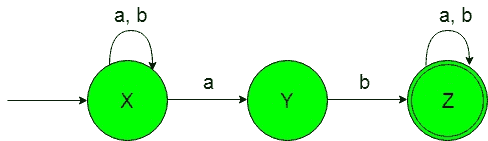
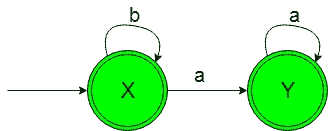

# 设计非确定性有限自动机(集合 5)

> 原文:[https://www . geesforgeks . org/design-非确定性-有限-自动机-set-5/](https://www.geeksforgeeks.org/designing-non-deterministic-finite-automata-set-5/)

**先决条件:** [有限自动机简介](https://www.geeksforgeeks.org/toc-finite-automata-introduction/)
在本文中，我们将看到非确定性有限自动机(NFA)的一些设计。

**问题-1:** 构造最小 NFA，接受{a，b}上的一组字符串，其中语言的每个字符串都包含“ab”作为子字符串。
**解释:**想要的语言会是这样的:

```
L1 = {ab, abba, abaa, ...........}
```

这里我们可以看到上面语言的每个字符串都包含“ab”作为子串，但是下面的语言不被这个 NFA 接受，因为下面语言的一些字符串不包含“ab”作为子串。

```
L2 = {bb, b, bbbb, .............}
```

所需语言的状态转换图如下:

在上面的 NFA 中，初始状态“X”在获得“a”作为输入时，它要么保持自身状态，要么过渡到状态“Y”，在获得“b”作为输入时，它保持自身状态。

获得“b”作为输入时的状态“Y”传输到最终状态“Z”。最终状态“Z”在获得“a”或“b”作为输入时，它保持在自身的状态。

**问题-2:** 构造一个最小 NFA，接受{a，b}上的一组字符串，其中语言的每个字符串都不包含“ab”作为子字符串。
**解释:**想要的语言会是这样的:

```
L1 = {b, bb, bbbb, ...........}
```

这里我们可以看到，上面语言的每个字符串都不包含‘ab’作为子串，但是下面语言不被这个 NFA 接受，因为下面语言的一些字符串包含‘ab’作为子串。

```
L2 = {ab, aba, ababaab..............}
```

所需语言的状态转换图如下:

在上面的 NFA 中，初始和最终状态“X”在获得“b”作为输入时保持自身状态，在获得“a”作为输入时转换到另一个最终状态“Y”。

另一个最终状态‘Y’在得到‘a’作为输入时它保持在自身的状态。