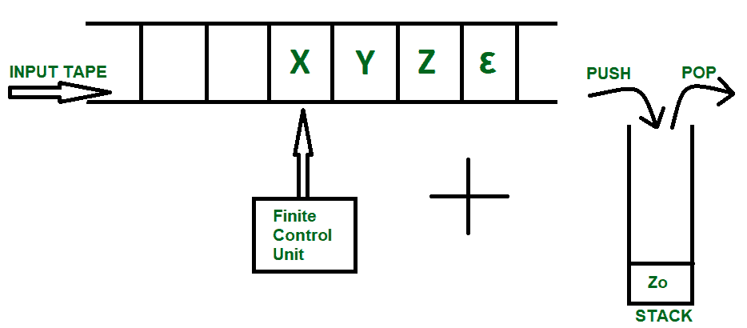
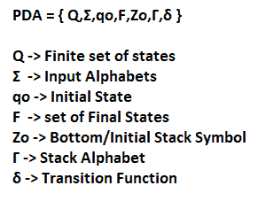
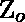
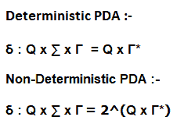
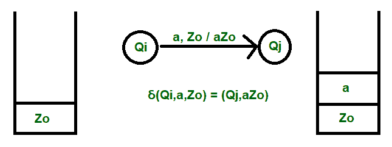
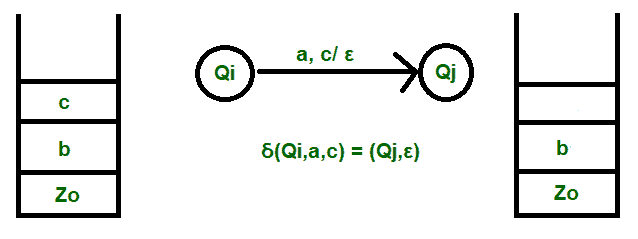
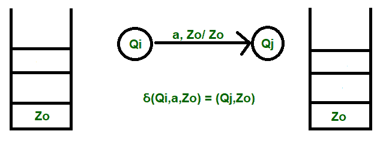

# 下推自动机的详细研究

> 原文:[https://www . geesforgeks . org/detailed-study-of-push-automator/](https://www.geeksforgeeks.org/detailed-study-of-pushdown-automata/)

根据[乔姆斯基层次结构](https://www.geeksforgeeks.org/toc-chomsky-hierarchy/)，生成一种语言的某种类型的语法的要求经常被一个合适的可以用来接受同一种语言的机器搅在一起。当语法简单时，语言变得更复杂，因此我们需要一台更强大的机器来理解和接受语言。

**示例:**
Type 0 语法简单，它生成一个递归可枚举语言(REL)，这需要一个强大的机器如“[图灵机](https://www.geeksforgeeks.org/turing-machine/)”来接受所有字符串。

在这里，我们讨论了属于这个层次的一个类似的场景，即类型 2 语法；它生成由[下推自动机(PDA)接受的控制自由语言。](https://www.geeksforgeeks.org/theory-of-computation-pushdown-automata/)

上图显示了一个输入磁带，这就是[有限自动机](https://www.geeksforgeeks.org/toc-finite-automata-introduction/)的工作原理，字符串被接收到磁带中，读取头根据有限控制单元提供的指令不断更新。另一方面，下推自动机是这种磁带和堆栈数据结构的组合。

组成 PDA 的元组如下:

我们看到前四个元组 Q、、Q0 和 F 类似于有限自动机的情况。

让我们来谈谈，现在我们知道下推自动机有一个堆栈机制来接受有限自动机中不可能的语言。当在推送操作之前我们需要检查溢出条件，或者在弹出操作之前我们检查下溢条件时，问题就出现了。

我们通过假设堆栈是无限的来解决这个问题，而在处理字符串之前，通过在堆栈中预先引入一个元素来克服空条件。

**这个假设在两个方面帮助了我们:-**

1.  我们克服了下溢条件，从而节省了任何内存来保持堆栈上的检查为空。
2.  初始堆栈符号可用于声明字符串处理已成功完成。

**伽马符号( )** 用于表示所有的堆叠字母。每个输入字母(相同或不同)可以用不同的堆栈符号表示。它也是必要的，因为它将堆栈的最顶层元素传送到机器。

**Delta 函数( )** 是过渡函数，通过仔细查看在 Stack 上完成的三个主要操作，其使用将变得更加清晰:-

1.  推
2.  流行音乐
3.  跳跃

**1。推送**

推送操作如图所示。
**转换发生的顺序:-** *输入，最顶层元素/最终列表*
这里，a 是输入元素，插入到堆栈中，从而使最终内容为 aZo。

**2 .pop〔t1〕**

弹出操作如图所示。
**转换发生的顺序:-** *输入元素，最顶端的元素/移除确认*
这里，a 是输入，c 是要删除的元素，移除确认用 Epsilon 符号表示，宣布立即已被弹出，为空。

**3。跳过**

跳过操作如图所示。
**转换发生的顺序:-** *输入元素，最顶端的元素/最顶端的元素*

这里，a 是输入，堆栈在此操作后保持不变。

因此，关于下推自动机如何工作的详细研究到此结束。接下来，我们将进入一些例子，使工作和过渡更加清晰。