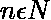
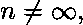
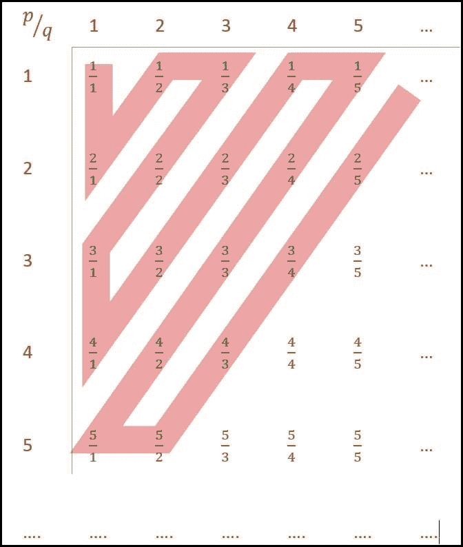
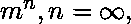
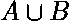

# 确定目录中的可数性

> 原文:[https://www . geesforgeks . org/decising-county-in-TOC/](https://www.geeksforgeeks.org/determining-countability-in-toc/)

**可数集**是基数与自然数集的某个子集 **<font size="2" face="Times New Roman">N</font>** *相同的集。可数集合是可列表的集合。*

> 可数集的基数可以是一个有限的数。例如，B: {1，5，4}，|B| = 3，在这种情况下，它被称为可数有限集，或者可数集的基数可以是无限的。例如，A: {2，4，6，8 …}，在这种情况下，它被称为可数无穷大。

**可数集的公共迹:**

*   基数用形式表示，其中、； **<font size="2" face="Times New Roman"> m </font>** 可能是也可能不是∞
*   它只有在可数有限集合的情况下才有有限元素。
*   它可以按照烘焙形式列出*存在一个详尽的列表，至少可以包含一次每个元素，在可数无限列表的情况下，前几个元素后跟三个点省略号(…)。

**有理数集可数无限:**



沿着红线建立包含所有有理数的烘焙集。因此，包含每个元素至少一次的穷举集合可以被建立，因此有理数集合是可数无限的。

**不可数集合:**
一个集合，它的元素不能被列出，或者直观地说，不存在一个序列可以列出集合中的每个元素至少一次。

**示例:**

```
R : {set of real numbers is uncountable}
B : {set of all binary sequences of infinite length} 
```

**不可数集的公共迹:**

*   基数用形式表示；
*   它是无限元素集的幂集
*   等于设置了 **R** 组实数
*   等于集合 **Q** 的无理数集合
*   它是不可列表的集合

**联合作战快速参考:**

<center>

| A | B |  |
| --- | --- | --- |
| 可数的 | 可数的 | 可数的 |
| 无数的 | 无数的 | 无数的 |
| 可数的 | 无数的 | 无数的 |

</center>

**例-1:**
设 N 为自然数的集合。考虑以下集合，

```
P: Set of Rational numbers (positive and negative)
Q: Set of functions from {0, 1} to N
R: Set of functions from N to {0, 1}
S: Set of finite subsets of N 
```

以上哪一组是可数的？
**(A)** 仅 Q 和 S
**(B)**仅 P 和 S
**(C)**仅 P 和 R
**(D)**仅 P、Q 和 S

**说明:**
请看 [GATE CS 2018 |问题 58](https://www.geeksforgeeks.org/gate-gate-cs-2018-question-58/)

**示例-2:**
考虑以下集合:

```
S1: Set of all recursively enumerable languages over the alphabet {0, 1}.
S2: Set of all syntactically valid C programs.
S3: Set of all languages over the alphabet {0, 1}.
S4: Set of all non-regular languages over the alphabet {0, 1}. 
```

以上哪几组是不可数的？
**(A)** S1 和 S2
T4【B】S3 和 S4
T7【C】S1 和 S4
T10【D】S2 和 S3

**说明:**
请看 [GATE CS 2019 |第 43 题](https://www.geeksforgeeks.org/gate-gate-cs-2019-question-43/)