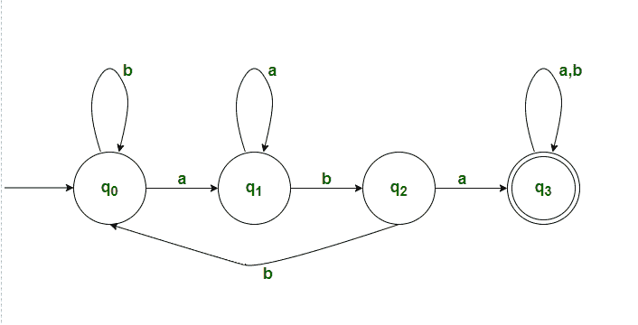

# DFA 接受 w∑(a，b)*上的所有字符串，该字符串包含“aba”作为子字符串

> 原文:[https://www . geesforgeks . org/DFA-接受所有字符串-over-w-% E2 % 88% 88ab-其中包含-ABA-as-substring/](https://www.geeksforgeeks.org/dfa-accepting-all-strings-over-w-%e2%88%88ab-which-contains-aba-as-a-substring/)

给定一个二进制字符串 S，任务是为 DFA Machine 编写一个程序，该程序接受 w∑(a，b) <sup>*</sup> 上的一组所有字符串，其中包含“aba”作为子字符串。
**例:**

```
Input-1 : ababa
Output : Accepted
Explanation : "ababa" consists "aba"

Input-2 : abbbb
Output : Not accepted
Explanation : "abbbb" does not consist "aba"
```

**方法:**下面是针对给定问题设计的 DFA 机器。为 DFA 状态构建一个转换表，并分析每个状态之间的转换。以下是步骤–



**所需语言:**

```
L = {aba, baba, abab, aababbb.....}
```

**说明:**

1.  首先，会有 4 种状态。(说 q <sub>0</sub> ，q <sub>1</sub> ，q <sub>2</sub> ，q <sub>3</sub> ) ，其中q <sub>0</sub> 为初始状态，q <sub>3</sub> 为最终状态。
2.  最初我们将处于 q <sub>0</sub> 状态，现在我们开始读取给定的字符串。

*   当我们读“b”的时候，我们会保持同样的状态
*   如果我们读“a”，那么它会过渡到状态 q <sub>1</sub> 。

3.假设现在我们处于 q <sub>1</sub> 状态。

*   当我们读“a”的时候，我们会保持同样的状态。
*   如果我们读‘b’，我们会过渡到状态 q <sub>2</sub> 。

4.假设现在我们处于 q <sub>2</sub> 状态。

*   如果我们读‘a’，它会过渡到状态 q <sub>3</sub> 。
*   如果我们读‘b’，它会过渡到状态 q <sub>0。</sub>

5.假设我们处于最终状态(q <sub>3</sub> )

*   当我们读“a”或“b”时，我们保持同样的状态。

6.该 DFA 接受的所有字符串都将“aba”作为其子字符串。
**过渡表:**

<figure class="table">

| 初速电流状态 | 末态 |
| --- | --- |
| a | b |
| --- | --- |
| q0 | 雌三醇环戊醚 | q0 |
| 雌三醇环戊醚 | 雌三醇环戊醚 | q2 |
| q2 | q3 | q0 |
| q3 | q3 | q3 |

**以下是上述方法的实施–**

## C++

```
// C++ program for the above approach
#include <cstring>
#include <iostream>
using namespace std;

// Function to check whether the given
// string is accepted by DFA or not
void checkValidDFA(string s)
{
    // Stores initial state of DFA
    int initial_state = 0;
    // Stores previous state of DFA
    int previous_state = initial_state;
    // Stores final state of DFA
    int final_state;
    // Iterate through the string
    for (int i = 0; i < s.length(); i++) {
        // Checking for all combinations
        if ((previous_state == 0 && s[i] == 'a') ||
        (previous_state == 1 && s[i] == 'a')) {
            final_state = 1;
        }
        if ((previous_state == 0 && s[i] == 'b') ||
        (previous_state == 2 && s[i] == 'b')) {
            final_state = 0;
        }
        if (previous_state == 1 && s[i] == 'b') {
            final_state = 2;
        }
        if ((previous_state == 2 && s[i] == 'a') ||
        (previous_state == 3)) {
            final_state = 3;
        }
        // Update the previous_state
        previous_state = final_state;
    }
    // If final state is reached
    if (final_state == 3) {
        cout << "Accepted" << endl;
    }
    // Otherwise
    else {
        cout << "Not Accepted" << endl;
    }
}

// Driver Code
int main()
{
    // Given string
    string s = "ababa";
    // Function Call
    checkValidDFA(s);
}
```

## C

```
// C++ program for the above approach
#include <stdio.h>
#include <string.h>

// Function to check whether the given
// string is accepted by DFA or not
void checkValidDFA(char s[] )
{
    // Stores initial state of DFA
    int initial_state = 0;
    // Stores previous state of DFA
    int previous_state = initial_state;
    // Stores final state of DFA
    int final_state;
    // Iterate through the string
    for(int i = 0; i < strlen(s); i++)
    {
      // Checking for all combinations    
      if((previous_state == 0 && s[i] == 'a') ||
      (previous_state == 1 && s[i] == 'a'))
      {
          final_state = 1;
      }
      if((previous_state == 0 && s[i] == 'b') ||
      (previous_state == 2 && s[i] == 'b'))
      {
          final_state = 0;
      }
      if(previous_state == 1 && s[i] == 'b')
      {
          final_state = 2;
      }
      if((previous_state == 2 && s[i] == 'a') ||
      (previous_state == 3))
      {
          final_state = 3;
      }
        // Update the previous_state
        previous_state = final_state;
    }
    // If final state is reached
    if(final_state == 3)
    {
        printf("Accepted");
    }
    // Otherwise
    else
    {
        printf("Not Accepted");
    }
}

// Driver Code
int main()
{
    // Given string
    char s[] = "ababa";

    // Function Call
    checkValidDFA(s);
}
```

**Output :** 

```
Accepted
```

**时间复杂度:**O(N)
T3】辅助空间: O(1)

</figure>