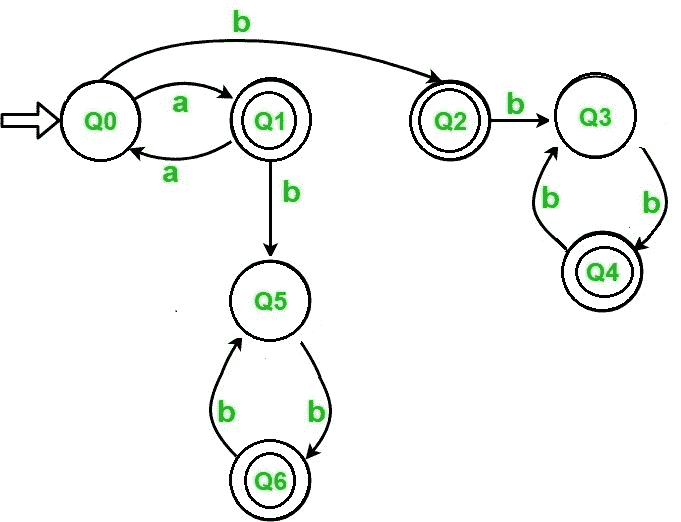

# 接受语言的 DFA L = { an BM | n+m =奇数}

> 原文:[https://www . geesforgeks . org/DFA-for-accept-language-l-an-BM-nmodd/](https://www.geeksforgeeks.org/dfa-for-accepting-the-language-l-an-bm-nmodd/)

设计确定性有限自动机(DFA)接受语言
为语言 L = { a<sup>n</sup>b<sup>m</sup>| n+m =奇数}创建 DFA 使用初等数学，上面写着-

```
odd + even = odd, and 
even+odd  = odd 
```

**例:**

```
Input:  a a b b b           
Output:  ACCEPTED
// n = 2, m = 3, 2 + 3 = 5 (odd)

Input:  a a a b b b         
Output:  NOT ACCEPTED
 // n = 3, m = 3, 3 + 3 = 6 (even)

Input:  a a a a b b b       
Output:  ACCEPTED
// n = 4, m = 3, 4 + 3 = 7 (odd)
```

**方法:**
有两种情况导致接受字符串:

1.  如果 n 是奇数，m 是偶数，那么它们的和将是奇数
2.  如果 n 是偶数，m 是奇数，那么它们的和将是奇数

**描述:**
给定的 DFA 有 2 个部分。第一部分由状态 0、1、5 和 6 组成，表示 n 是奇数，m 是偶数。第二部分由状态 2、3 和 4 组成，表示 n 是偶数，m 是奇数。
**DFA 状态转换图:**



**我们来看看演示的代码:**

## C++

```
// C program to implement DFS that accepts
// all string which follow the language
// L = { a^n b^m ; n+m=odd }
#include <stdio.h>
#include <string.h>

// dfa tells the number associated
// string end in which state.
int dfa = 0;

// This function is for
// the starting state (Q0)of DFA
void start(char c)
{
    if (c == 'a') {
        dfa = 1;
    }
    else if (c == 'b') {
        dfa = 2;
    }

    // -1 is used to check for any invalid symbol
    else {
        dfa = -1;
    }
}

// This function is for the first state (Q1) of DFA
void state1(char c)
{
    if (c == 'a') {
        dfa = 0;
    }
    else if (c == 'b') {
        dfa = 5;
    }
    else {
        dfa = -1;
    }
}

// This function is for the second state (Q2) of DFA
void state2(char c)
{
    if (c == 'b') {
        dfa = 3;
    }
    else {
        dfa = -1;
    }
}

// This function is for the third state (Q3)of DFA
void state3(char c)
{
    if (c == 'b') {
        dfa = 4;
    }
    else {
        dfa = -1;
    }
}

// This function is for the fourth state (Q4) of DFA
void state4(char c)
{
    if (c == 'b') {
        dfa = 3;
    }
    else {
        dfa = -1;
    }
}

// This function is for the fifth state (Q5) of DFA
void state5(char c)
{
    if (c == 'b') {
        dfa = 6;
    }
    else {
        dfa = -1;
    }
}

// This function is for the sixth state (Q6) of DFA
void state6(char c)
{
    if (c == 'b') {
        dfa = 5;
    }
    else {
        dfa = -1;
    }
}

int isAccepted(char str[])
{
    // store length of string
    int i, len = strlen(str);

    for (i = 0; i < len; i++) {
        if (dfa == 0)
            start(str[i]);

        else if (dfa == 1)
            state1(str[i]);

        else if (dfa == 2)
            state2(str[i]);

        else if (dfa == 3)
            state3(str[i]);

        else if (dfa == 4)
            state4(str[i]);

        else if (dfa == 5)
            state5(str[i]);

        else if (dfa == 6)
            state6(str[i]);

        else
            return 0;
    }
    if (dfa == 2 || dfa == 4 || dfa == 6 || dfa == 1)
        return 1;
    else
        return 0;
}

// driver code
int main()
{
    char str[] = "aaaabbbbb";
    if (isAccepted(str))
        printf("ACCEPTED");
    else
        printf("NOT ACCEPTED");
    return 0;
}
```

## Java 语言(一种计算机语言，尤用于创建网站)

```
// Java program to implement DFS that accepts
// all string which follow the language
// L = { a^n b^m ; n+m=odd }
class GFG
{

// dfa tells the number associated
// string end in which state.
static int dfa = 0;

// This function is for
// the starting state (Q0)of DFA
static void start(char c)
{
    if (c == 'a')
    {
        dfa = 1;
    }
    else if (c == 'b')
    {
        dfa = 2;
    }

    // -1 is used to check for any invalid symbol
    else
    {
        dfa = -1;
    }
}

// This function is for
// the first state (Q1) of DFA
static void state1(char c)
{
    if (c == 'a')
    {
        dfa = 0;
    }
    else if (c == 'b')
    {
        dfa = 5;
    }
    else
    {
        dfa = -1;
    }
}

// This function is for the
// second state (Q2) of DFA
static void state2(char c)
{
    if (c == 'b')
    {
        dfa = 3;
    }
    else
    {
        dfa = -1;
    }
}

// This function is for the
// third state (Q3)of DFA
static void state3(char c)
{
    if (c == 'b')
    {
        dfa = 4;
    }
    else
    {
        dfa = -1;
    }
}

// This function is for the
// fourth state (Q4) of DFA
static void state4(char c)
{
    if (c == 'b')
    {
        dfa = 3;
    }
    else
    {
        dfa = -1;
    }
}

// This function is for the
// fifth state (Q5) of DFA
static void state5(char c)
{
    if (c == 'b')
    {
        dfa = 6;
    }
    else
    {
        dfa = -1;
    }
}

// This function is for the
// sixth state (Q6) of DFA
static void state6(char c)
{
    if (c == 'b')
    {
        dfa = 5;
    }
    else
    {
        dfa = -1;
    }
}

static int isAccepted(char str[])
{
    // store length of string
    int i, len = str.length;

    for (i = 0; i < len; i++)
    {
        if (dfa == 0)
            start(str[i]);

        else if (dfa == 1)
            state1(str[i]);

        else if (dfa == 2)
            state2(str[i]);

        else if (dfa == 3)
            state3(str[i]);

        else if (dfa == 4)
            state4(str[i]);

        else if (dfa == 5)
            state5(str[i]);

        else if (dfa == 6)
            state6(str[i]);

        else
            return 0;
    }
    if (dfa == 2 || dfa == 4 ||
        dfa == 6 || dfa == 1)
        return 1;
    else
        return 0;
}

// Driver code
public static void main(String[] args)
{
    char str[] = "aaaabbbbb".toCharArray();
    if (isAccepted(str) == 1)
        System.out.println("ACCEPTED");
    else
        System.out.println("NOT ACCEPTED");
}
}

// This code is contributed by PrinciRaj1992
```

## 蟒蛇 3

```
# Python3 program to implement DFS that accepts 
# all Stringing which follow the language 
# L = a ^ n b ^ m n + m = odd

# This function is for the dfa = starting
# dfa = state (zeroth) of DFA 
def start(c):
    if (c == 'a'):
        dfa = 1
    elif (c == 'b'):
        dfa = 2

    # -1 is used to check for any
    # invalid symbol 
    else:
        dfa = -1
    return dfa

# This function is for the first 
# dfa = state of DFA 
def state1(c): 
    if (c == 'a'):
        dfa = 0
    elif (c == 'b'):
        dfa = 5
    else:
        dfa = -1
    return dfa

# This function is for the second 
# dfa = state of DFA 
def state2(c):
    if (c == 'b'):
        dfa = 3
    else:
        dfa = -1
    return dfa

# This function is for the third 
# dfa = state of DFA 
def state3(c):
    if (c == 'b'):
        dfa = 4
    else:
        dfa = -1
    return dfa

# This function is for the fourth
# dfa = state of DFA 
def state4(c):
    if (c == 'b'):
        dfa = 3
    else:
        dfa = -1
    return dfa

# This function is for the fifth 
# dfa = state of DFA 
def state5(c): 
    if (c == 'b'):
        dfa = 6
    else:
        dfa = -1
    return dfa

# This function is for the sixth 
# dfa = state of DFA 
def state6(c): 
    if (c == 'b'):
        dfa = 5
    else:
        dfa = -1
    return dfa

def isAccepted(String):

    # store length of Stringing 
    l = len(String)

    # dfa tells the number associated
    # with the present dfa = state
    dfa = 0
    for i in range(l): 
        if (dfa == 0): 
            dfa = start(String[i]) 

        elif (dfa == 1): 
            dfa = state1(String[i]) 

        elif (dfa == 2) :
            dfa = state2(String[i]) 

        elif (dfa == 3) :
            dfa = state3(String[i]) 

        elif (dfa == 4) :
            dfa = state4(String[i]) 

        elif (dfa == 5) :
            dfa = state5(String[i]) 

        elif (dfa == 6): 
            dfa = state6(String[i]) 

        else:
            return 0
    if(dfa == 1 or dfa == 2 or dfa == 4 or dfa == 6) :
        return 1
    else:
        return 0

# Driver code 
if __name__ == "__main__" :
    String = "aaaabbbbb"
    if (isAccepted(String)) :
        print("ACCEPTED") 
    else:
        print("NOT ACCEPTED") 

```

## C#

```
// C# program to implement DFS that accepts
// all string which follow the language
// L = { a^n b^m ; n+m=odd }
using System;

class GFG
{

    // dfa tells the number associated
    // string end in which state.
    static int dfa = 0;

    // This function is for
    // the starting state (Q0)of DFA
    static void start(char c)
    {
        if (c == 'a')
        {
            dfa = 1;
        }
        else if (c == 'b')
        {
            dfa = 2;
        }

        // -1 is used to check for any invalid symbol
        else
        {
            dfa = -1;
        }
    }

    // This function is for
    // the first state (Q1) of DFA
    static void state1(char c)
    {
        if (c == 'a')
        {
            dfa = 0;
        }
        else if (c == 'b')
        {
            dfa = 5;
        }
        else
        {
            dfa = -1;
        }
    }

    // This function is for the
    // second state (Q2) of DFA
    static void state2(char c)
    {
        if (c == 'b')
        {
            dfa = 3;
        }
        else
        {
            dfa = -1;
        }
    }

    // This function is for the
    // third state (Q3)of DFA
    static void state3(char c)
    {
        if (c == 'b')
        {
            dfa = 4;
        }
        else
        {
            dfa = -1;
        }
    }

    // This function is for the
    // fourth state (Q4) of DFA
    static void state4(char c)
    {
        if (c == 'b')
        {
            dfa = 3;
        }
        else
        {
            dfa = -1;
        }
    }

    // This function is for the
    // fifth state (Q5) of DFA
    static void state5(char c)
    {
        if (c == 'b')
        {
            dfa = 6;
        }
        else
        {
            dfa = -1;
        }
    }

    // This function is for the
    // sixth state (Q6) of DFA
    static void state6(char c)
    {
        if (c == 'b')
        {
            dfa = 5;
        }
        else
        {
            dfa = -1;
        }
    }

    static int isAccepted(char []str)
    {
        // store length of string
        int i, len = str.Length;

        for (i = 0; i < len; i++)
        {
            if (dfa == 0)
                start(str[i]);

            else if (dfa == 1)
                state1(str[i]);

            else if (dfa == 2)
                state2(str[i]);

            else if (dfa == 3)
                state3(str[i]);

            else if (dfa == 4)
                state4(str[i]);

            else if (dfa == 5)
                state5(str[i]);

            else if (dfa == 6)
                state6(str[i]);

            else
                return 0;
        }
        if (dfa == 2 || dfa == 4 ||
            dfa == 6 || dfa == 1)
            return 1;
        else
            return 0;
    }

    // Driver code
    public static void Main(String[] args)
    {
        char []str = "aaaabbbbb".ToCharArray();
        if (isAccepted(str) == 1)
            Console.WriteLine("ACCEPTED");
        else
            Console.WriteLine("NOT ACCEPTED");
    }
}

// This code contributed by Rajput-Ji
```

## 服务器端编程语言（Professional Hypertext Preprocessor 的缩写）

```
<?php
// PHP program to implement DFS that accepts
// all string which follow the language
// L = { a^n b^m ; n+m=odd }

// This function is for the
// starting state (zeroth) of DFA
function start($c, &$dfa)
{
    if ($c == 'a') $dfa = 1;
    elseif ($c == 'b') $dfa = 2;

    // -1 is used to check for any
    // invalid symbol
    else $dfa = -1;
}

// This function is for the first
// state of DFA
function state1($c, &$dfa)
{
    if ($c == 'a') $dfa = 0;
    elseif ($c == 'b') $dfa = 5;
    else $dfa = -1;
}

// This function is for the second
// state of DFA
function state2($c, &$dfa)
{
    if ($c == 'b') $dfa = 3;
    else $dfa = -1;
}

// This function is for the third
// state of DFA
function state3($c, &$dfa)
{
    if ($c == 'b') $dfa = 4;
    else $dfa = -1;
}

// This function is for the fourth
// state of DFA
function state4($c, &$dfa)
{
    if ($c == 'b') $dfa = 3;
    else $dfa = -1;
}

// This function is for the fifth
// state of DFA
function state5($c, &$dfa)
{
    if ($c == 'b') $dfa = 6;
    else $dfa = -1;
}

// This function is for the sixth
// state of DFA
function state6($c, &$dfa)
{
    if ($c == 'b') $dfa = 5;
    else $dfa = -1;
}

function isAccepted($str, &$dfa)
{

    // store length of string
    $i = 0; $len = sizeof($str);
    for ($i = 0; $i < $len; $i++)
    {
        if ($dfa == 0)
            start($str[$i], $dfa);

        elseif ($dfa == 1)
            state1($str[$i], $dfa);

        elseif ($dfa == 2)
            state2($str[$i], $dfa);

        elseif ($dfa == 3)
            state3($str[$i], $dfa);

        elseif ($dfa == 4)
            state4($str[$i], $dfa);

        elseif ($dfa == 5)
            state5($str[$i], $dfa);

        elseif ($dfa == 6)
            state6($str[$i], $dfa);

        else
            return 0;
    }

    if($dfa == 2 || $dfa == 4 ||
       $dfa == 6 || $dfa == 1)
        return 1;
    else
        return 0;
}

// Driver code

// dfa tells the number associated
// with the present state
$dfa = 0;
$str = array("a", "a", "a", "a",   
             "b", "b", "b", "b", "b");

if (isAccepted($str, $dfa) != 0)
    echo "ACCEPTED";
else
    echo "NOT ACCEPTED";

// This code is contributed by
// Adesh kumar Singh(adeshsingh1)
?>
```

## java 描述语言

```
<script>
// javascript program to implement DFS that accepts
// all string which follow the language
// L = [ a^n b^m ; n+m=odd }   
// dfa tells the number associated
    // string end in which state.
    var dfa = 0;

    // This function is for
    // the starting state (Q0)of DFA
    function start( c) {
        if (c == 'a') {
            dfa = 1;
        } else if (c == 'b') {
            dfa = 2;
        }

        // -1 is used to check for any invalid symbol
        else {
            dfa = -1;
        }
    }

    // This function is for
    // the first state (Q1) of DFA
    function state1( c) {
        if (c == 'a') {
            dfa = 0;
        } else if (c == 'b') {
            dfa = 5;
        } else {
            dfa = -1;
        }
    }

    // This function is for the
    // second state (Q2) of DFA
    function state2( c) {
        if (c == 'b') {
            dfa = 3;
        } else {
            dfa = -1;
        }
    }

    // This function is for the
    // third state (Q3)of DFA
    function state3( c) {
        if (c == 'b') {
            dfa = 4;
        } else {
            dfa = -1;
        }
    }

    // This function is for the
    // fourth state (Q4) of DFA
    function state4( c) {
        if (c == 'b') {
            dfa = 3;
        } else {
            dfa = -1;
        }
    }

    // This function is for the
    // fifth state (Q5) of DFA
    function state5( c) {
        if (c == 'b') {
            dfa = 6;
        } else {
            dfa = -1;
        }
    }

    // This function is for the
    // sixth state (Q6) of DFA
    function state6( c) {
        if (c == 'b') {
            dfa = 5;
        } else {
            dfa = -1;
        }
    }

    function isAccepted( str) {
        // store length of string
        var i, len = str.length;

        for (i = 0; i < len; i++) {
            if (dfa == 0)
                start(str[i]);

            else if (dfa == 1)
                state1(str[i]);

            else if (dfa == 2)
                state2(str[i]);

            else if (dfa == 3)
                state3(str[i]);

            else if (dfa == 4)
                state4(str[i]);

            else if (dfa == 5)
                state5(str[i]);

            else if (dfa == 6)
                state6(str[i]);

            else
                return 0;
        }
        if (dfa == 2 || dfa == 4 || dfa == 6 || dfa == 1)
            return 1;
        else
            return 0;
    }

    // Driver code

         var str = "aaaabbbbb";
        if (isAccepted(str) == 1)
            document.write("ACCEPTED");
        else
            document.write("NOT ACCEPTED");

// This code is contributed by gauravrajput1
</script>
```

**输出:**

```
ACCEPTED
```