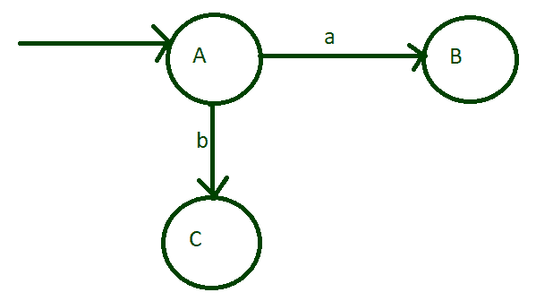
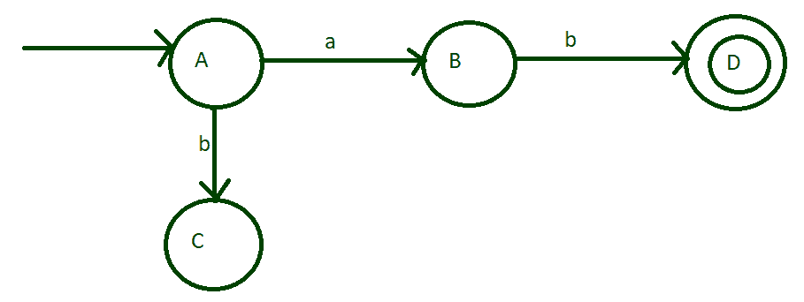
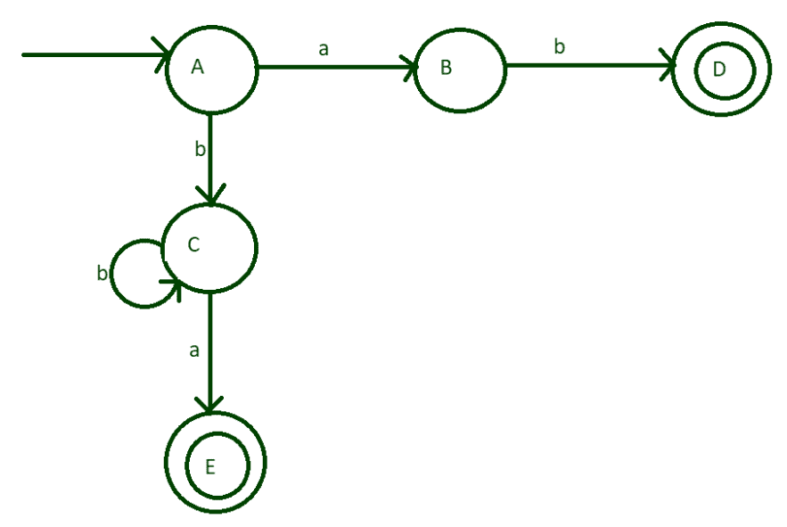
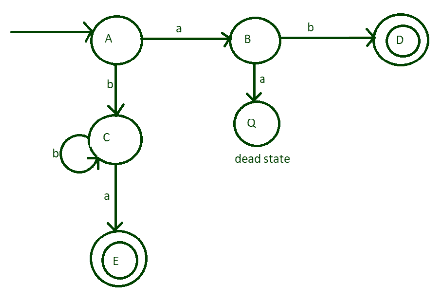
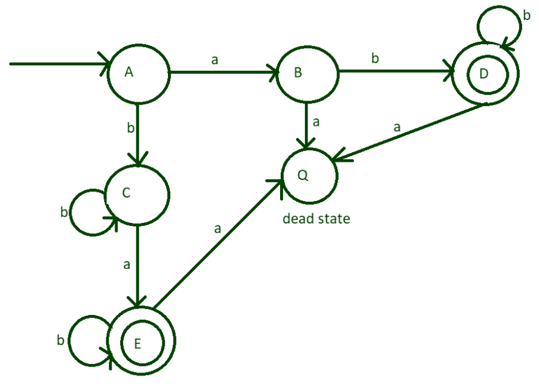

# a 和 b 中至少一个的 DFA

> 原文:[https://www . geeksforgeeks . org/DFA-for-the-one-of-a-至少是-of-b/](https://www.geeksforgeeks.org/dfa-for-exactly-one-of-a-and-at-least-one-of-b/)

[确定性有限自动机(DFA)](https://www.geeksforgeeks.org/introduction-of-finite-automata/) 定义为一个抽象的数学概念，用于解决不同软硬件中的各种具体问题。在这类问题中，我们有一些给定的参数，根据这些参数我们应该设计 DFA。

本文给出了两个说明:

*   DFA 应该有一个

*   DFA 应该至少有一个 b

该 DFA 应接受 **ab、ba、abb、bab、bba、abb、babb、bbab、bbba、abbb…等字符串。**等，但不接受 **a、b、bb、bbb、aabb、亚贝巴……**等字符串。

**分步设计:**

**Step-1:**
取一个初始状态 A，可能最小的字符串是 ab 和 ba，如果 A 取‘A’作为第一个输入字母表，则进入状态 B，如果 A 取‘B’作为第一个输入字母表，则进入状态 c



**第二步:**
现在想想状态 B，如果它接受输入字母‘a’，它就打破了我们只有一个‘a’的条件，但是如果接受输入字母‘B’，它就变成了一个可接受的字符串，现在它进入状态 D，状态 D 被设置为最终状态。



**第三步:**
在状态 C 下，如果可以取任何可能的数字‘b’，也可以取‘a’作为输入字母。在字母“b”上，它保持相同的状态，但在输入“a”时，它进入状态 E，该状态将设置为最终状态。



**第 4 步:**
输入状态 B 的字母‘a’打破了这个条件，所以它进入了某个死状态(Q)。



**第五步:**
到目前为止，我们的机器接受以‘a’和‘ab’结尾的字符串。但是如果“a”出现在中间，如 bab、babb、bbab 等，如果最后有很多“b”呢？要做到这一点，请将“b”的自循环设置为最终状态，并将它们的“a”设置为死状态。



**注意–**
输入的死状态字母将进入死状态，这就是为什么这些字母没有显示在图表中的原因。

上图的转换表和转换规则。

```
finite set of states = {A, B, C, D, E, Q} 
```

在转换表中，初始状态由→表示，最终状态为 E 和 d

```
set of input alphabets = {a, b} 
```

<figure class="table">

| 状态 | 输入(a) | 输入(b) |
| --- | --- | --- |
| →A | B | C |
| B | q(死状态) | D |
| C | E | C |
| D | q(死状态) | D |
| E | q(死状态) | E |

</figure>