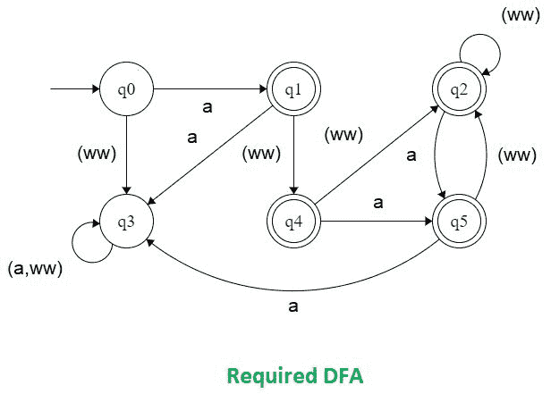

# 不包含连续两个 a 且以“a”开头的字符串的 DFA

> 原文:[https://www . geesforgeks . org/DFA-for-string-not-continuous-two-as-and-start-a/](https://www.geeksforgeeks.org/dfa-for-strings-not-containing-consecutive-two-as-and-starting-with-a/)

先决条件–[有限自动机简介](https://www.geeksforgeeks.org/toc-finite-automata-introduction/)
**问题:**为不包含连续两个 a 且以 a 开头的字符串构造确定性有限自动机(DFA)

**解释:**
接受不包含连续两个 a 的字符串。检查给定的字符串是否包含连续的两个 a。(b-z)的任何出现都不应影响场景。字符串应该遵循以下模式:

```
a.(ww|(ww.a))*
where, ww = all possible character except a 
```

所有不属于上述模式的字符串都不被接受。
不包含连续两个 a 的字符串的确定性有限自动机(DFA)，如下所示。该 dfa 中的初始和起始状态是 q0。



**使用的方法:**
在这个程序中，考虑 6 个状态为 0、1、2、3、4 和 5。现在让我们取一个名为 DFA 的变量，它最初将是 0。每当任何转换发生时，它都会用与新状态相关联的数字来更新 DFA 的值。

**示例:**
如果发生从状态 0 到状态 1 的转换，则 DFA 的值将更新为 1。如果从状态 2 转换到状态 3，则 dfa 的值将更新为 3。这样，在整个字符串上应用这个算法，如果最终达到状态 1、2、4 或 5，那么我们的字符串将被接受，否则不会。

```
Input : geeksaforaageeks
Output : NOT ACCEPTED

Input : aageeksforageeks
Output : NOT ACCEPTED

Input : ageeksaforageeks
Output : ACCEPTED 
```

**实施:**

## C++

```
// C++ program to implement DFA for Strings
// not containing consecutive two a's
#include <bits/stdc++.h>
using namespace std;

int dfa = 0;

// This function is for
// the starting state of DFA
void start(char c)
{
    if (c == 'a')
    {
        dfa = 1;
    }
    else
    {
        dfa = 3;
    }
}

// This function is for the first state of DFA
void state1(char c)
{
    if (c == 'a')
    {
        dfa = 3;
    }
    else
    {
        dfa = 4;
    }
}

// This function is for the second state of DFA
void state2(char c)
{
    if (c == 'a')
    {
        dfa = 5;
    }
    else
    {
        dfa = 2;
    }
}

// This function is for the third state of DFA
void state3(char c)
{
    if (c == 'a')
    {
        dfa = 3;
    }
    else
    {
        dfa = 3;
    }
}

// This function is for the fourth state of DFA
void state4(char c)
{
    if (c == 'a')
    {
        dfa = 5;
    }
    else
    {
        dfa = 2;
    }
}

void state5(char c)
{
    if (c == 'a')
    {
        dfa = 3;
    }
    else
    {
        dfa = 2;
    }
}

int isAccepted(char str[])
{

    // Store length of string
    int i, len = strlen(str);

    for(i = 0; i < len; i++)
    {
        // cout<<"%d", dfa);
        if (dfa == 0)
            start(str[i]);

        else if (dfa == 1)
            state1(str[i]);

        else if (dfa == 2)
            state2(str[i]);

        else if (dfa == 3)
            state3(str[i]);

        else if (dfa == 4)
            state4(str[i]);

        else if (dfa == 5)
            state5(str[i]);

        else
            return 0;
    }
    if (dfa == 0)
        return 0;
    else if (dfa == 3)
        return 0;
    else
        return 1;
}

// Driver code
int main()
{
    char str[] = "ageeksaforageeks";
    if (isAccepted(str))
        cout << "ACCEPTED";
    else
        cout << "NOT ACCEPTED";

    return 0;
}

// This code is contributed by shivanisinghss2110.
```

## C

```
// C program to implement DFA for Strings
// not containing consecutive two a's
#include <stdio.h>
#include <string.h>

int dfa = 0;

// This function is for
// the starting state of DFA
void start(char c)
{
    if (c == 'a') {
        dfa = 1;
    }
    else {
        dfa = 3;
    }
}

// This function is for the first state of DFA
void state1(char c)
{
    if (c == 'a') {
        dfa = 3;
    }
    else {
        dfa = 4;
    }
}

// This function is for the second state of DFA
void state2(char c)
{
    if (c == 'a') {
        dfa = 5;
    }
    else {
        dfa = 2;
    }
}

// This function is for the third state of DFA
void state3(char c)
{
    if (c == 'a') {
        dfa = 3;
    }
    else {
        dfa = 3;
    }
}

// This function is for the fourth state of DFA
void state4(char c)
{
    if (c == 'a') {
        dfa = 5;
    }
    else {
        dfa = 2;
    }
}

void state5(char c)
{
    if (c == 'a') {
        dfa = 3;
    }
    else {
        dfa = 2;
    }
}

int isAccepted(char str[])
{
    // store length of string
    int i, len = strlen(str);

    for (i = 0; i < len; i++) {

        // printf("%d", dfa);
        if (dfa == 0)
            start(str[i]);

        else if (dfa == 1)
            state1(str[i]);

        else if (dfa == 2)
            state2(str[i]);

        else if (dfa == 3)
            state3(str[i]);

        else if (dfa == 4)
            state4(str[i]);

        else if (dfa == 5)
            state5(str[i]);

        else
            return 0;
    }
    if (dfa == 0)
        return 0;
    else if (dfa == 3)
        return 0;
    else
        return 1;
}

// driver code
int main()
{
    char str[] = "ageeksaforageeks";
    if (isAccepted(str))
        printf("ACCEPTED");
    else
        printf("NOT ACCEPTED");
    return 0;
}

// This code is contributed by SHUBHAMSINGH10.
```

## Java 语言(一种计算机语言，尤用于创建网站)

```
// Java program to implement DFA for Strings
// not containing consecutive two a's
import java.util.*;

class GFG
{

static int dfa = 0;

// This function is for
// the starting state of DFA
static void start(char c)
{
    if (c == 'a')
    {
        dfa = 1;
    }
    else
    {
        dfa = 3;
    }
}

// This function is for the first state of DFA
static void state1(char c)
{
    if (c == 'a')
    {
        dfa = 3;
    }
    else
    {
        dfa = 4;
    }
}

// This function is for the second state of DFA
static void state2(char c)
{
    if (c == 'a')
    {
        dfa = 5;
    }
    else
    {
        dfa = 2;
    }
}

// This function is for the third state of DFA
static void state3(char c)
{
    if (c == 'a')
    {
        dfa = 3;
    }
    else
    {
        dfa = 3;
    }
}

// This function is for the fourth state of DFA
static void state4(char c)
{
    if (c == 'a')
    {
        dfa = 5;
    }
    else
    {
        dfa = 2;
    }
}

static void state5(char c)
{
    if (c == 'a')
    {
        dfa = 3;
    }
    else
    {
        dfa = 2;
    }
}

static int isAccepted(char str[])
{
    // store length of string
    int i, len = str.length;

    for (i = 0; i < len; i++)
    {

        // System.out.printf("%d", dfa);
        if (dfa == 0)
            start(str[i]);

        else if (dfa == 1)
            state1(str[i]);

        else if (dfa == 2)
            state2(str[i]);

        else if (dfa == 3)
            state3(str[i]);

        else if (dfa == 4)
            state4(str[i]);

        else if (dfa == 5)
            state5(str[i]);

        else
            return 0;
    }
    if (dfa == 0)
        return 0;
    else if (dfa == 3)
        return 0;
    else
        return 1;
}

// Driver code
public static void main(String args[])
{
    char str[] = "ageeksaforageeks".toCharArray();
    if (isAccepted(str) == 1)
        System.out.printf("ACCEPTED");
    else
        System.out.printf("NOT ACCEPTED");

}
}

// This code is contributed by Arnab Kundu
```

## 蟒蛇 3

```
# Python3 program to implement DFA for Strings
# not containing consecutive two a's

# This function is for the dfa = starting 
# dfa = state (zeroth) of DFA  
def start(c): 
    if (c == 'a'): 
        dfa = 1
    else: 
        dfa = 3
    return dfa 

# This function is for the first  
# dfa = state of DFA  
def state1(c):  
    if (c == 'a'): 
        dfa = 3
    else: 
        dfa = 4
    return dfa 

# This function is for the second  
# dfa = state of DFA  
def state2(c): 
    if (c == 'a'): 
        dfa = 5
    else: 
        dfa = 2
    return dfa 

# This function is for the third  
# dfa = state of DFA  
def state3(c): 
    if (c == 'a'): 
        dfa = 3
    else: 
        dfa = 3
    return dfa 

# This function is for the fourth  
# dfa = state of DFA  
def state4(c): 
    if (c == 'a'): 
        dfa = 5
    else: 
        dfa = 2
    return dfa

# This function is for the fifth 
# dfa = state of DFA  
def state5(c): 
    if (c == 'a'): 
        dfa = 3
    else: 
        dfa = 2
    return dfa  

def isAccepted(String): 

    # store length of Stringing  
    l = len(String) 

    # dfa tells the number associated 
    # with the present dfa = state 
    dfa = 0
    for i in range(l):  
        if (dfa == 0):  
            dfa = start(String[i])  

        elif (dfa == 1):  
            dfa = state1(String[i])  

        elif (dfa == 2) : 
            dfa = state2(String[i])  

        elif (dfa == 3) : 
            dfa = state3(String[i])  

        elif (dfa == 4) : 
            dfa = state4(String[i])

        elif (dfa == 5) : 
            dfa = state5(String[i])
        else: 
            return 0
    if(dfa == 3 or dfa == 0) : 
        return 0
    else: 
        return 1

# Driver code  
if __name__ == "__main__" : 
    String = "ageeksaforageeks"
    if (isAccepted(String)) : 
        print("ACCEPTED")  
    else: 
        print("NOT ACCEPTED")  

# This code is contributed by SHUBHAMSINGH10.
```

## C#

```
// C# program to implement DFA for Strings
// not containing consecutive two a's
using System;

public class GFG
{

static int dfa = 0;

// This function is for
// the starting state of DFA
static void start(char c)
{
    if (c == 'a')
    {
        dfa = 1;
    }
    else
    {
        dfa = 3;
    }
}

// This function is for the first state of DFA
static void state1(char c)
{
    if (c == 'a')
    {
        dfa = 3;
    }
    else
    {
        dfa = 4;
    }
}

// This function is for the second state of DFA
static void state2(char c)
{
    if (c == 'a')
    {
        dfa = 5;
    }
    else
    {
        dfa = 2;
    }
}

// This function is for the third state of DFA
static void state3(char c)
{
    if (c == 'a')
    {
        dfa = 3;
    }
    else
    {
        dfa = 3;
    }
}

// This function is for the fourth state of DFA
static void state4(char c)
{
    if (c == 'a')
    {
        dfa = 5;
    }
    else
    {
        dfa = 2;
    }
}

static void state5(char c)
{
    if (c == 'a')
    {
        dfa = 3;
    }
    else
    {
        dfa = 2;
    }
}

static int isAccepted(char[] str)
{
    // store length of string
    int i, len = str.Length;

    for (i = 0; i < len; i++)
    {

        // System.out.printf("%d", dfa);
        if (dfa == 0)
            start(str[i]);

        else if (dfa == 1)
            state1(str[i]);

        else if (dfa == 2)
            state2(str[i]);

        else if (dfa == 3)
            state3(str[i]);

        else if (dfa == 4)
            state4(str[i]);

        else if (dfa == 5)
            state5(str[i]);

        else
            return 0;
    }
    if (dfa == 0)
        return 0;
    else if (dfa == 3)
        return 0;
    else
        return 1;
}

// Driver code
public static void Main(String []args)
{
    char []str = "ageeksaforageeks".ToCharArray();
    if (isAccepted(str) == 1)
        Console.WriteLine("ACCEPTED");
    else
        Console.WriteLine("NOT ACCEPTED");

}
}

/* This code contributed by PrinciRaj1992 */
```

## java 描述语言

```
<script>

// JavaScript program to implement DFA
// for Strings not containing consecutive
// two a's
var dfa = 0;

// This function is for
// the starting state of DFA
function start(c)
{
    if (c === "a")
    {
        dfa = 1;
    }
    else
    {
        dfa = 3;
    }
}

// This function is for the first state of DFA
function state1(c)
{
    if (c === "a")
    {
        dfa = 3;
    }
    else
    {
        dfa = 4;
    }
}

// This function is for the second state of DFA
function state2(c)
{
    if (c === "a")
    {
        dfa = 5;
    }
    else
    {
        dfa = 2;
    }
}

// This function is for the third state of DFA
function state3(c)
{
    if (c === "a")
    {
        dfa = 3;
    }
    else
    {
        dfa = 3;
    }
}

// This function is for the fourth state of DFA
function state4(c)
{
    if (c === "a")
    {
        dfa = 5;
    }
    else
    {
        dfa = 2;
    }
}

function state5(c)
{
    if (c === "a")
    {
        dfa = 3;
    }
    else
    {
        dfa = 2;
    }
}

function isAccepted(str)
{

    // Store length of string
    var i,
    len = str.length;

    for(i = 0; i < len; i++)
    {
        // System.out.printf("%d", dfa);
        if (dfa === 0) start(str[i]);
        else if (dfa === 1) state1(str[i]);
        else if (dfa === 2) state2(str[i]);
        else if (dfa === 3) state3(str[i]);
        else if (dfa === 4) state4(str[i]);
        else if (dfa === 5) state5(str[i]);
        else return 0;
    }
    if (dfa === 0) return 0;
    else if (dfa === 3) return 0;
    else return 1;
}

// Driver code
var str = "ageeksaforageeks".split("");
if (isAccepted(str) === 1)
    document.write("ACCEPTED");
else
    document.write("NOT ACCEPTED");

// This code is contributed by rdtank

</script>
```

**输出:**

```
ACCEPTED 
```

这个程序的时间复杂度为 O(n)