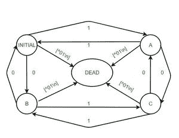

# LEX 代码中的 DFA，接受偶数个 0 和偶数个 1

> 原文:[https://www . geesforgeks . org/DFA-lex-code-accept-偶数-零-偶数-1/](https://www.geeksforgeeks.org/dfa-lex-code-accepts-even-number-zeros-even-number-ones/)

Lex 是一个生成词法分析器的计算机程序，通常与 YACC 分析器生成器一起使用。Lex 最初由迈克·莱斯克和 Eric Schmidt 编写，并在 1975 年进行了描述，它是许多 Unix 系统上的标准词法分析器生成器，一个等效的工具被指定为 POSIX 标准的一部分。Lex 读取指定词法分析器的输入流，并输出用 C 编程语言实现 lexer 的源代码。

**确定性有限接受者–**
在理论计算机科学的一个分支计算理论中，确定性有限自动机(DFA)——也称为确定性有限接受者(DFA)和确定性有限状态机(DFSM)——是一种接受和拒绝符号串的有限状态机，并且只为每个输入串产生唯一的自动机计算(或运行)。确定性是指计算的唯一性。为了寻找捕捉有限状态机的最简单模型，麦卡洛克和皮茨是最早在 1943 年引入类似有限自动机概念的研究人员之一。

**进场–**


LEX 默认为我们提供了一个 **INITIAL** 状态。所以要做一个 DFA，用这个初始状态作为 DFA 的初始状态。定义另外两个状态 **A 和 B** ，其中 B 是死状态，如果遇到错误或无效输入，将使用该状态。当用户获得无效输入时，移动到状态 B 并打印消息“无效”，如果用户从状态 A 到达初始状态并带有“\n”，则显示消息“未接受”。但是如果用户在初始状态得到一个\n，用户会显示一条消息“接受”。

**示例–**

```
Input : 1001
Output : Accepted

Input : hjabdba
Output : INVALID
```

为了实现上面的 DFA，用户需要在扩展名为. l 的 lex 文件中编写下面的代码。

**注:**

> 要编译一个 lex 程序，用户需要一个 unix 系统和 flex，可以使用**sudo apt-get install flex**
> 在上述所有规范的情况下，打开 UNIX 终端并执行以下操作:
> **1。**使用 lex 程序将规范文件更改为 C 语言程序。生成的程序在 lex.yy.c 文件中。
> **2。**使用带有-ll 标志的 cc 命令编译程序，并将程序与 lex 子程序库链接。生成的可执行程序在 a.out 文件中。
> 
> ```
> lex lextest
> cc lex.yy.c -lfl
> ```

**代码–**

## C++

```
%{
%}

%s A B

%%
<INITIAL>1 BEGIN INITIAL;
<INITIAL>0 BEGIN A;
<INITIAL>[^0|\n] BEGIN B;
<INITIAL>\n BEGIN INITIAL; printf("Accepted\n");
<A>1 BEGIN A;
<A>0 BEGIN INITIAL;
<A>[^0|\n] BEGIN B;
<A>\n BEGIN INITIAL; printf("Not Accepted\n");
<B>0 BEGIN B;
<B>1 BEGIN B;
<B>[^0|\n] BEGIN B;
<B>\n {BEGIN INITIAL; printf("INVALID\n");}
%%

void main()
{
yylex();
}
```

**输出–**

```
nickhil@NICKHIL:~$ lex prpg11.l
nickhil@NICKHIL:~$ cc lex.yy.c -lfl
nickhil@NICKHIL:~$ ./a.out
1000
Not Accepted
hello
INVALID
01010101
Accepted
```

**<u>方法 2:-</u>**

**进场:-**

LEX 默认为我们提供了一个 INITIAL 状态。所以要做一个 DFA，用这个作为 DFA 的初始状态。我们定义了另外四种状态:A、B、C 和 DEAD，如果遇到错误或无效的输入，将使用 DEAD 状态。当用户输入无效字符时，移动到“死亡”状态并打印消息“无效”，如果输入字符串在“初始”状态结束，则显示消息“已接受”。如果输入字符串在状态 A、B、C 结束，则显示消息“不接受”。



**LEX CODE:-**

```
%{

%}

%s A B C DEAD

%%

<INITIAL>1 BEGIN A;

<INITIAL>0 BEGIN B;

<INITIAL>[^01\n] BEGIN DEAD;

<INITIAL>\n BEGIN INITIAL; {printf("Accepted\n");}

<A>1 BEGIN INITIAL;

<A>0 BEGIN C;

<A>[^01\n] BEGIN DEAD;

<A>\n BEGIN INITIAL; {printf("Not Accepted\n");}

<B>1 BEGIN C;

<B>0 BEGIN INITIAL;

<B>[^01\n] BEGIN DEAD;

<B>\n BEGIN INITIAL; {printf("Not Accepted\n");}  

<C>1 BEGIN B;

<C>0 BEGIN A;

<C>[^01\n] BEGIN DEAD;

<C>\n BEGIN INITIAL; {printf("Not Accepted\n");}  

<DEAD>[^\n] BEGIN DEAD;

<DEAD>\n BEGIN INITIAL; {printf("Invalid\n");}  

%%

int main()

{

   printf("Enter String\n");

   yylex();

   return 0;

}
```

**输出:-**

```
kashyap@kashyap-singh:~$ lex e0e1.l
Kashyap@Kashyap-singh:~$ cc lex.yy.c -lfl
Kashyap@Kashyap-singh:~$ ./a.out
1010
Accepted
hello
INVALID
11100
Not Accepted
111100
Accepted
0001
Not Accepted
```