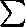
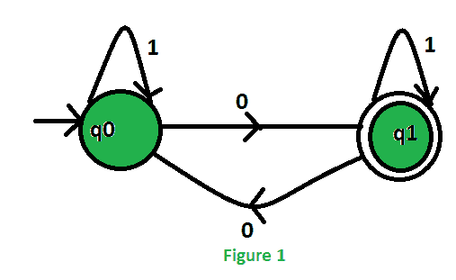
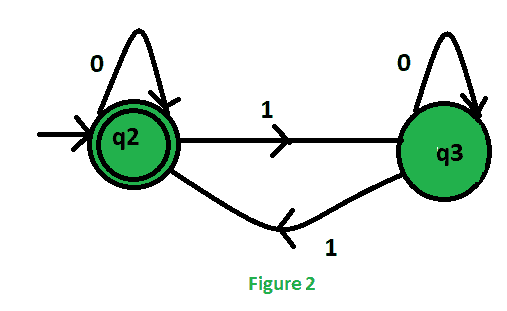
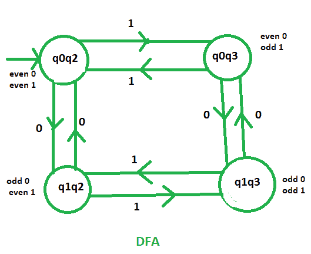
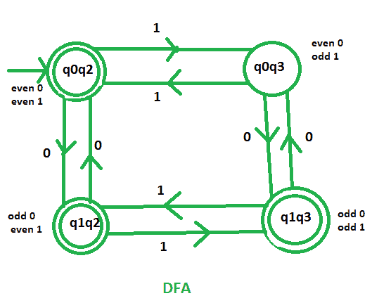
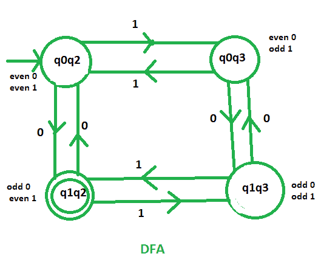
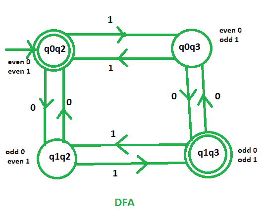

# 接受奇数个 0 或/和偶数个 1 的 DFA 机器

> 原文:[https://www . geesforgeks . org/DFA-机器-接受奇数个 0 或偶数个 1/](https://www.geeksforgeeks.org/dfa-machines-accepting-odd-number-of-0s-or-and-even-number-of-1s/)

先决条件–[设计有限自动机](https://www.geeksforgeeks.org/designing-finite-automata-from-regular-expression/)
**问题–**在输入字母表 = {0，1}上构建 DFA 机器，该机器接受:

1.  奇数个 0 或偶数个 1
2.  奇数个 0 和偶数个 1
3.  奇数个 0 或偶数个 1，但不能两者都有

**解决方案–**让我们首先为两种情况设计两台独立的机器:

*   只接受奇数个 0
*   只接受偶数个 1

然后，合并这两个并找到所需的最终状态。

为了合并这两台机器，我们将取这两台机器状态的笛卡尔乘积:

这些 DFA 的初始状态将是包含这两个独立机器的初始状态的状态。由于，q0 和 q2 是初始状态，因此，q0q2 是最终 DFA 的初始状态。

现在开始逐个设计所有的 DFA:

1.  **Odd number of 0’s or even number of 1’s:**

    这台机器接受包含奇数个 0 或偶数个 1 语言。我们知道 q1 表示奇数个 0，q2 表示偶数个 1。因此，所需 DFA 的最终状态将包含 q1 或 q2。
    。。最终状态= {(q0q2)、(q1q2)、(q1q3)}

    

    这是我们要求的 DFA，它接受包含奇数个 0 或偶数个 1 的语言。

2.  **Odd number of 0’s and even number of 1’s:**

    这台机器接受包含奇数个 0 和偶数个 1 语言。我们知道 q1 表示奇数个 0，q2 表示偶数个 1。因此，所需 DFA 的最终状态将同时包含 q1 和 q2。
    。。最终状态= {(qq2)}

    

    这是我们要求的 DFA，它接受包含奇数和 0 或偶数 1 的语言。

3.  **Either odd number of 0’s or even number of 1’s but not the both together:**

    该机器接受包含奇数个 0 或偶数个 1 语言，但不接受包含奇数个 0 和偶数个 1 的语言。我们知道 q1 表示奇数个 0，q2 表示偶数个 1。因此，所需 DFA 的最终状态将在 q1 和 q2 之间恰好包含一个。
    。。最终状态= {(q0q2)，(q1q3)}

    

    这是我们要求的 DFA，它接受包含奇数个 0 或偶数个 1 的语言，但不同时接受这两种语言。