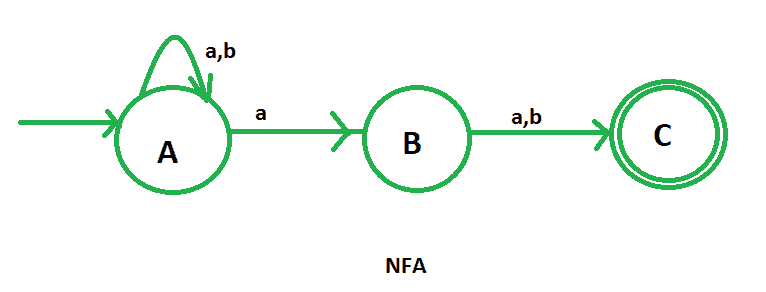
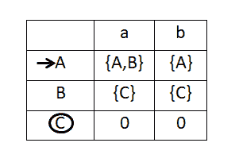

# 字符串的 DFA，其中 RHS 的第二个符号是“a”

> 原文:[https://www . geesforgeks . org/DFA-of-a-string-in-2nd-symbol-from-RHS-is-a/](https://www.geeksforgeeks.org/dfa-of-a-string-in-which-2nd-symbol-from-rhs-is-a/)

先决条件–[有限自动机简介](https://www.geeksforgeeks.org/toc-finite-automata-introduction/)
**问题–**绘制包含{a，b}上所有字符串集合的语言的确定性有限自动机(DFA)，其中 RHS 的第二个符号是“a”。

倒数第二个符号为“a”的字符串包括:

```
aa, ab, aab, aaa, aabbaa, bbbab etc

```

**例如:**

```
INPUT : baba
OUTPUT: NOT ACCEPTED

INPUT: aaab
OUTPUT: ACCEPTED

```

直接构造给定问题的 DFA 是非常复杂的。所以，这里我们要设计非确定性有限自动机(NFA)，然后将其转换为确定性有限自动机(DFA)。

包含所有字符串的语言的 NFA 是:



这里，A 是初始状态，C 是最终状态。
现在，我们要构造上述 NFA 的状态转移表。



之后，我们将使用子集配置在 NFA 的状态转移表上绘制 DFA 的状态转移表。我们将提到 a 和 b 的所有可能的过渡

现在，借助于它的转换表，绘制 DFA 变得非常容易。在这个 DFA 中，我们有四种不同的状态 A、AB、ABC 和 AC，其中 ABC 和 AC 是 DFA 的最终状态，A 是 DFA 的初始状态。


这是我们要求的包含{a，b}上所有字符串集合的语言的 DFA，其中 RHS 的第二个符号是“a”。

### 过渡表:

| 州 | 输入(a) | 输入(b) |
| —> A(初始状态) | AB 型血 | A |
| AB 型血 | ABC*(最终状态) | 交流*(最终状态) |
| 交流*(最终状态) | AB 型血 | A |
| ABC*(最终状态) | ABC*(最终状态) | 交流*(最终状态) |

### Python 实现:

```
def stateA(n):
    #if length found 0 
    #print not accepted
    if (len(n)==0):
        print("string not accepted")
    else:    

        #if at index 0 
        #'a' found call 
        #function stateAB 
        if(n[0]=='a'):
            stateAB(n[1:])

        #else if 'b' found 
        #call function A.    
        elif (n[0]=='b'):
            stateA(n[1:])

def stateAB(n):
    #if length found 0 
    #print not accepted
    if (len(n)==0):
        print("string not accepted")
    else:

        #if at index 0 
        #'a' found call 
        #function stateABC
        if(n[0]=='a'):
            stateABC(n[1:])

        #else if 'b' found 
        #call function AC.     
        elif (n[0]=='b'):
            stateAC(n[1:]) 

def stateABC(n):
    #if length found 0 
    #print accepted
    if (len(n)==0):
        print("string accepted")
    else:

        #if at index 0 
        #'a' found call 
        #function stateABC
        if(n[0]=='a'):
            stateABC(n[1:])

        #else if 'b' found 
        #call function AC.     
        elif (n[0]=='b'):
            stateAC(n[1:])

def stateAC(n):
    #if length found 0 
    #print accepted
    if (len(n)==0):
        print("string accepted")
    else:
        #if at index 0 
        #'a' found call 
        #function stateAB
        if(n[0]=='a'):
            stateAB(n[1:])

        #else if 'b' found 
        #call function A.     
        elif (n[0]=='b'):
            stateA(n[1:])        

#take string input
n=input()

#call stateA
#to check the input
stateA(n)
```