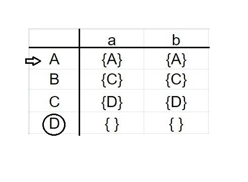
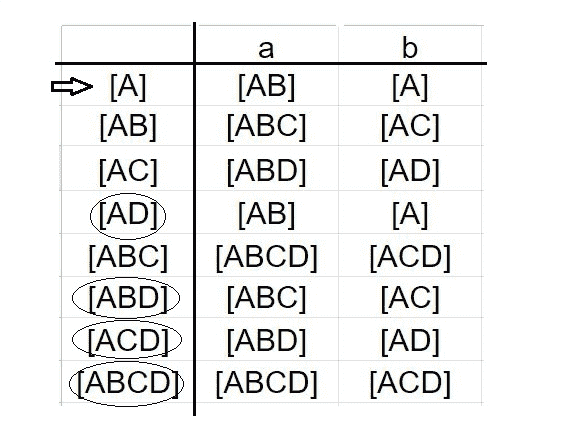
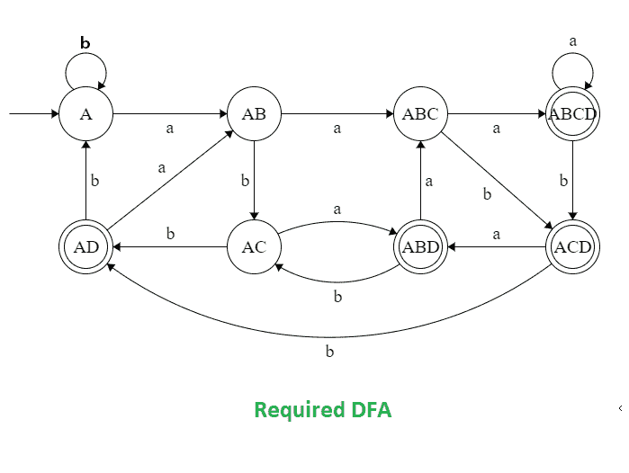

# 字符串的 DFA，其中 RHS 的第三个符号是‘a’

> 原文:[https://www . geesforgeks . org/DFA-of-a-string-in-third-symbol-from-RHS-is-a/](https://www.geeksforgeeks.org/dfa-of-a-string-in-which-3rd-symbol-from-rhs-is-a/)

先决条件–[有限自动机简介](https://www.geeksforgeeks.org/toc-finite-automata-introduction/)、[一个字符串的 DFA，其中 RHS 的第二个符号是‘a’](https://www.geeksforgeeks.org/dfa-of-a-string-in-which-2nd-symbol-from-rhs-is-a/)
**问题–**绘制包含{a，b}上所有字符串集合的语言的确定性有限自动机(DFA)，其中 RHS 的第三个符号是‘a’。

第三个最后一个符号是“a”的字符串是:

```
aaa, aab, aaab, aaaa, aabbaaa, bbbaba etc

```

接受这种字符串语言的 DFA 类似于接受正则表达式的 DFA:

```
L = (a+b)*.a.(a+b).(a+b) 
```

**例如:**

```
Input: babaa
Output: NOT ACCEPTED

Input: aaabb
Output: ACCEPTED 
```

直接构造给定问题的 DFA 是非常复杂的。所以，这里我们要设计非确定性有限自动机(NFA)，然后将其转换为确定性有限自动机(DFA)。

包含所有字符串的语言的 NFA 是:


这里，A 是初始状态，D 是最终状态。

现在，我们将构建上述 NFA 的状态转换表。



之后，我们将使用子集配置在 NFA 的状态转移表上绘制 DFA 的状态转移表。我们将提到 a 和 b 的所有可能的转换。



现在，借助于它的转换表，绘制 DFA 变得非常容易。在这个 DFA 中，我们有八个不同的状态 A、AB、AC、AD、ABC、ABD、ACD 和 ABCD，其中 AD、ABD、ACD 和 ABCD 是最终状态，A 是 DFA 的初始状态。



这是我们要求的包含{a，b}上所有字符串的集合的语言的 DFA，其中 RHS 的第三个符号是“a”。