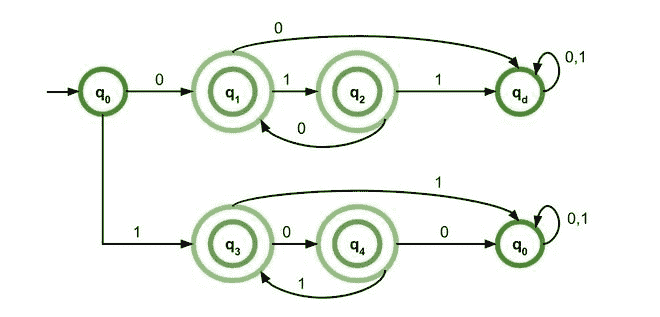

# 交替 0 和 1 的 DFA

> 原文:[https://www.geeksforgeeks.org/dfa-of-alternate-0s-and-1s/](https://www.geeksforgeeks.org/dfa-of-alternate-0s-and-1s/)

**正则表达式**可以是任何东西，从终端符号∅，到两个正则表达式(R <sub>1</sub> + R <sub>2</sub> )的并集，它们的串联(R <sub>1</sub> R <sub>2</sub> )或其闭包 R <sub>1</sub> *也可以。

**正则表达式示例:**

1.  以两个零开始的 0 和 1 的所有字符串的集合的正则表达式:

    ```
    00(0+1)*
    ```

2.  0 和 1 的所有字符串集合的正则表达式，其中 0 是偶数，1 是奇数:

    ```
    (00)*1(11)*
    ```

3.  包含至少一个 0 和至少两个 1 的 0 和 1 的所有字符串的集合的正则表达式:

    ```
    00*11(0+1)* + 0111*(0+1)*
    ```

正则表达式可接受的字符串，替换为 0 和 1–

1.  ∑(无输入，0 和 1)
2.  010101…..(以 0 开头，然后是 1 的字符串，依此类推)。
3.  101010…..(以 1 开头，然后是 0 的字符串，依此类推)。

现在，由交替的 0 和 1 组成的所有字符串集合的正则表达式将是 **(01)*** ，其中它可以接受∑，01，0101，010101…..但是这限制了字符串，因为它总是只能以 0 开头。

再次，表达式 **(10)*** 将接受∑，10，1010，101010……。但是这也限制了字符串，因为它总是只能以 1 开头。

因此，我们引入 **1(01)*** 和 **0(10)*** 来满足各自情况下的差距。

虽然 1(01)*打破了以 0 开始的字符串的限制，但 0(10)*打破了以 1 开始的字符串的限制。

所以，最后的表达是–

```
(01)* + (10)* + 0(10)* + 1(01)*
```

[](https://media.geeksforgeeks.org/wp-content/uploads/20200908133816/DFA-660x317.jpg) 

<center>**Figure –** Finite Automata of Regular Expression for alternate 0’s and 1’s</center>